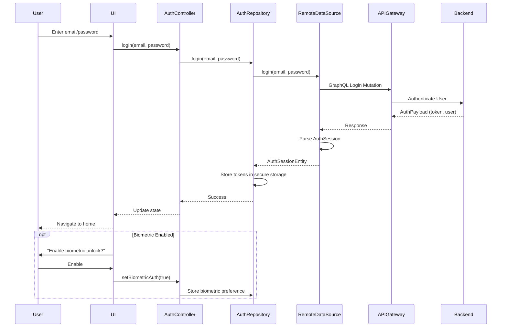
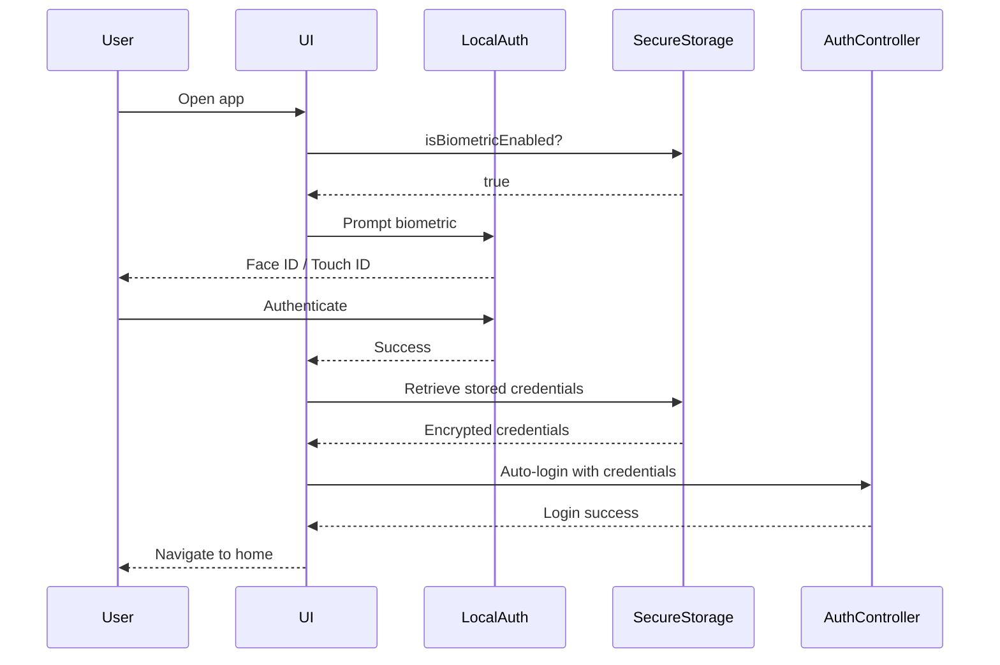

# Clubland Authentication Implementation

**Status**: Option 2 - Simplified Approach (Phase 1)
**Date**: October 21, 2025
**Backend**: henrybook (192.168.0.170:30080)

---

## Current Implementation (Phase 1)

### ✅ What's Working

#### 1. **Email/Password Authentication via GraphQL**
- **Primary authentication method**
- Uses GraphQL mutations through API Gateway
- Full integration with backend at `http://192.168.0.170:30080/graphql`

**Login Flow:**
```dart
mutation Login($email: String!, $password: String!) {
  login(input: { email: $email, password: $password }) {
    token
    refreshToken
    expiresAt
    user {
      id
      clubId
      email
      username
      firstName
      lastName
      status
      roles
      permissions
      createdAt
      updatedAt
    }
  }
}
```

**Registration Flow:**
```dart
mutation Register(
  $email: String!
  $password: String!
  $username: String!
  $clubId: ID!
  $firstName: String!
  $lastName: String!
) {
  register(input: { ... }) {
    token
    refreshToken
    expiresAt
    user { ... }
  }
}
```

#### 2. **Local Biometric Unlock**
- **Convenience feature** for returning users
- Device-level Face ID / Touch ID / Fingerprint
- Implemented with `local_auth` package
- Stores preference in secure storage

**How it works:**
1. User logs in with email/password first time
2. App asks: "Enable biometric unlock for next time?"
3. User enables → Credentials stored securely
4. Next login → User can use biometrics instead of typing password
5. Biometric verification → App retrieves stored credentials → Auto-login

**Key Files:**
- `lib/features/auth/data/datasources/auth_remote_datasource.dart:423-494`
- `lib/features/auth/presentation/controllers/auth_controller.dart:287-323`
- `lib/features/auth/domain/usecases/login_usecase.dart:298-330`

#### 3. **Token Management**
- JWT access tokens stored in secure storage
- Refresh token support
- Automatic token refresh on 401 errors
- Secure storage using FlutterSecureStorage

#### 4. **Backend Integration**
- ✅ API Gateway: `http://192.168.0.170:30080`
- ✅ GraphQL Endpoint: `http://192.168.0.170:30080/graphql`
- ✅ Health Check: `http://192.168.0.170:30080/health`
- ✅ Multi-tenant support (clubId in JWT)

---

## Architecture

### Authentication Flow Diagram



### Biometric Unlock Flow



---

## File Structure

### Core Authentication Files

```
lib/features/auth/
├── data/
│   ├── datasources/
│   │   ├── auth_remote_datasource.dart     # GraphQL operations
│   │   ├── auth_local_datasource.dart      # Local storage
│   │   └── hanko_datasource.dart           # (Unused in Phase 1)
│   ├── repositories/
│   │   └── auth_repository_impl.dart       # Repository implementation
│   └── models/                              # Data models
├── domain/
│   ├── entities/
│   │   ├── user_entity.dart                # User domain model
│   │   └── auth_session_entity.dart        # Session domain model
│   ├── repositories/
│   │   └── auth_repository.dart            # Repository interface
│   └── usecases/
│       └── login_usecase.dart              # Business logic
└── presentation/
    ├── controllers/
    │   └── auth_controller.dart            # Riverpod state management
    ├── pages/
    │   ├── login_page.dart                 # Login UI
    │   └── register_page.dart              # Registration UI
    └── widgets/                             # Auth widgets

lib/core/network/
├── graphql_client.dart                      # GraphQL client config
├── graphql_links.dart                       # Auth, HTTP, WS links
└── connectivity_test.dart                   # Backend health check

lib/graphql/auth/                            # GraphQL operations
├── login.graphql
├── register.graphql
├── logout.graphql
└── refresh_token.graphql
```

---

## Testing Backend Connection

### Health Check Test

```dart
import 'package:clubland/core/network/connectivity_test.dart';

void main() async {
  // Test backend health
  final healthStatus = await ConnectivityTest.testBackendConnection();

  if (healthStatus.isConnected) {
    print('✅ Backend connected');
    print('Version: ${healthStatus.version}');
    print('Services: ${healthStatus.services}');
  } else {
    print('❌ Backend connection failed: ${healthStatus.error}');
  }

  // Test GraphQL endpoint
  final graphqlWorks = await ConnectivityTest.testGraphQLEndpoint();
  print(graphqlWorks ? '✅ GraphQL works' : '❌ GraphQL failed');
}
```

### Manual Testing Steps

1. **Network Check**: Ensure device is on same WiFi as backend (192.168.0.170)
   ```bash
   ping 192.168.0.170
   ```

2. **Health Check**: Test backend health endpoint
   ```bash
   curl http://192.168.0.170:30080/health
   ```

3. **Run App**: Start the Flutter app
   ```bash
   flutter run --target lib/simple_main.dart
   ```

4. **Test Login**: Try logging in with test credentials
   - Email: `test@example.com`
   - Password: (obtain from backend team)

5. **Enable Biometrics**: After successful login, enable biometric unlock

6. **Test Biometric Unlock**: Close app, reopen, use Face ID/Touch ID

---

## Known Limitations (Phase 1)

### ⚠️ Not Implemented Yet

1. **Passkey/WebAuthn Authentication**
   - Backend supports it (WebAuthn/FIDO2)
   - Flutter app doesn't have passkey integration
   - **Planned for Phase 2**

2. **Hanko Passwordless Flow**
   - UI exists but uses mock data
   - Doesn't route through API Gateway
   - **May be removed or integrated in Phase 2**

3. **Social Login**
   - No Google/Apple/Facebook authentication
   - **Future enhancement**

---

## Phase 2 Plan: Passkey/WebAuthn Integration

### Objectives
- Add true passkey support via backend's WebAuthn/FIDO2 API
- Make passkeys the PRIMARY authentication method
- Keep email/password as fallback

### Technical Requirements

#### 1. **Add WebAuthn Flutter Package**
Options:
- [`passkeys`](https://pub.dev/packages/passkeys) - Official WebAuthn support
- [`webauthn`](https://pub.dev/packages/webauthn) - Alternative package

#### 2. **Backend GraphQL Mutations Needed**
```graphql
# Passkey Registration
mutation RegisterPasskey($input: PasskeyRegisterInput!) {
  registerPasskey(input: $input) {
    challenge           # WebAuthn challenge
    credentialId        # Credential identifier
    publicKey          # Public key for verification
    user {
      id
      email
      # ... other fields
    }
  }
}

# Passkey Login
mutation LoginWithPasskey($input: PasskeyLoginInput!) {
  loginWithPasskey(input: $input) {
    token
    refreshToken
    expiresAt
    user { ... }
  }
}

# Check Passkey Support
query HasPasskey($userId: ID!) {
  user(id: $userId) {
    hasPasskey
    passkeyDevices {
      id
      name
      createdAt
      lastUsed
    }
  }
}
```

#### 3. **Registration Flow (Passkey-First)**
```
1. User enters email, name on registration page
2. App checks device capability:
   - Has biometrics? → Offer passkey registration
   - No biometrics? → Fall back to password
3. If passkey:
   a. Backend generates WebAuthn challenge
   b. Device creates passkey credential
   c. Send public key to backend
   d. Backend stores passkey → User registered
4. If password:
   a. User creates password
   b. Standard registration flow
```

#### 4. **Login Flow (Passkey-First)**
```
1. User opens app
2. App checks for existing user:
   - Has passkey? → Show "Sign in with passkey"
   - No passkey? → Show email/password form
3. If passkey:
   a. Backend sends challenge
   b. Device signs with passkey
   c. Send signed challenge to backend
   d. Backend verifies → Login success
4. If password:
   a. Standard email/password flow
```

### Implementation Tasks
- [ ] Add WebAuthn package to pubspec.yaml
- [ ] Get passkey GraphQL mutations from backend team
- [ ] Create passkey datasource
- [ ] Update registration page with passkey option
- [ ] Update login page with passkey option
- [ ] Add passkey management UI (view/remove devices)
- [ ] Test on iOS and Android
- [ ] Handle edge cases (passkey unavailable, lost device, etc.)

### Estimated Effort
- Backend schema coordination: 2-4 hours
- Flutter integration: 8-12 hours
- Testing: 4-6 hours
- **Total: 14-22 hours**

---

## Security Considerations

### Current (Phase 1)
- ✅ JWT tokens stored in secure storage (Keychain/KeyStore)
- ✅ Biometric credentials encrypted at rest
- ✅ TLS/HTTPS for all API communication
- ✅ Token expiration and refresh
- ✅ Secure logout (clears all stored credentials)

### Future (Phase 2)
- ✅ Passkeys never leave device (WebAuthn spec)
- ✅ Phishing-resistant (domain-bound credentials)
- ✅ No passwords to steal or leak
- ✅ Hardware-backed security (Secure Enclave/TEE)

---

## Troubleshooting

### "Cannot connect to backend"
- **Check**: Device on same WiFi as 192.168.0.170?
- **Check**: Run `ping 192.168.0.170`
- **Check**: Run `curl http://192.168.0.170:30080/health`
- **Fix**: Connect to correct WiFi network

### "Invalid credentials"
- **Check**: Correct email/password?
- **Check**: User account exists in backend?
- **Check**: Backend logs for authentication errors
- **Fix**: Verify test credentials with backend team

### "Biometric authentication failed"
- **Check**: Device supports Face ID / Touch ID / Fingerprint?
- **Check**: Biometrics enrolled on device?
- **Check**: App has permission to use biometrics?
- **Fix**: Enable biometrics in device settings

### "GraphQL errors"
- **Check**: Backend GraphQL endpoint accessible?
- **Check**: Mutations match backend schema?
- **Check**: Valid JWT token in requests?
- **Fix**: Run connectivity test, check schema alignment

---

## Summary

**Phase 1 (Current)** provides:
- ✅ Solid email/password authentication
- ✅ Convenient biometric unlock
- ✅ Full backend integration
- ✅ Production-ready security

**Phase 2 (Planned)** will add:
- 🔄 True passkey/WebAuthn support
- 🔄 Passkey-first UX
- 🔄 Maximum security with hardware-backed credentials

**Current approach is sufficient for:**
- Testing backend integration
- User acceptance testing
- Soft launch / beta
- MVP release

**Phase 2 recommended for:**
- Public production launch
- Enhanced security requirements
- Better UX (no passwords to remember)
- Competitive feature parity
