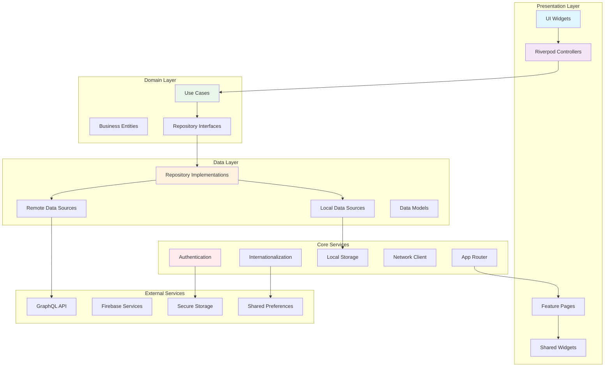
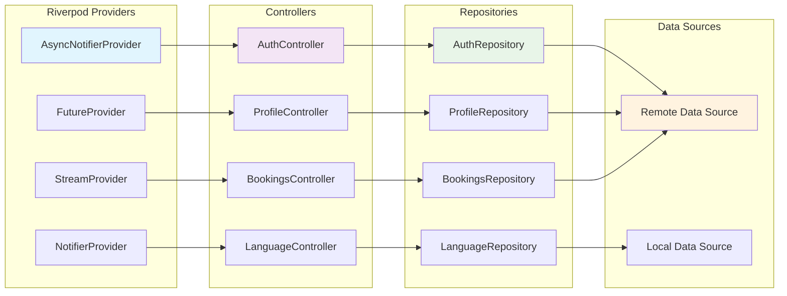
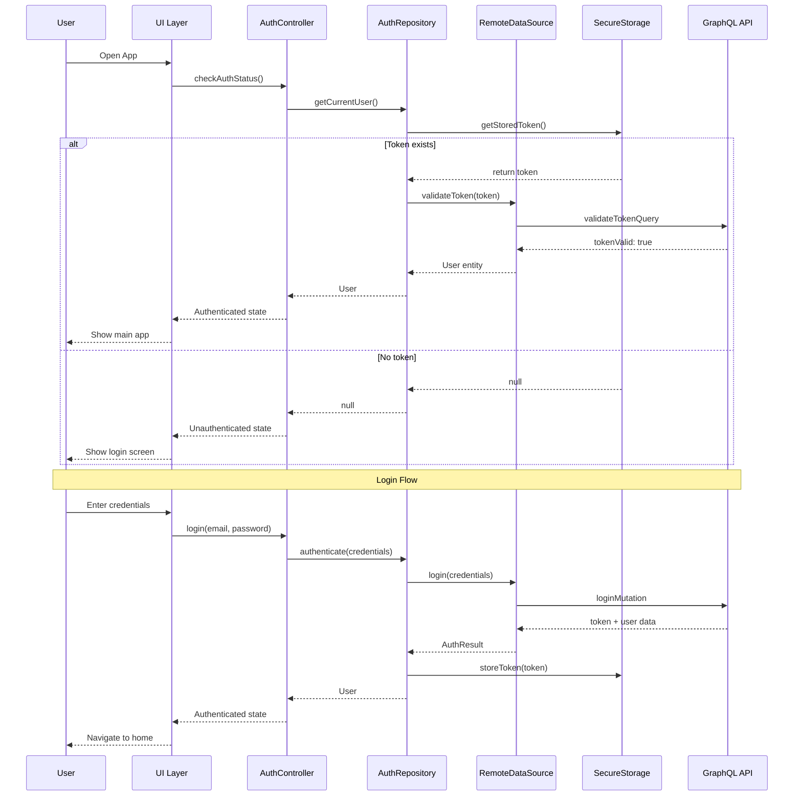
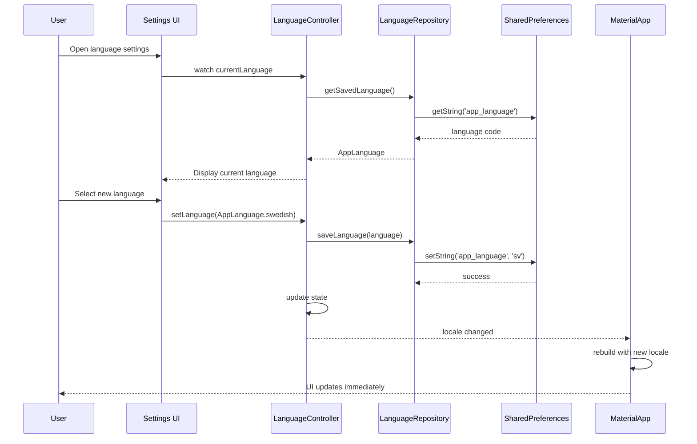
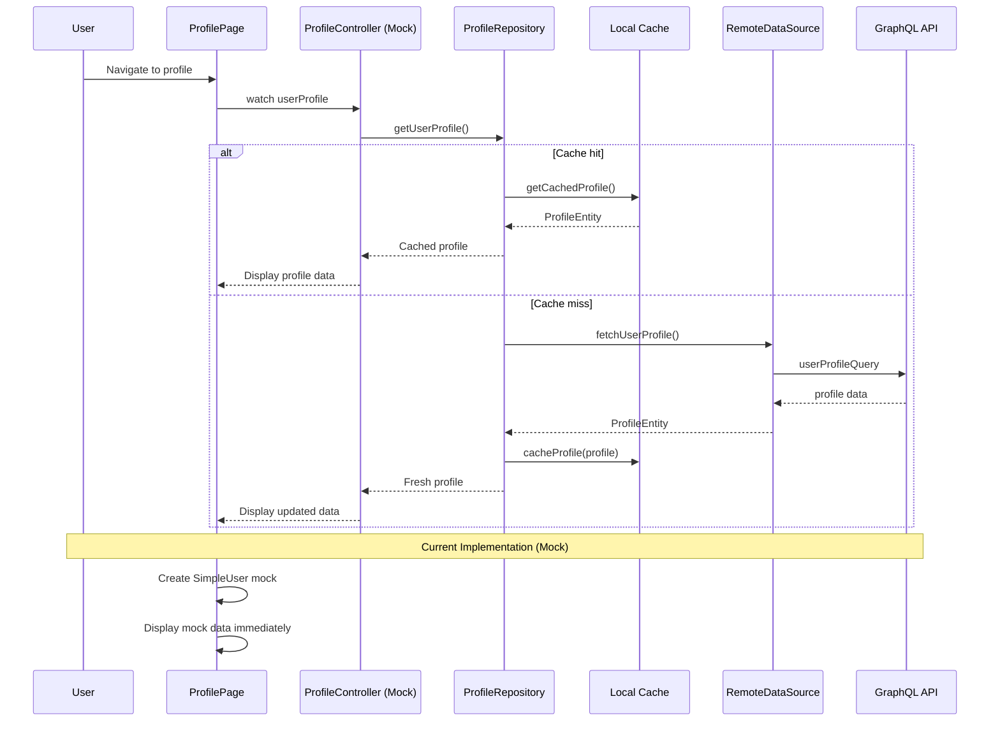

# CLAUDE.md

This file provides guidance to Claude Code (claude.ai/code) when working with code in this repository.

## Project Overview

Clubland is a premium End User Flutter application for the Reciprocal Clubs platform. It provides passwordless authentication, club discovery, booking management, social features, and real-time visit tracking across mobile, web, and desktop platforms.

## Requirements

- **Flutter**: 3.37.0+ (beta channel for latest packages)
- **Dart**: 3.10.0+ (required for macro support)
- **SDK**: ^3.9.2 (minimum supported version)

## Development Commands

### Essential Commands

- **Run the app (production)**: `flutter run`
- **Run with simple main**: `flutter run --target lib/simple_main.dart`
- **Hot reload**: Press `r` in the terminal while app is running
- **Hot restart**: Press `R` in the terminal while app is running
- **Run on specific platform**: `flutter run -d <device_id>`
- **Run with environment**: `flutter run --dart-define=ENVIRONMENT=development`

### Code Generation

- **Generate all code**: `dart run build_runner build --delete-conflicting-outputs`
- **Watch for changes**: `dart run build_runner watch --delete-conflicting-outputs`
- **Clean generated files**: `dart run build_runner clean`
- **Generate internationalization**: `dart run intl_utils:generate`

### Building

- **Build Android APK**: `flutter build apk --release --dart-define=ENVIRONMENT=production`
- **Build Android Bundle**: `flutter build appbundle --release --dart-define=ENVIRONMENT=production`
- **Build iOS**: `flutter build ios --release --dart-define=ENVIRONMENT=production`
- **Build web**: `flutter build web --release --dart-define=ENVIRONMENT=production`

### Testing and Quality

- **Run all tests**: `flutter test`
- **Run unit tests**: `flutter test test/unit/`
- **Run widget tests**: `flutter test test/widget/`
- **Run integration tests**: `flutter test integration_test/`
- **Test with coverage**: `flutter test --coverage`
- **Generate coverage report**: `genhtml coverage/lcov.info -o coverage/html`
- **Analyze code**: `flutter analyze --fatal-infos --fatal-warnings`
- **Format code**: `dart format .`
- **Run custom lints**: `dart run custom_lint`
- **Check dependencies**: `flutter pub outdated`

### Package Management

- **Install dependencies**: `flutter pub get`
- **Upgrade dependencies**: `flutter pub upgrade`
- **Clean build cache**: `flutter clean`

### Code Generation (Riverpod & Drift)

- **Generate all code**: `dart run build_runner build --delete-conflicting-outputs`
- **Watch for changes**: `dart run build_runner watch --delete-conflicting-outputs`
- **Clean generated files**: `dart run build_runner clean`

### Storage Architecture

- **Simple Data**: SharedPreferences-based multi-prefix storage system using TypedLocalStorage
- **Structured Data**: Drift SQL database for complex queries and relationships
- **Secure Data**: Flutter Secure Storage for sensitive information
- **Storage Manager**: Centralized StorageManager class managing multiple storage prefixes:
  - User data, clubs, bookings, visits, social, cache, settings, offline data
  - Automatic initialization and cleanup
  - Size monitoring and batch operations

### Deployment

- **Deploy web to staging**: `./scripts/deploy.sh web staging`
- **Deploy web to production**: `./scripts/deploy.sh web production`
- **Build all platforms**: `./scripts/deploy.sh all production`
- **Setup GitHub secrets**: `./scripts/setup-secrets.sh`

## Project Architecture

This project follows Clean Architecture principles with feature-based organization:

### Core Architecture Layers

- **Presentation Layer**: UI widgets, controllers (Riverpod), and state management
- **Domain Layer**: Business logic, entities, and use cases
- **Data Layer**: Repositories, data sources (remote/local), and models

### Architecture Flow Diagram



### State Management Architecture



### Data Architecture

- **API**: GraphQL with type-safe code generation
- **Authentication**: Hanko passwordless + JWT tokens
- **Local Storage**: Hive for offline-first architecture
- **Cache Strategy**: Multi-layer caching with TTL and invalidation
- **Internationalization**: ARB files with generated type-safe translations

## Project Structure

```text
lib/
├── main.dart                           # Main entry point
├── simple_main.dart                    # Simplified entry point
├── app/
│   ├── app.dart                        # Main app configuration
│   ├── router/
│   │   ├── app_router.dart             # Go Router configuration
│   │   └── route_paths.dart            # Route constants
│   └── themes/
│       ├── app_theme.dart              # Theme configuration
│       ├── colors.dart                 # Color scheme
│       └── text_styles.dart            # Typography
├── core/
│   ├── constants/
│   │   ├── api_constants.dart          # API endpoints
│   │   ├── app_constants.dart          # App-wide constants
│   │   └── storage_keys.dart           # Local storage keys
│   ├── errors/
│   │   ├── exceptions.dart             # Custom exceptions
│   │   ├── failures.dart               # Failure classes
│   │   └── error_handler.dart          # Global error handling
│   ├── network/
│   │   ├── graphql_client.dart         # GraphQL client setup
│   │   ├── graphql_links.dart          # Auth, HTTP, WebSocket links
│   │   └── network_info.dart           # Connectivity checking
│   ├── storage/
│   │   ├── local_storage.dart          # Hive configuration
│   │   ├── secure_storage.dart         # Flutter Secure Storage
│   │   └── cache_manager.dart          # Caching strategies
│   └── utils/
│       ├── extensions.dart             # Dart extensions
│       ├── validators.dart             # Form validators
│       └── formatters.dart             # Data formatters
├── features/
│   ├── auth/
│   │   ├── data/
│   │   │   ├── models/                 # Data models
│   │   │   ├── repositories/           # Repository implementations
│   │   │   └── sources/                # Remote/local data sources
│   │   ├── domain/
│   │   │   ├── entities/               # Business entities
│   │   │   ├── repositories/           # Repository interfaces
│   │   │   └── usecases/               # Business use cases
│   │   └── presentation/
│   │       ├── controllers/            # Riverpod controllers
│   │       ├── pages/                  # Screen widgets
│   │       └── widgets/                # Feature-specific widgets
│   ├── clubs/                          # Club discovery & details
│   ├── bookings/                       # Reservation management
│   ├── visits/                         # Visit tracking & history
│   ├── social/                         # Social features & feed
│   ├── travel/                         # Trip planning
│   ├── profile/                        # User profile & settings
│   └── home/                           # Home screen & dashboard
├── shared/
│   ├── widgets/                        # Reusable UI components
│   │   ├── buttons/                    # Button variants
│   │   ├── cards/                      # Card layouts
│   │   ├── forms/                      # Form components
│   │   ├── loading/                    # Loading indicators
│   │   └── dialogs/                    # Modal dialogs
│   ├── models/                         # Shared data models
│   └── services/                       # Shared services
├── generated/                          # Generated code (GraphQL, etc.)
├── l10n/                              # Internationalization
└── schema/                            # GraphQL schema files
    ├── auth.graphql
    ├── clubs.graphql
    ├── bookings.graphql
    └── subscriptions.graphql
```

## Key Dependencies

### Production Dependencies

- **State Management**: flutter_riverpod, riverpod_annotation
- **Navigation**: go_router
- **HTTP/GraphQL**: dio, graphql_flutter, gql
- **Authentication**: local_auth, flutter_secure_storage, crypto, encrypt
- **Local Storage**: SharedPreferences (simple key-value storage), drift (structured data)
- **UI/UX**: cached_network_image, lottie, shimmer
- **Maps**: google_maps_flutter, geolocator
- **Internationalization**: flutter_localizations, intl
- **Utils**: equatable, freezed_annotation, json_annotation

### Development Dependencies

- **Code Generation**: build_runner, freezed, json_serializable, drift_dev
- **GraphQL**: graphql_codegen
- **State Management**: riverpod_generator, riverpod_lint
- **Internationalization**: intl_utils
- **Testing**: mocktail, integration_test, alchemist (visual regression testing)
- **Code Quality**: flutter_lints, very_good_analysis

## Authentication Architecture

### Security Architecture

- **Primary**: Local biometric authentication on mobile devices
- **Encryption**: Custom encryption service for sensitive data
- **Storage**: FlutterSecureStorage for tokens and credentials
- **Session Management**: Secure session management with encrypted storage

### Authentication Flow

1. User initiates authentication
2. Biometric/PIN verification required
3. Encrypted credentials retrieved from secure storage
4. Session established with encrypted local data
5. App maintains secure session state

## GraphQL Integration

### Schema Organization

- **auth.graphql**: Authentication mutations and queries
- **clubs.graphql**: Club discovery, details, and search
- **bookings.graphql**: Reservation management
- **visits.graphql**: Check-in/out and visit tracking
- **subscriptions.graphql**: Real-time updates

### GraphQL Code Generation

The project uses GraphQL code generation to create type-safe Dart classes:

- Run `dart run build_runner build` after schema changes
- Generated files are in `lib/generated/`
- Never edit generated files manually

### Client Configuration

- **Authentication**: Automatic JWT token injection
- **Caching**: Optimistic updates with cache-first strategy
- **Subscriptions**: WebSocket for real-time features
- **Error Handling**: Comprehensive error categorization

## Internationalization (i18n)

### Supported Languages

- **English** (en): Default language, comprehensive translations
- **Swedish** (sv): Full translation support for Swedish users

### Implementation Architecture

- **Translation Files**: ARB format in `lib/l10n/` (intl_en.arb, intl_sv.arb)
- **Code Generation**: Uses `intl_utils` package for type-safe translation access
- **Generated Code**: Located in `lib/generated/l10n/` with S.dart localization class
- **State Management**: Language selection managed by Riverpod providers
- **Persistence**: User language preference saved to SharedPreferences

### Language Management

- **Language Provider**: `lib/core/providers/language_provider.dart`
  - Manages current app language state
  - Handles language switching and persistence
  - Provides system locale fallback
  - Supports AppLanguage enum for type safety

### Usage in Code

```dart
// Import localization
import '../../../../generated/l10n/l10n.dart';

// Use in widgets
Text(S.of(context).profile)
Text(S.of(context).signOut)
```

### Language Selection

- **Settings Page**: Profile settings include language selector
- **Real-time Switching**: Changes apply immediately without app restart
- **System Default**: Falls back to device language if supported

### Adding New Languages

1. Create new ARB file: `lib/l10n/intl_[locale].arb`
2. Add translations for all existing keys
3. Update AppLanguage enum in language_provider.dart
4. Run `dart run intl_utils:generate`
5. Test language switching functionality

### Translation Keys Organization

- **UI Elements**: profile, settings, overview, activity, achievements
- **Actions**: signOut, editProfile, shareProfile, viewAll
- **Navigation**: quickActions, recentActivity, account, social, support
- **Messages**: logoutFunctionalityComingSoon, profileSharingComingSoon
- **Placeholders**: activityHistoryPlaceholder, noRecentActivity

## Application Flow Diagrams

### User Authentication Flow



### Language Switching Flow



### Profile Data Loading Flow



## API Integration Patterns

### GraphQL Client Configuration

```mermaid
graph TB
    subgraph "GraphQL Client Setup"
        Client[GraphQL Client]
        AuthLink[Auth Link]
        HttpLink[HTTP Link]
        CacheLink[Cache Link]
        ErrorLink[Error Link]
    end

    subgraph "Request Flow"
        Request[GraphQL Request]
        Auth[Add JWT Token]
        Cache[Check Cache]
        Network[Network Request]
        Response[Response]
    end

    subgraph "Code Generation"
        Schema[GraphQL Schema]
        Generator[graphql_codegen]
        Types[Generated Types]
        Operations[Generated Operations]
    end

    Client --> AuthLink
    AuthLink --> HttpLink
    HttpLink --> CacheLink
    CacheLink --> ErrorLink

    Request --> Auth
    Auth --> Cache
    Cache --> Network
    Network --> Response

    Schema --> Generator
    Generator --> Types
    Generator --> Operations

    style Client fill:#e1f5fe
    style Request fill:#f3e5f5
    style Schema fill:#e8f5e8
```



### Function Call Patterns

#### Language Provider Functions

```dart
// Language switching with persistence
Future<void> setLanguage(AppLanguage language) async {
  // Parameters:
  // - language: AppLanguage enum (english, swedish)

  state = AsyncData(language);
  await ref.read(languageRepositoryProvider).saveLanguage(language);
}

// Get saved language with fallback
Future<AppLanguage?> getSavedLanguage() async {
  // Returns: AppLanguage? (null if not set)

  final prefs = await SharedPreferences.getInstance();
  final languageCode = prefs.getString(_languageKey);
  return AppLanguage.fromCode(languageCode);
}

// System locale detection
AppLanguage? detectSystemLanguage() {
  // Returns: AppLanguage? (null if not supported)

  final systemLocale = PlatformDispatcher.instance.locale;
  return AppLanguage.fromCode(systemLocale.languageCode);
}
```

#### Authentication Controller Functions

```dart
// Login with credentials
Future<void> login(String email, String password) async {
  // Parameters:
  // - email: String - User email address
  // - password: String - User password
  // Throws: AuthException on failure

  state = const AsyncLoading();
  try {
    final user = await _authRepository.login(email, password);
    state = AsyncData(user);
  } catch (error, stackTrace) {
    state = AsyncError(error, stackTrace);
  }
}

// Check authentication status
Future<User?> checkAuthStatus() async {
  // Returns: User? (null if not authenticated)

  return await _authRepository.getCurrentUser();
}

// Logout user
Future<void> logout() async {
  // Side effects: Clears secure storage, navigates to login

  await _authRepository.logout();
  state = const AsyncData(null);
}
```

#### Profile Repository Functions

```dart
// Get user profile (simplified implementation)
SimpleUser createMockUser() {
  // Returns: SimpleUser with predefined data
  // Used for: Profile display, statistics

  return SimpleUser(
    id: '1',
    firstName: 'John',
    lastName: 'Doe',
    email: 'john.doe@example.com',
    bio: 'Passionate about exploring exclusive clubs...',
    visitCount: 24,
    reviewCount: 12,
    clubCount: 8,
    points: 4520,
  );
}

// Future: Real profile fetching
Future<ProfileEntity> fetchUserProfile(String userId) async {
  // Parameters:
  // - userId: String - Unique user identifier
  // Returns: ProfileEntity with full user data
  // Throws: NetworkException, AuthException

  final response = await _remoteDataSource.getUserProfile(userId);
  return ProfileEntity.fromJson(response.data);
}
```

## Testing Strategy

### Test Types

- **Unit Tests** (`test/unit/`): Business logic, repositories, use cases
- **Widget Tests** (`test/widget/`): UI components and interactions
- **Integration Tests** (`integration_test/`): End-to-end user flows

### Testing Patterns

- **Repository Testing**: Mock data sources, test business logic
- **Controller Testing**: Mock repositories, test state management
- **Widget Testing**: Test UI interactions and state changes
- **Visual Regression Tests**: Alchemist-based golden testing for UI components

### Coverage Goals

- Unit tests: 80%+ coverage
- Widget tests: 70%+ coverage for critical components
- Integration tests: 100% coverage of core user journeys

## Development Workflow

### Code Generation Workflow

1. Update GraphQL schema files in `lib/schema/`
2. Run `dart run build_runner build --delete-conflicting-outputs`
3. Update data models if schema changes affect types
4. Update tests to reflect changes

### Feature Development

1. Create feature branch from main
2. Implement following Clean Architecture layers: Domain → Data → Presentation
3. Write tests for each layer
4. Generate code if needed
5. Test on multiple platforms
6. Submit PR with comprehensive tests

### Quality Checks

- **Pre-commit**: Format code, run fast tests
- **PR**: Full test suite, code coverage check
- **Deploy**: Integration tests, build verification

## Build Configuration

### Environment Configuration

The app uses environment configuration to manage different settings:

- **Environment Detection**: Automatic environment detection and validation
- **Configuration Management**: Centralized configuration with validation
- **Logging**: Environment-specific logging levels
- **Encryption**: Built-in encryption service initialization

## Performance Optimization

### Critical Performance Targets

- App launch time: < 2 seconds
- Search results: < 1.5 seconds
- Image loading: Progressive with caching
- Battery usage: Optimized background processing

### Optimization Strategies

- **Lazy Loading**: Load data on demand
- **Image Caching**: Multi-layer image cache
- **Code Splitting**: Dynamic imports for large features
- **Bundle Optimization**: Tree shaking and minification

## Security Considerations

### Data Protection

- **Encryption**: All sensitive data encrypted at rest
- **Secure Storage**: Use FlutterSecureStorage for tokens
- **Biometric Auth**: Required for sensitive operations
- **Network Security**: Certificate pinning, TLS 1.3

### Privacy Controls

- **Location**: Granular location sharing settings
- **Activity**: User-controlled visibility settings
- **Data Export**: GDPR-compliant data export/deletion
- **Analytics**: Opt-out capabilities

## Monitoring and Analytics

### Error Tracking

- **Crashes**: Firebase Crashlytics integration
- **Performance**: Firebase Performance monitoring
- **User Analytics**: Privacy-respecting usage analytics

### Logging Strategy

- **Development**: Verbose logging for debugging
- **Production**: Error and warning logs only
- **Sensitive Data**: Never log tokens, passwords, or PII

## Common Commands for Development

```bash
# Full development setup
flutter clean && flutter pub get && dart run build_runner build

# Run with hot reload (production)
flutter run

# Run tests with coverage
flutter test --coverage && genhtml coverage/lcov.info -o coverage/html

# Format and analyze
dart format . && flutter analyze

# Build for production
flutter build appbundle
```

## Troubleshooting

### Common Issues

- **Build failures**: Run `flutter clean` and regenerate code
- **GraphQL errors**: Check schema files and regenerate
- **Authentication issues**: Verify encryption service and secure storage configuration
- **Performance issues**: Use Flutter Inspector and profiling tools

### Debug Tools

- **Flutter Inspector**: Widget tree and performance analysis
- **DevTools**: Memory, network, and performance profiling
- **GraphQL Playground**: Test API queries directly
- **Redux DevTools**: State management debugging (via Riverpod)

## Recent Major Updates

### Package Upgrade & Migration (September 2024)

- **Flutter SDK**: Upgraded to 3.37.0-0.1.pre (beta) with Dart 3.10.0 for macro support
- **Riverpod**: Migrated from 2.x to 3.x ecosystem with breaking changes resolved
- **Database**: Migrated from Hive to Drift for modern SQL capabilities
- **Storage**: Replaced Hive with SharedPreferences for simple key-value storage
- **Testing**: Migrated from discontinued golden_toolkit to alchemist
- **Dependencies**: Upgraded 50+ packages, reduced incompatible packages by 62%

### Breaking Changes Resolved

- Updated provider naming conventions (`languageNotifierProvider` → `languageProvider`)
- Fixed type inference issues with explicit type annotations
- Updated `Ref` parameter types throughout codebase
- Regenerated all providers with Riverpod 3.x code generation

### Latest Riverpod 3.x Compatibility Fixes (September 2024)

- **Core Performance**: Fixed `LazyLoadingManager` compatibility issues and improved singleton pattern
- **Authentication Module**: Resolved undefined `AuthControllerRef`, `CurrentUserRef`, and other custom Ref types
- **Core Providers**: Fixed `LoggerRef`, `FlutterSecureStorageRef`, and 8 other undefined provider references
- **App Router**: Updated both `lib/core/routing/app_router.dart` and `lib/app/router/app_router.dart` with proper Ref types
- **App Providers**: Migrated `StateProvider` to `@riverpod` annotations and fixed `DeviceInfoRef` issues
- **Code Generation**: All modules now fully compatible with Riverpod 3.x code generation system

### Critical Runtime Fixes (September 2024)

- **App Initialization Sequence**: Fixed GraphQL client and error handler initialization order
  - Resolved `LateInitializationError` in GraphQL client causing login spinner to hang
  - Implemented proper service dependency chain: core services → auth → UI
  - Added global navigator and scaffold messenger keys for error handling
  - Integrated `AppInitialization` provider for coordinated startup sequence

- **Test Infrastructure Overhaul**: Complete Riverpod 3.x test compatibility
  - Fixed `AsyncValue.valueOrNull` → `AsyncValue.value` migration
  - Added proper `Override` type imports from riverpod framework
  - Updated test helper functions with correct type annotations
  - Cleaned up widget test structure and documentation

### Development Status (Current)

- **Compilation**: ✅ All source files compile successfully
- **Code Generation**: ✅ Riverpod 3.x providers generate without errors
- **Test Suite**: ✅ Unit and widget tests compile and run
- **App Startup**: ✅ Runtime initialization sequence fixed
- **Provider System**: ✅ Full compatibility with Riverpod 3.x ecosystem
