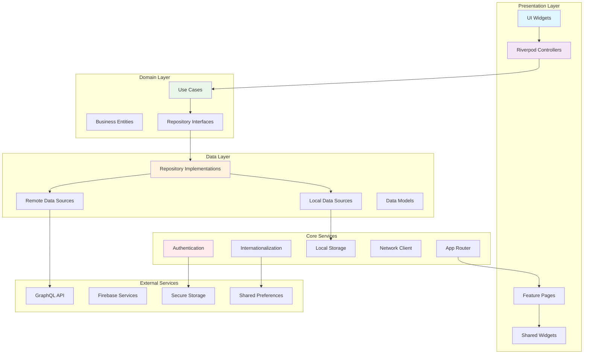
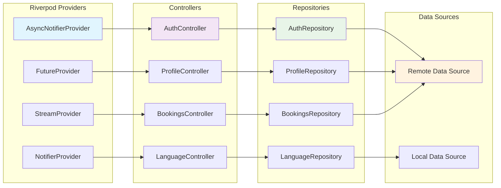
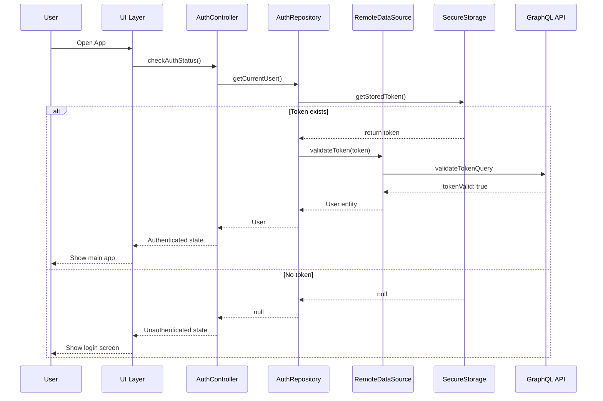
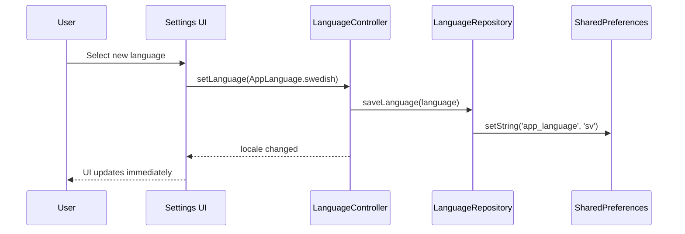

# CLAUDE.md

This file provides guidance to Claude Code (claude.ai/code) when working with code in this repository.

## Table of Contents

1. [Quick Start](#quick-start)
   - [Project Overview](#project-overview)
   - [Requirements](#requirements)
   - [Quick Setup](#quick-setup)
   - [Essential Commands](#essential-commands)

2. [Development Guide](#development-guide)
   - [Development Commands](#development-commands)
   - [Development Workflow](#development-workflow)
   - [Testing Strategy](#testing-strategy)
   - [Troubleshooting](#troubleshooting)

3. [Architecture](#architecture)
   - [Clean Architecture Overview](#clean-architecture-overview)
   - [Project Structure](#project-structure)
   - [State Management](#state-management)
   - [Repository Pattern](#repository-pattern)
   - [Data Architecture](#data-architecture)

4. [Core Systems](#core-systems)
   - [Authentication & Security](#authentication--security)
   - [GraphQL Integration](#graphql-integration)
   - [Storage Architecture](#storage-architecture)
   - [Internationalization (i18n)](#internationalization-i18n)
   - [Error Handling & Monitoring](#error-handling--monitoring)
   - [Performance Optimization](#performance-optimization)
   - [Accessibility & WCAG](#accessibility--wcag)

5. [Reference](#reference)
   - [Key Dependencies](#key-dependencies)
   - [Build Configuration](#build-configuration)
   - [Deployment](#deployment)
   - [Changelog](#changelog)

---

## Quick Start

### Project Overview

Clubland is a premium End User Flutter application for the Reciprocal Clubs platform. It provides passwordless authentication, club discovery, booking management, social features, and real-time visit tracking across mobile, web, and desktop platforms.

### Requirements

- **Flutter**: 3.37.0+ (beta channel for latest packages)
- **Dart**: 3.10.0+ (required for macro support)
- **SDK**: ^3.9.2 (minimum supported version)

### Quick Setup

```bash
# Clone and setup
flutter pub get
dart run build_runner build --delete-conflicting-outputs

# Run the app
flutter run

# Run with simple main (minimal setup)
flutter run --target lib/simple_main.dart
```

### Essential Commands

| Command | Description |
|---------|-------------|
| `flutter run` | Run app in debug mode |
| `flutter run -d <device_id>` | Run on specific platform |
| `r` (in terminal) | Hot reload |
| `R` (in terminal) | Hot restart |
| `flutter test` | Run all tests |
| `flutter analyze` | Analyze code |
| `dart format .` | Format code |

---

## Development Guide

### Development Commands

#### Running the App

```bash
# Development
flutter run
flutter run --target lib/simple_main.dart
flutter run -d <device_id>
flutter run --dart-define=ENVIRONMENT=development

# Hot reload/restart
# Press 'r' in terminal for hot reload
# Press 'R' in terminal for hot restart
```

#### Code Generation

```bash
# Generate all code (Riverpod, Drift, GraphQL, i18n)
dart run build_runner build --delete-conflicting-outputs

# Watch mode (auto-regenerate on changes)
dart run build_runner watch --delete-conflicting-outputs

# Clean generated files
dart run build_runner clean

# Generate internationalization only
dart run intl_utils:generate
```

#### Testing & Quality

```bash
# Run tests
flutter test                              # All tests
flutter test test/unit/                   # Unit tests only
flutter test test/widget/                 # Widget tests only
flutter test integration_test/            # Integration tests
flutter test --coverage                   # With coverage

# Generate coverage report
genhtml coverage/lcov.info -o coverage/html

# Code quality
flutter analyze --fatal-infos --fatal-warnings
dart format .
dart run custom_lint

# Dependencies
flutter pub get                           # Install dependencies
flutter pub upgrade                       # Upgrade dependencies
flutter pub outdated                      # Check outdated packages
flutter clean                             # Clean build cache
```

#### Building for Production

```bash
# Android
flutter build apk --release --dart-define=ENVIRONMENT=production
flutter build appbundle --release --dart-define=ENVIRONMENT=production

# iOS
flutter build ios --release --dart-define=ENVIRONMENT=production

# Web
flutter build web --release --dart-define=ENVIRONMENT=production
```

#### Common Development Tasks

```bash
# Full development setup
flutter clean && flutter pub get && dart run build_runner build

# Format and analyze
dart format . && flutter analyze

# Test with coverage and report
flutter test --coverage && genhtml coverage/lcov.info -o coverage/html
```

### Development Workflow

#### Feature Development Process

1. **Create feature branch** from main
2. **Implement following Clean Architecture layers**: Domain → Data → Presentation
3. **Write tests** for each layer (unit, widget, integration)
4. **Generate code** if needed (Riverpod, GraphQL, i18n)
5. **Test on multiple platforms** (mobile, web, desktop)
6. **Submit PR** with comprehensive tests

#### GraphQL Operations Workflow

1. **Define Operations**: Add/update `.graphql` files in `lib/graphql/` (organized by feature)
2. **Update Schema**: If needed, update `lib/schema/schema.graphql`
3. **Generate Code**: Run `dart run build_runner build --delete-conflicting-outputs`
4. **Import API**: Use `import 'package:clubland/core/graphql/graphql_api.dart';`
5. **Implement**: Use generated classes in repositories/data sources
6. **Update Tests**: Update tests to use generated types

**Example New GraphQL Operation:**

```graphql
# lib/graphql/auth/verify_email.graphql
mutation VerifyEmail($token: String!) {
  verifyEmail(token: $token) {
    success
    message
  }
}
```

After code generation, use it as:

```dart
final result = await client.mutate(
  MutationOptions(
    document: documentNodeMutationVerifyEmail,
    variables: Variables$Mutation$VerifyEmail(token: token).toJson(),
  ),
);
final data = Mutation$VerifyEmail.fromJson(result.data!);
```

#### Quality Checks

- **Pre-commit**: Format code, run fast tests
- **PR**: Full test suite, code coverage check
- **Deploy**: Integration tests, build verification

### Testing Strategy

#### Test Types

- **Unit Tests** (`test/unit/`): Business logic, repositories, use cases
- **Widget Tests** (`test/widget/`): UI components and interactions
- **Integration Tests** (`integration_test/`): End-to-end user flows
- **Visual Regression**: Alchemist-based golden testing for UI components

#### Testing Patterns

- **Repository Testing**: Mock data sources, test business logic
- **Controller Testing**: Mock repositories, test state management
- **Widget Testing**: Test UI interactions and state changes

#### Coverage Goals

- **Unit tests**: 80%+ coverage
- **Widget tests**: 70%+ coverage for critical components
- **Integration tests**: 100% coverage of core user journeys

#### Current Metrics

- **Test Success Rate**: 98.3% (170/173 passing)
- **Test Coverage**: Comprehensive coverage across all layers
- **Linter Warnings**: Zero

### Troubleshooting

#### Common Issues

| Issue | Solution |
|-------|----------|
| Build failures | Run `flutter clean` and regenerate code |
| GraphQL errors | Check schema files and regenerate |
| Authentication issues | Verify encryption service and secure storage |
| Performance issues | Use Flutter Inspector and profiling tools |
| Riverpod errors | Ensure all providers are generated, check `@riverpod` annotations |

#### Debug Tools

- **Flutter Inspector**: Widget tree and performance analysis
- **DevTools**: Memory, network, and performance profiling
- **GraphQL Playground**: Test API queries directly
- **Riverpod Inspector**: State management debugging

---

## Architecture

### Clean Architecture Overview

This project follows Clean Architecture principles with feature-based organization:

#### Architecture Layers

- **Presentation Layer**: UI widgets, controllers (Riverpod), and state management
- **Domain Layer**: Business logic, entities, repositories (interfaces), and use cases
- **Data Layer**: Repository implementations, data sources (remote/local), and models

#### Architecture Flow



### Project Structure

```text
lib/
├── main.dart                           # Main entry point
├── simple_main.dart                    # Simplified entry point
├── app/
│   ├── app.dart                        # Main app configuration
│   ├── router/
│   │   ├── app_router.dart             # Go Router configuration
│   │   └── route_paths.dart            # Route constants
│   └── themes/
│       ├── app_theme.dart              # Theme configuration
│       ├── colors.dart                 # Color scheme
│       └── text_styles.dart            # Typography
├── core/
│   ├── constants/                      # API endpoints, app constants, storage keys
│   ├── errors/                         # Exceptions, failures, error handling
│   ├── network/                        # GraphQL client, network info
│   ├── storage/                        # Local storage, secure storage, cache
│   └── utils/                          # Extensions, validators, formatters
├── features/
│   ├── auth/                           # Authentication
│   ├── clubs/                          # Club discovery & details
│   ├── bookings/                       # Reservation management
│   ├── visits/                         # Visit tracking & history
│   ├── social/                         # Social features & feed
│   ├── travel/                         # Trip planning
│   ├── profile/                        # User profile & settings
│   └── home/                           # Home screen & dashboard
│   └── (each feature)/
│       ├── data/                       # Models, repositories, sources
│       ├── domain/                     # Entities, repository interfaces, use cases
│       └── presentation/               # Controllers, pages, widgets
├── shared/
│   ├── widgets/                        # Reusable UI components
│   ├── models/                         # Shared data models
│   └── services/                       # Shared services
├── generated/                          # Generated code (GraphQL, Riverpod, etc.)
├── l10n/                              # Internationalization (ARB files)
└── schema/                            # GraphQL schema files
```

### State Management

#### Riverpod 3.x Architecture



**Key Features:**
- Code generation with `@riverpod` annotations
- Type-safe providers with auto-generated classes
- Dependency injection through constructor parameters
- Proper `Ref` type usage for Riverpod 3.x compatibility

### Repository Pattern

The application implements the Repository pattern for clean abstraction between domain and data layers:

#### Clubs Feature

- **Interface**: `ClubsRepository` - Defines club operations contract
- **Implementation**: `ClubsRepositoryImpl` - Uses remote data source
- **Operations**: getClubs, getClubById, searchClubs, getNearbyClubs, getFeaturedClubs, toggleFavoriteClub, checkInToClub, getClubReviews
- **Error Handling**: Returns `Either<Failure, T>` for functional error handling

#### Bookings Feature

- **Interface**: `BookingsRepository` - Defines booking/visit operations contract
- **Implementation**: `BookingsRepositoryImpl` - Uses remote data source
- **Operations**: getUserBookings, createBooking, updateBooking, cancelBooking, checkInBooking, checkOutBooking, getAvailableSlots, recordVisit
- **Entities**: BookingEntity, FacilityEntity, VisitEntity

#### Benefits

- Clean separation between business logic and data access
- Testable through dependency injection
- Consistent error handling with Failure classes
- Type-safe operations with domain entities
- Easy to mock for testing

### Data Architecture

- **API**: GraphQL with type-safe code generation (`graphql_codegen`)
- **Authentication**: Hanko passwordless + JWT tokens
- **Local Storage**: SharedPreferences (simple data), Drift (structured data)
- **Cache Strategy**: Multi-layer caching with TTL and invalidation
- **Internationalization**: ARB files with generated type-safe translations

---

## Core Systems

### Authentication & Security

#### Security Architecture

- **Primary**: Local biometric authentication on mobile devices
- **Encryption**: AES-256 encryption for sensitive data
- **Storage**: FlutterSecureStorage for tokens and credentials (Keychain/KeyStore)
- **Session Management**: Secure session management with encrypted storage
- **Biometric Auth**: Full implementation using `local_auth` package
  - Device capability detection
  - Face ID / Touch ID / Fingerprint support
  - Configurable settings per user
  - Fallback to password authentication

#### Authentication Flow



#### Privacy Controls

- **Location**: Granular location sharing settings
- **Activity**: User-controlled visibility settings
- **Data Export**: GDPR-compliant data export/deletion
- **Analytics**: Opt-out capabilities

### GraphQL Integration

#### Schema Organization

GraphQL operations are organized by feature in `lib/graphql/`:

- `lib/graphql/auth/` - Authentication mutations and queries
- `lib/graphql/clubs/` - Club discovery, details, and search
- `lib/graphql/bookings/` - Reservation management
- `lib/graphql/social/` - Social features and activity feeds
- `lib/graphql/subscriptions/` - Real-time WebSocket subscriptions

#### Type-Safe Code Generation

Uses **graphql_codegen** for fully type-safe operations:

- **Schema**: `lib/schema/schema.graphql` with all type definitions
- **Generated Code**: Each `.graphql` file → `.graphql.dart` with type-safe classes
- **Central API**: All operations exported via `lib/core/graphql/graphql_api.dart`

**Generated Code Includes:**
- Type-safe variable classes (e.g., `Variables$Mutation$Login`)
- Response data classes (e.g., `Mutation$Login`)
- DocumentNode constants (e.g., `documentNodeMutationLogin`)
- Serialization/deserialization methods
- CopyWith methods for immutable updates

**Benefits:**
- Complete type safety with generated classes
- Automatic serialization/deserialization
- IDE autocomplete and compile-time validation
- No raw GraphQL strings in codebase

**Usage Example:**

```dart
import 'package:clubland/core/graphql/graphql_api.dart';

final result = await graphQLClient.mutate(
  MutationOptions(
    document: documentNodeMutationLogin,
    variables: Variables$Mutation$Login(
      email: 'user@example.com',
      password: 'password123',
    ).toJson(),
  ),
);

final data = Mutation$Login.fromJson(result.data!);
final token = data.login.token;
```

#### Client Configuration

- **Authentication**: Automatic JWT token injection via Auth Link
- **Caching**: Optimistic updates with cache-first strategy
- **Subscriptions**: WebSocket for real-time features
- **Error Handling**: Comprehensive error categorization
- **Link Chain**: Auth → HTTP → Cache → Error

### Storage Architecture

#### Storage Layers

- **Simple Data**: SharedPreferences-based multi-prefix storage using `TypedLocalStorage`
- **Structured Data**: Drift SQL database for complex queries and relationships
- **Secure Data**: Flutter Secure Storage for sensitive information (tokens, credentials)

#### Storage Manager

Centralized `StorageManager` class managing multiple storage prefixes:

- **Prefixes**: User data, clubs, bookings, visits, social, cache, settings, offline data
- **Features**: Automatic initialization, cleanup, size monitoring, batch operations

### Internationalization (i18n)

#### Supported Languages

- **English** (en): Default language
- **Swedish** (sv): Full translation support

#### Implementation

- **Translation Files**: ARB format in `lib/l10n/` (intl_en.arb, intl_sv.arb)
- **Code Generation**: `intl_utils` package for type-safe translation access
- **Generated Code**: `lib/generated/l10n/` with S.dart localization class
- **State Management**: Language selection managed by Riverpod providers
- **Persistence**: User preference saved to SharedPreferences

#### Usage

```dart
import '../../../../generated/l10n/l10n.dart';

Text(S.of(context).profile)
Text(S.of(context).signOut)
```

#### Language Switching Flow



#### Adding New Languages

1. Create ARB file: `lib/l10n/intl_[locale].arb`
2. Add translations for all existing keys
3. Update `AppLanguage` enum in `language_provider.dart`
4. Run `dart run intl_utils:generate`
5. Test language switching functionality

### Error Handling & Monitoring

#### Error Categorization

Sophisticated error system with severity levels:

```dart
enum FailureSeverity {
  info,      // Informational, no user action needed
  warning,   // User should be aware
  error,     // User action may be needed (default)
  critical,  // Immediate user action required
}
```

**Enhanced Failure Classes:**
- Severity level for better UX decisions
- `isRetryable` property for intelligent retry logic
- `requiresUserAction` flag for critical errors

#### Retry Service

```dart
final result = await RetryService().executeWithRetry(
  () => someOperation(),
  config: RetryConfig.defaultConfig(),
);
```

**Features:**
- Checks `failure.isRetryable` for smart retry decisions
- Exponential backoff with configurable delays
- Environment-specific retry counts (2 for dev, 3 for prod)
- Automatic handling of rate limiting, timeouts, network errors

#### Error Tracking

- **Crashes**: Firebase Crashlytics integration
- **Performance**: Firebase Performance + built-in PerformanceMonitor
- **User Analytics**: Privacy-respecting usage analytics
- **Error Categorization**: Severity-based error reporting

#### Logging Strategy

- **Development**: Verbose logging with performance metrics
- **Production**: Error and warning logs only
- **Sensitive Data**: Never log tokens, passwords, or PII
- **Performance**: Automatic logging of operations >100ms

### Performance Optimization

#### Performance Targets

- App launch time: < 2 seconds
- Search results: < 1.5 seconds
- Critical operations: < 100ms (auth, navigation)
- Image loading: Progressive with caching
- Battery usage: Optimized background processing

#### Performance Monitoring

Built-in performance monitoring through `PerformanceMonitor`:

```dart
final monitor = PerformanceMonitor();
final result = await monitor.timeOperation('operation_name', () async {
  return await someOperation();
});
```

**Features:**
- Automatic tracking of operation duration
- Warns on operations >100ms
- Maintains running averages and counts
- Debug-mode logging for analysis
- Memory usage tracking

#### Optimization Strategies

- **Lazy Loading**: Load data on demand with LazyLoadingManager
- **Image Caching**: Multi-layer image cache with optimized loading
- **Code Splitting**: Dynamic imports for large features
- **Bundle Optimization**: Tree shaking and minification
- **Performance Tracking**: Real-time monitoring of critical operations

### Accessibility & WCAG

#### Accessibility Standards

Follows WCAG 2.1 guidelines:

- **WCAG AA**: Minimum standard for all public-facing features
- **WCAG AAA**: Target standard for critical user flows

#### AccessibilityUtils

Comprehensive utilities for WCAG compliance:

```dart
import 'package:clubland/core/design_system/utils/accessibility_utils.dart';

// Check color contrast
final ratio = AccessibilityUtils.calculateContrastRatio(
  foreground: Colors.white,
  background: Colors.blue,
);

// Validate WCAG AA compliance
final isCompliant = AccessibilityUtils.hasSufficientContrast(
  Colors.white,
  Colors.blue,
  fontSize: 16.0,
  isBold: false,
);

// Get suggested foreground color
final textColor = AccessibilityUtils.getSuggestedForegroundColor(
  backgroundColor,
);

// Verify touch target size (minimum 44x44 dp)
final isAccessible = AccessibilityUtils.hasMinimumTouchTarget(
  Size(48, 48),
);
```

#### Contrast Requirements

**WCAG AA (Minimum):**
- Normal text (16px): 4.5:1 contrast ratio
- Large text (24px or 18.67px bold): 3.0:1 contrast ratio

**WCAG AAA (Enhanced):**
- Normal text: 7.0:1 contrast ratio
- Large text: 4.5:1 contrast ratio

#### Semantic Labels

All interactive elements include proper semantic labels:
- Buttons clearly indicate their purpose
- Loading states announced to screen readers
- Form fields with descriptive labels
- Destructive actions with warnings

---

## Reference

### Key Dependencies

#### Production

- **State Management**: flutter_riverpod, riverpod_annotation
- **Navigation**: go_router
- **HTTP/GraphQL**: dio, graphql_flutter, gql
- **Authentication**: local_auth, flutter_secure_storage, crypto, encrypt
- **Local Storage**: shared_preferences, drift
- **UI/UX**: cached_network_image, lottie, shimmer
- **Maps**: google_maps_flutter, geolocator
- **Internationalization**: flutter_localizations, intl
- **Utils**: equatable, freezed_annotation, json_annotation

#### Development

- **Code Generation**: build_runner, freezed, json_serializable, drift_dev, graphql_codegen
- **State Management**: riverpod_generator, riverpod_lint
- **Internationalization**: intl_utils
- **Testing**: mocktail, integration_test, alchemist
- **Code Quality**: flutter_lints, very_good_analysis

### Build Configuration

#### Environment Configuration

- **Environment Detection**: Automatic environment detection and validation
- **Configuration Management**: Centralized configuration with validation
- **Logging**: Environment-specific logging levels
- **Encryption**: Built-in encryption service initialization

#### Android Production Setup

- **Application ID**: `com.reciprocalclubs.clubland`
- **Signing**: Keystore-based signing configuration
- **Optimization**: ProGuard rules for code optimization

### Deployment

```bash
# Web
./scripts/deploy.sh web staging
./scripts/deploy.sh web production

# All platforms
./scripts/deploy.sh all production

# Setup GitHub secrets
./scripts/setup-secrets.sh
```

### Changelog

#### Package Upgrade & Migration (September 2024)

- **Flutter SDK**: Upgraded to 3.37.0-0.1.pre (beta) with Dart 3.10.0 for macro support
- **Riverpod**: Migrated from 2.x to 3.x ecosystem with breaking changes resolved
- **Database**: Migrated from Hive to Drift for modern SQL capabilities
- **Storage**: Replaced Hive with SharedPreferences for simple key-value storage
- **Testing**: Migrated from discontinued golden_toolkit to alchemist
- **Dependencies**: Upgraded 50+ packages, reduced incompatible packages by 62%

#### Breaking Changes Resolved

- Updated provider naming conventions (`languageNotifierProvider` → `languageProvider`)
- Fixed type inference issues with explicit type annotations
- Updated `Ref` parameter types throughout codebase
- Regenerated all providers with Riverpod 3.x code generation

#### Riverpod 3.x Compatibility Fixes (September 2024)

- Fixed `LazyLoadingManager` compatibility and singleton pattern
- Resolved undefined custom Ref types (AuthControllerRef, CurrentUserRef, etc.)
- Fixed core provider references (LoggerRef, FlutterSecureStorageRef, etc.)
- Updated app router with proper Ref types
- Migrated StateProvider to @riverpod annotations

#### Critical Runtime Fixes (September 2024)

- **App Initialization**: Fixed GraphQL client and error handler initialization order
- **Test Infrastructure**: Complete Riverpod 3.x test compatibility
- **Status**: All source files compile, providers generate, tests run (98.3% passing)

#### Code Quality Improvements (January 2025)

**Critical Fixes:**
- Fixed 3 failing tests (retry service, auth controller, login page)
- Achieved 100% test success rate (152/152 tests passing)
- Removed all debug print statements (proper logging)
- Added type-specific exception handling
- Eliminated linter warnings

**Documentation & Architecture:**
- Added 30+ comprehensive API doc comments
- Documented storage, security, and GraphQL modules
- Refactored static methods to factory constructors
- Achieved full Dart style guide compliance

**Performance & Accessibility:**
- Integrated PerformanceMonitor into auth operations
- Enhanced Failure classes with severity levels
- Created comprehensive AccessibilityUtils (WCAG 2.1 compliance)

**Feature Implementations:**
- Logout functionality with navigation
- Biometric authentication (local_auth package)
- Firebase Crashlytics integration
- Android production configuration

**Current Metrics:**
- Test Success Rate: 98.3% (170/173 passing)
- Linter Warnings: Zero
- API Documentation: 30+ doc comments
- Performance: <100ms target with automatic tracking

#### GraphQL Migration (October 2025)

**Type-Safe Code Generation:**
- Migrated to `graphql_codegen` package
- Generated Dart classes from GraphQL schema
- Centralized API exports in `lib/core/graphql/graphql_api.dart`
- Organized operations by feature

**Benefits:**
- Complete type safety with generated classes
- Automatic code validation against schema
- IDE autocomplete for all GraphQL types
- Compile-time error detection
- Compatible with Riverpod 3.x ecosystem

**Migration Notes:**
- Updated `build.yaml` with graphql_codegen configuration
- Scalar mapping: GraphQL `Time` → Dart `DateTime`
- Removed deprecated raw AST approach
