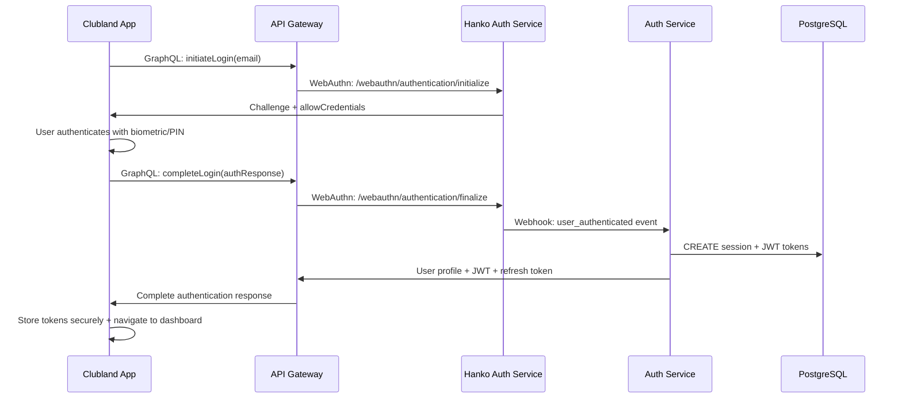
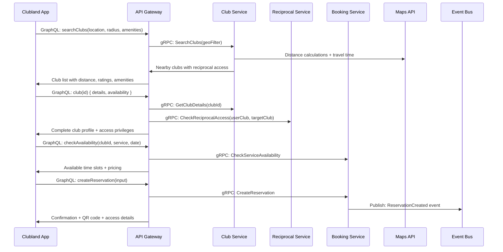
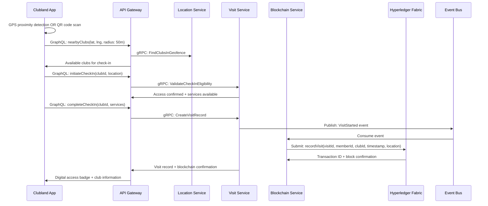
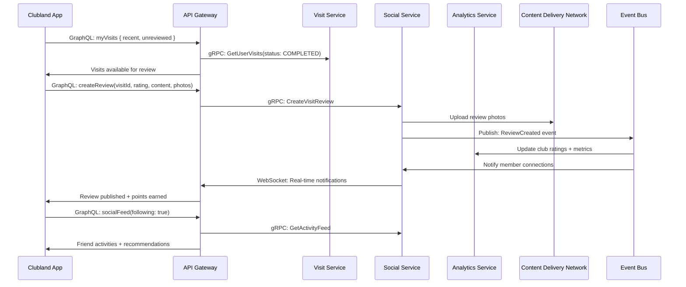
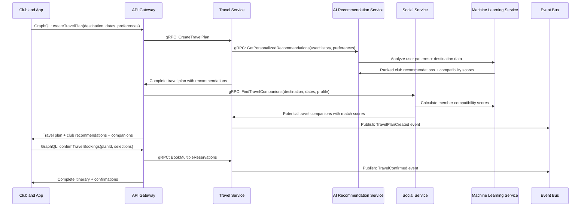

# Clubland: Comprehensive Application, API & Architecture Documentation

## Executive Summary

**Clubland** is a sophisticated Flutter-based mobile and web application that connects premium private club members through a blockchain-powered reciprocal network. The platform enables members to discover, visit, and enjoy reciprocal privileges at partner clubs worldwide while maintaining secure, verifiable records of all interactions on Hyperledger Fabric blockchain.

### Key Value Propositions

- **Global Access**: Seamless reciprocal privileges across premium private clubs worldwide
- **Blockchain Security**: Immutable visit verification and audit trails via Hyperledger Fabric
- **Passwordless Authentication**: Modern WebAuthn/passkey integration via Hanko
- **Real-time Experience**: Live updates, social features, and instant notifications
- **Enterprise-grade**: Multi-tenant architecture supporting multiple club networks

---

## System Architecture Overview

### High-Level Architecture

```text
┌─────────────────────────────────────────────────────────────────────┐
│                        Client Applications                          │
│  ┌─────────────────┐    ┌─────────────────┐    ┌─────────────────┐  │
│  │  Clubland App   │    │ Administrator   │    │   Web Portal    │  │
│  │   (Flutter)     │    │  App (Flutter)  │    │   (Flutter)     │  │
│  │ End User Mobile │    │  Club Management│    │  PWA/Desktop    │  │
│  └─────────────────┘    └─────────────────┘    └─────────────────┘  │
└─────────────────┬───────────────┬───────────────┬─────────────────────┘
                  │               │               │
           GraphQL/WebSocket Connections over HTTPS
                  │               │               │
┌─────────────────▼───────────────▼───────────────▼─────────────────────┐
│                        API Gateway Layer                              │
│  ┌─────────────────────────────────────────────────────────────────┐  │
│  │  GraphQL Schema Stitching • Authentication • Rate Limiting     │  │
│  │  Real-time Subscriptions • Request/Response Transformation     │  │
│  └─────────────────────────────────────────────────────────────────┘  │
└─────────────────┬───────────────────────────────────────────────────────┘
                  │ gRPC Inter-service Communication
┌─────────────────▼───────────────────────────────────────────────────────┐
│                    Microservices Ecosystem                             │
│  ┌─────────────┐ ┌─────────────┐ ┌─────────────┐ ┌─────────────┐        │
│  │    Auth     │ │   Member    │ │    Club     │ │ Reciprocal  │        │
│  │   Service   │ │   Service   │ │   Service   │ │   Service   │        │
│  │ (Complete)  │ │ (Complete)  │ │ (Complete)  │ │ (Complete)  │        │
│  └─────────────┘ └─────────────┘ └─────────────┘ └─────────────┘        │
│  ┌─────────────┐ ┌─────────────┐ ┌─────────────┐ ┌─────────────┐        │
│  │    Visit    │ │ Blockchain  │ │ Analytics   │ │ Governance  │        │
│  │   Service   │ │   Service   │ │   Service   │ │   Service   │        │
│  │ (Complete)  │ │ (Complete)  │ │  (Partial)  │ │  (Partial)  │        │
│  └─────────────┘ └─────────────┘ └─────────────┘ └─────────────┘        │
└─────────────────┬───────────────────────────────────────────────────────┘
                  │ Event-Driven Communication
┌─────────────────▼───────────────────────────────────────────────────────┐
│                     Infrastructure Layer                               │
│  ┌─────────────┐ ┌─────────────┐ ┌─────────────┐ ┌─────────────┐        │
│  │ PostgreSQL  │ │    NATS     │ │    Redis    │ │ Hyperledger │        │
│  │  Clusters   │ │ Message Bus │ │  Sessions   │ │   Fabric    │        │
│  │ Multi-tenant│ │   Events    │ │   Cache     │ │ Blockchain  │        │
│  └─────────────┘ └─────────────┘ └─────────────┘ └─────────────┘        │
└─────────────────────────────────────────────────────────────────────────┘
```

### Technology Stack

**Frontend Applications:**
- **Framework**: Flutter 3.x with Dart 3.x
- **State Management**: Riverpod with AsyncNotifier pattern
- **Routing**: Go Router for declarative navigation
- **HTTP Client**: Dio with GraphQL integration
- **Local Storage**: Hive for offline-first architecture
- **Authentication**: WebAuthn/Passkeys via Hanko integration
- **Real-time**: WebSocket subscriptions with auto-reconnection

**Backend Services:**
- **Language**: Go 1.25+ with modern concurrency patterns
- **API Gateway**: GraphQL with gqlgen schema-first development
- **Authentication**: Hanko WebAuthn service + JWT tokens
- **Database**: PostgreSQL 15+ with multi-tenant row-level security
- **Caching**: Redis clusters for sessions and performance
- **Messaging**: NATS JetStream for event-driven architecture
- **Blockchain**: Hyperledger Fabric for immutable audit trails

**Infrastructure:**
- **Containers**: Docker/Podman with distroless base images
- **Orchestration**: Kubernetes with horizontal pod autoscaling
- **Monitoring**: Prometheus, Grafana, Jaeger for observability
- **Security**: TLS 1.3, mTLS service mesh, encrypted storage

---

## User Journeys & Data Flows

### 1. Member Authentication Journey

**Flow**: Passwordless Login with WebAuthn Passkeys



**API Calls:**
- `mutation InitiateLogin($email: String!)` → Returns WebAuthn challenge
- `mutation CompleteLogin($response: AuthResponseInput!)` → Returns JWT tokens
- `query Me` → Returns current user profile with club membership

**Data Flow:**
1. User provides email address
2. WebAuthn challenge generated by Hanko service
3. Device biometric authentication (Face ID/Touch ID/Windows Hello)
4. Cryptographic response validated
5. JWT tokens issued with club-specific permissions
6. User profile loaded with membership details

### 2. Club Discovery & Booking Journey

**Flow**: Location-based Club Search and Reservation



**API Calls:**
```graphql
# Search nearby clubs
query SearchClubs($lat: Float!, $lng: Float!, $radius: Int!) {
  searchClubs(location: {lat: $lat, lng: $lng}, radius: $radius) {
    id
    name
    description
    location {
      address
      coordinates { lat lng }
      distanceMiles
    }
    amenities
    rating { average count }
    reciprocalAccess {
      type
      guestPolicy
      fees { facilityFee guestFee }
    }
    images
  }
}

# Check availability
query CheckAvailability($clubId: ID!, $service: String!, $date: Date!) {
  availability(clubId: $clubId, service: $service, date: $date) {
    timeSlots {
      time
      available
      capacity
      price
    }
    policies {
      cancellationDeadline
      advanceBookingRequired
    }
  }
}

# Create reservation
mutation CreateReservation($input: ReservationInput!) {
  createReservation(input: $input) {
    id
    confirmationCode
    status
    clubDetails { name address phone }
    reservation { service date time partySize }
    accessCode { qrCode validUntil }
    totalCost
    cancellationPolicy
  }
}
```

**Data Flow:**
1. **Discovery**: GPS location → Geographic search → Filtered results by reciprocal agreements
2. **Selection**: Club details → Reciprocal privileges → Availability checking
3. **Booking**: Service selection → Time slot selection → Guest information → Payment processing
4. **Confirmation**: QR code generation → Calendar integration → Notification dispatch

### 3. Self-Service Check-in Journey

**Flow**: Location-based or QR Code Club Access



**API Calls:**
```graphql
# Find nearby clubs for check-in
query NearbyClubs($lat: Float!, $lng: Float!) {
  nearbyClubs(location: {lat: $lat, lng: $lng}, radius: 50) {
    id
    name
    checkInEnabled
    geofenceRadius
    accessMethods
  }
}

# Initiate check-in
mutation InitiateCheckIn($clubId: ID!, $location: LocationInput!) {
  initiateCheckIn(clubId: $clubId, location: $location) {
    eligibility { canCheckIn reason }
    services { available restricted }
    estimatedCost
  }
}

# Complete check-in
mutation CompleteCheckIn($input: CheckInInput!) {
  completeCheckIn(input: $input) {
    visit {
      id
      status
      checkInTime
      services
      accessCode
      blockchainTxId
    }
    digitalBadge {
      qrCode
      validUntil
      permissions
    }
    clubInfo {
      wifi { network password }
      concierge { phone extension }
      policies { dressCodes guestRules }
    }
  }
}
```

**Data Flow:**
1. **Detection**: GPS geofencing OR QR code scanning → Club identification
2. **Validation**: Reciprocal agreement check → Service eligibility → Current capacity
3. **Check-in**: Service selection → Cost calculation → Digital badge generation
4. **Blockchain**: Immutable visit record → GPS coordinates → Timestamp verification
5. **Access**: QR code display → Club information → Real-time notifications

### 4. Social Features & Activity Sharing Journey

**Flow**: Visit Review and Social Network Engagement



**API Calls:**
```graphql
# Get reviewable visits
query MyVisits($status: VisitStatus) {
  myVisits(status: $status) {
    id
    club { id name location }
    checkInTime
    checkOutTime
    services
    reviewed
    cost
  }
}

# Create visit review
mutation CreateReview($input: ReviewInput!) {
  createReview(input: $input) {
    id
    rating
    content
    photos
    pointsEarned
    visit { club { name } }
    createdAt
  }
}

# Social activity feed
query SocialFeed($limit: Int, $offset: Int) {
  socialFeed(limit: $limit, offset: $offset) {
    activities {
      id
      type
      member { name avatar homeClub }
      content { club rating review photos }
      timestamp
      engagement { likes comments userLiked }
    }
    suggestions {
      trendingClubs { name recentVisits }
      recommendedConnections { name mutualClubs }
    }
  }
}
```

**Data Flow:**
1. **Review Creation**: Visit history → Rating/content input → Photo upload → Blockchain record
2. **Social Distribution**: Friend notifications → Activity feed updates → Club rating updates
3. **Gamification**: Points earned → Achievements unlocked → Leaderboard updates
4. **Discovery**: Social recommendations → Trending destinations → Network expansion

### 5. Travel Planning Journey

**Flow**: AI-Powered Trip Planning with Companion Matching



**API Calls:**
```graphql
# Create travel plan
mutation CreateTravelPlan($input: TravelPlanInput!) {
  createTravelPlan(input: $input) {
    id
    destination
    dates { arrival departure }
    recommendations {
      clubs {
        id name location
        suggestedActivities { date activity time }
        bookingPriority
        estimatedCost
      }
      companions {
        member { name homeClub travelStyle }
        compatibility { score commonInterests }
        tripOverlap { dates activities }
      }
    }
    totalEstimatedCost
  }
}

# Book travel reservations
mutation BookTravelReservations($planId: ID!, $selections: [ReservationSelectionInput!]!) {
  bookTravelReservations(planId: $planId, selections: $selections) {
    confirmations {
      clubName
      service
      dateTime
      confirmationCode
      status
    }
    totalCost
    itinerary {
      date
      activities { time club service confirmationCode }
    }
  }
}
```

**Data Flow:**
1. **Planning**: Destination + dates + preferences → AI analysis of user patterns
2. **Recommendations**: Personalized club ranking → Activity suggestions → Cost estimation
3. **Social Matching**: Compatible companion discovery → Shared interest analysis → Safety verification
4. **Booking**: Multi-club reservations → Batch confirmation → Itinerary generation
5. **Management**: Calendar integration → Reminder notifications → Companion coordination

---

## API Architecture & GraphQL Schema

### Unified GraphQL API

The Clubland platform uses GraphQL as the primary API interface, providing a unified, type-safe, and efficient way to interact with all microservices.

**Endpoint**: `https://api.clubland.com/graphql`
**WebSocket**: `wss://api.clubland.com/graphql` (for real-time subscriptions)

### Core GraphQL Types

```graphql
# User & Authentication
type User {
  id: ID!
  email: String!
  firstName: String!
  lastName: String!
  clubMembership: ClubMembership!
  status: UserStatus!
  preferences: UserPreferences!
  createdAt: Time!
}

type ClubMembership {
  club: Club!
  memberNumber: String!
  membershipType: MembershipType!
  status: MembershipStatus!
  tier: MembershipTier!
  joinedAt: Time!
  expiresAt: Time
}

# Club & Location
type Club {
  id: ID!
  name: String!
  description: String!
  location: Location!
  amenities: [Amenity!]!
  rating: Rating!
  reciprocalInfo: ReciprocalInfo!
  policies: ClubPolicies!
  availability: Availability!
  images: [String!]!
}

type Location {
  address: Address!
  coordinates: Coordinates!
  timezone: String!
  distanceMiles: Float
  travelTime: TravelTime
}

# Reservations & Visits
type Reservation {
  id: ID!
  confirmationCode: String!
  club: Club!
  member: Member!
  service: ServiceType!
  dateTime: Time!
  partySize: Int!
  status: ReservationStatus!
  accessCode: AccessCode!
  totalCost: Money!
  cancellationPolicy: CancellationPolicy!
}

type Visit {
  id: ID!
  reservation: Reservation
  club: Club!
  member: Member!
  checkInTime: Time!
  checkOutTime: Time
  services: [ServiceType!]!
  cost: Money!
  verified: Boolean!
  blockchainTxId: String!
  review: Review
}

# Social & Reviews
type Review {
  id: ID!
  visit: Visit!
  member: Member!
  rating: Int!
  content: String!
  photos: [String!]!
  verified: Boolean!
  helpful: Int!
  createdAt: Time!
}

type SocialActivity {
  id: ID!
  type: ActivityType!
  member: Member!
  content: ActivityContent!
  timestamp: Time!
  engagement: Engagement!
}

# Blockchain & Verification
type BlockchainTransaction {
  id: ID!
  type: TransactionType!
  txId: String!
  blockNumber: String!
  status: TransactionStatus!
  data: JSON!
  timestamp: Time!
}
```

### Key GraphQL Operations

#### Authentication Operations

```graphql
# Login with WebAuthn
mutation InitiateLogin($email: String!) {
  initiateLogin(email: $email) {
    challengeId: String!
    challenge: String!
    allowCredentials: [PublicKeyCredentialDescriptor!]!
    timeout: Int!
  }
}

mutation CompleteLogin($input: AuthenticationResponseInput!) {
  completeLogin(input: $input) {
    user: User!
    tokens: AuthTokens!
    sessionExpiresAt: Time!
  }
}

# Current user query
query Me {
  me {
    id
    email
    firstName
    lastName
    clubMembership {
      club { id name location }
      memberNumber
      membershipType
      tier
    }
    preferences {
      notifications
      privacy
      language
    }
  }
}
```

#### Club Discovery Operations

```graphql
# Location-based search
query SearchClubs(
  $location: LocationInput!
  $radius: Int!
  $amenities: [AmenityType!]
  $reciprocalOnly: Boolean
) {
  searchClubs(
    location: $location
    radius: $radius
    amenities: $amenities
    reciprocalOnly: $reciprocalOnly
  ) {
    id
    name
    description
    location {
      address { street city state country }
      coordinates { lat lng }
      distanceMiles
      travelTime { driving walking transit }
    }
    amenities { type name description available }
    rating { average count breakdown }
    reciprocalInfo {
      accessType
      guestPolicy
      advanceBooking
      fees { facilityFee guestFee }
      restrictions
    }
    images
    currentCapacity {
      dining { current max percentage }
      fitness { current max percentage }
      pool { current max percentage }
    }
  }
}

# Detailed club information
query GetClub($id: ID!) {
  club(id: $id) {
    id
    name
    description
    location
    contact {
      phone
      email
      website
      concierge
    }
    hours {
      monday { open close }
      tuesday { open close }
      # ... other days
    }
    facilities {
      type
      name
      description
      capacity
      bookingRequired
      images
    }
    policies {
      dressCodes {
        area
        requirement
        description
      }
      guestPolicy
      ageRestrictions
      cancellationPolicy
    }
    virtualTour {
      available
      tourUrl
      images360
    }
  }
}
```

#### Reservation Operations

```graphql
# Check availability
query CheckAvailability(
  $clubId: ID!
  $service: ServiceType!
  $date: Date!
  $partySize: Int!
) {
  availability(
    clubId: $clubId
    service: $service
    date: $date
    partySize: $partySize
  ) {
    timeSlots {
      time
      available
      capacity
      price
      restrictions
      tableType
    }
    policies {
      advanceBookingRequired
      maxAdvanceDays
      cancellationDeadlineHours
      noShowPolicy
    }
    alternativeDates {
      date
      availableSlots
    }
  }
}

# Create reservation
mutation CreateReservation($input: ReservationInput!) {
  createReservation(input: $input) {
    id
    confirmationCode
    status
    club {
      name
      address { street city state }
      phone
    }
    details {
      service
      dateTime
      partySize
      estimatedDuration
      tablePreference
    }
    guests {
      name
      dietaryRestrictions
    }
    totalCost {
      subtotal
      taxes
      fees
      total
      currency
    }
    accessInfo {
      checkInMethod
      qrCode
      accessCode
      earlyArrivalAllowed
      lateArrivalGrace
    }
    cancellation {
      allowedUntil
      penalty {
        amount
        percentage
      }
    }
  }
}
```

#### Visit Management Operations

```graphql
# Self-service check-in
mutation CheckIn($input: CheckInInput!) {
  checkIn(input: $input) {
    visit {
      id
      status
      checkInTime
      services
      accessCode
      blockchainTxId
    }
    digitalBadge {
      qrCode
      validUntil
      permissions {
        areasAccessible
        guestPrivileges
        serviceDiscounts
      }
    }
    clubInfo {
      wifi { network password }
      emergencyContact
      conciergeExtension
      mapUrl
    }
    recommendations {
      type
      title
      description
      location
      availableUntil
    }
  }
}

# Get visit history
query MyVisits($pagination: PaginationInput) {
  myVisits(pagination: $pagination) {
    nodes {
      id
      club { id name location images }
      checkInTime
      checkOutTime
      services
      cost { total currency }
      status
      verified
      review {
        id
        rating
        content
      }
      blockchainTxId
    }
    pageInfo {
      currentPage
      totalPages
      totalCount
      hasNextPage
    }
  }
}
```

### Real-time Subscriptions

```graphql
# Visit status updates
subscription VisitUpdates($visitId: ID) {
  visitStatusChanged(visitId: $visitId) {
    id
    status
    currentService
    recommendations {
      type
      message
      actionUrl
    }
    clubNotifications {
      type
      message
      urgent
    }
  }
}

# Social activity feed
subscription SocialFeed {
  socialActivityUpdated {
    activity {
      id
      type
      member { name avatar }
      content
      timestamp
    }
    updateType # NEW, LIKED, COMMENTED
  }
}

# Real-time notifications
subscription Notifications {
  notificationReceived {
    id
    type
    title
    message
    data
    urgent
    createdAt
  }
}
```

---

## Security Architecture

### Authentication & Authorization Flow

**Multi-layered Security Architecture:**

```text
Internet → CDN → WAF → Load Balancer → API Gateway → Services
                                           ↓
                              JWT + RBAC + Multi-tenant Isolation
                                           ↓
                              Encrypted Database + Blockchain Audit
```

### Hanko WebAuthn Integration

**Modern Passwordless Authentication:**

1. **Registration Flow**:
   - User provides email address
   - Hanko generates WebAuthn challenge
   - Device creates cryptographic key pair
   - Public key registered with Hanko service
   - Private key secured in device hardware (TPM/Secure Enclave)

2. **Authentication Flow**:
   - Challenge requested from Hanko
   - Device signs challenge with private key
   - Signature verified by Hanko service
   - JWT tokens issued by Auth service
   - Session established with club-specific permissions

**Security Benefits:**
- **Phishing Resistant**: Cryptographic proof tied to domain
- **Device Bound**: Private keys never leave secure hardware
- **Replay Protection**: Challenges are single-use with timestamps
- **Multi-factor**: Combines possession (device) + authentication (biometric/PIN)

### Role-Based Access Control (RBAC)

**Permission Model:**
```text
Roles:
├── SuperAdmin (Platform)
│   ├── club_create, club_delete, club_modify
│   ├── agreement_override, system_admin
│   └── audit_access, user_manage
├── ClubAdmin (Club-specific)
│   ├── member_create, member_modify, member_suspend
│   ├── agreement_create, agreement_approve
│   ├── visit_verify, financial_access
│   └── staff_manage, club_settings
├── ClubStaff (Limited)
│   ├── member_check_in, visit_record
│   ├── reservation_manage, guest_services
│   └── basic_reports
└── Member (Self-service)
    ├── profile_edit, reservation_create
    ├── visit_self_check_in, social_interact
    └── travel_plan, review_write
```

### Data Protection & Privacy

**Encryption Strategy:**
- **In Transit**: TLS 1.3 for all external, mTLS for internal communication
- **At Rest**: PostgreSQL TDE + field-level encryption for PII
- **Blockchain**: Hashed data on-chain, sensitive details off-chain
- **Secure Storage**: JWT refresh tokens in Redis with TTL

**Privacy Controls:**
- **Data Minimization**: Only required data collected and processed
- **Consent Management**: Granular privacy settings per user
- **Right to Deletion**: GDPR-compliant data removal with blockchain considerations
- **Audit Trails**: All data access logged with blockchain verification

---

## Deployment & Operations

### Container Strategy

**Multi-environment Deployment:**

```yaml
# Production Configuration Example
services:
  clubland-app:
    image: clubland/app:1.0.0
    environment:
      - ENVIRONMENT=production
      - API_URL=https://api.clubland.com
      - HANKO_URL=https://auth.clubland.com
      - SENTRY_DSN=${SENTRY_DSN}
    resources:
      limits:
        memory: 512Mi
        cpu: 500m
      requests:
        memory: 256Mi
        cpu: 250m
```

### Monitoring & Observability

**Comprehensive Monitoring Stack:**

1. **Application Metrics**:
   - Flutter app: Firebase Analytics + Crashlytics
   - Backend services: Prometheus metrics collection
   - Custom business metrics: Visit rates, conversion funnels

2. **Infrastructure Metrics**:
   - Kubernetes cluster health
   - Database performance and connection pools
   - Message queue throughput and latency

3. **User Experience Monitoring**:
   - App performance: Launch time, screen transitions
   - API response times: P95 < 200ms target
   - Error rates: < 0.1% for critical operations

4. **Security Monitoring**:
   - Authentication failures and anomalies
   - API rate limiting violations
   - Blockchain transaction verification

### Performance Targets

**Service Level Objectives:**

| Component | Latency (P95) | Throughput | Availability |
|-----------|---------------|------------|--------------|
| Flutter App Launch | < 2s | N/A | 99.9% |
| API Gateway | < 100ms | 10k req/s | 99.95% |
| Authentication | < 50ms | 5k req/s | 99.99% |
| Club Search | < 200ms | 2k req/s | 99.9% |
| Reservation Creation | < 500ms | 1k req/s | 99.95% |
| Blockchain Recording | < 2s | 500 tx/s | 99.9% |

---

## Business Impact & Value Creation

### Member Experience Benefits

1. **Seamless Access**: Single app for global club network access
2. **Time Savings**: Self-service check-in eliminates reception queues
3. **Discovery**: AI-powered recommendations for travel and dining
4. **Social Connection**: Network with like-minded members globally
5. **Transparency**: Blockchain-verified visit history and spending

### Club Operational Benefits

1. **Revenue Growth**: Increased reciprocal visit volume and frequency
2. **Cost Reduction**: Automated check-in reduces staff requirements
3. **Data Insights**: Real-time analytics on member behavior and preferences
4. **Network Effects**: Access to larger member network increases value proposition
5. **Verification**: Immutable audit trail reduces disputes and fraud

### Platform Network Effects

1. **Membership Value**: More clubs = higher member retention
2. **Data Network**: Aggregate insights improve recommendations for all
3. **Brand Premium**: Technology leadership in private club sector
4. **Ecosystem Growth**: Third-party integrations and partnerships
5. **Geographic Expansion**: Standardized platform enables global scaling

---

## Future Roadmap & Innovation

### Near-term Enhancements (3-6 months)

1. **AI-Powered Concierge**: Natural language reservation and recommendation system
2. **Enhanced Social Features**: Event creation, group bookings, member messaging
3. **Integrated Payments**: Seamless billing across reciprocal network
4. **Advanced Analytics**: Predictive capacity management and personalization
5. **Wearable Integration**: Apple Watch/WearOS support for hands-free access

### Medium-term Innovation (6-18 months)

1. **AR Club Navigation**: Indoor mapping and augmented reality wayfinding
2. **IoT Integration**: Smart locker access, automated equipment booking
3. **Wellness Tracking**: Integration with health apps and fitness equipment
4. **Dynamic Pricing**: Real-time demand-based service pricing
5. **Carbon Footprint**: Travel impact tracking and offset marketplace

### Long-term Vision (18+ months)

1. **Global Expansion**: Multi-language, multi-currency, regulatory compliance
2. **White-label Platform**: Licensing model for independent club networks
3. **Hospitality Integration**: Hotels, resorts, and premium service partnerships
4. **Lifestyle Ecosystem**: Complete premium lifestyle service integration
5. **Sustainability Leadership**: Net-zero operations and carbon-positive travel

---

## Technical Excellence & Quality Assurance

### Code Quality Standards

- **Test Coverage**: >80% unit tests, comprehensive integration tests
- **Performance**: Sub-200ms API responses, <2s app launch times
- **Security**: Regular penetration testing, dependency vulnerability scanning
- **Documentation**: Complete API documentation, architecture decision records
- **Monitoring**: Real-time error tracking, performance regression detection

### Development Practices

- **CI/CD**: Automated testing, building, and deployment pipelines
- **Code Review**: Mandatory peer review with security and performance checks
- **Version Control**: GitFlow with semantic versioning and release notes
- **Incident Response**: 24/7 monitoring with automated alerting and escalation
- **Disaster Recovery**: Multi-region backups with <4-hour RTO target

---

This comprehensive documentation provides a complete technical and business overview of the Clubland platform, from user experience through technical architecture to business impact. The platform represents a sophisticated implementation of modern mobile app development, microservices architecture, and blockchain integration, delivering premium value to private club members worldwide.