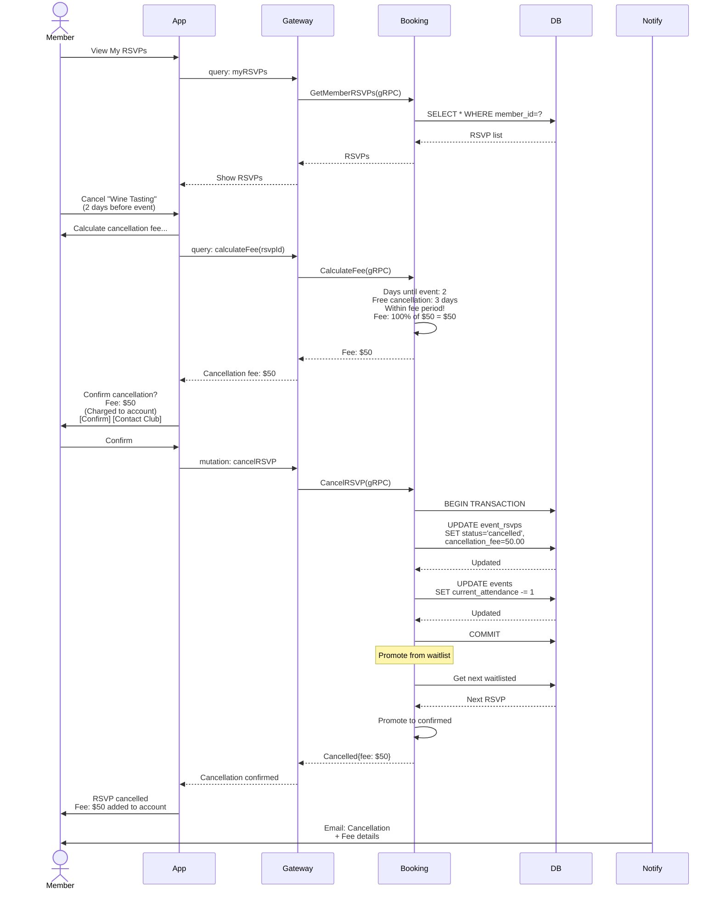

# User Journey: Member RSVPs to Club Event

## Overview

**Journey**: Member RSVPs to club events with Yes/No/Maybe response
**Category**: Events & Social Engagement
**Actor**: Member (home or reciprocal club)
**Services**: Booking Service, Auth Service, Notification Service, Analytics Service
**Estimated Implementation**: 3-4 days

---

## Quick Summary

Members RSVP to club events with a simple **Yes/No/Maybe** model. The system manages capacity with priority queues (home members first, reciprocal members second), enforces cancellation terms, collects dietary preferences, and sends timely reminders.

---

## Business Requirements

### Event Types

All event types support RSVPs:
- ✅ Social events (galas, mixers, holiday parties)
- ✅ Sporting events (tournaments, competitions)
- ✅ Educational events (workshops, seminars)
- ✅ Club meetings (board meetings, assemblies)
- ✅ Fundraisers
- ✅ **Finding-Friends subgroups** (Vinna Vänner) - with priority for subgroup members

### RSVP Response Model

**Simple 3-state model**:
- ✅ **Yes** - Attending (creates confirmed RSVP)
- ❌ **No** - Not attending (no RSVP record)
- ❓ **Maybe** - Interested (creates tentative RSVP, doesn't count toward capacity)

### Guest Policies (per event)

Event organizer configures:
- **Members-only**: No guests
- **Male guests**: +N male guests allowed
- **Female guests**: +N female guests allowed
- **Friends & Family**: Any guests up to +N
- Guest names are **optional**

### Information Collected

On RSVP form:
- Attendance count (self + guests)
- Guest names (optional)
- Dietary restrictions/preferences
- Special requests:
  - Food/drink preferences
  - Seating preferences ("seat with [name]", "near [group]")
  - Free text for other needs

### Payment Options

Event organizer selects payment method:
- **Free event**: No payment
- **Paid event** with payment instructions in description:
  - Pay at bar/restaurant on arrival
  - Pre-pay to club bank account
  - Add to member's monthly bill

**No automated payment processing** - all payment verification is manual by club back-office.

### Capacity Management

**Two-tier priority system**:

**Priority Queue A (Home Club Members)**:
- First access to all event capacity
- FCFS (First-Come-First-Served) by default
- Optional: Reserve X seats or Y% for approval-based allocation

**Priority Queue B (Reciprocal Club Members)**:
- Access to remaining capacity from Queue A
- Only if active reciprocal agreement exists
- Separate waitlist if reciprocal spots exhausted

**Adjustable capacity**: Event organizer can increase/decrease capacity after creation.

### RSVP Modes

**Default**: Auto-confirm (immediate confirmation)

**Optional**: Approval-based
- Event organizer reviews and approves each RSVP
- Can reserve specific number/percentage of seats for approval
- Used for:
  - Finding-Friends subgroup events (subgroup members get priority)
  - Exclusive club events requiring vetting

### RSVP Deadlines

- **Standard**: Up to Day-1 before event
- **Configurable** by event organizer
- System blocks RSVP after deadline
- Shows organizer contact info for late requests

### Cancellation Terms

**Configurable by**:
- Club management (default club policy)
- Restaurant (for dining events)
- Event organizer (event-specific override)

**Default terms**:
- ✅ **Free cancellation**: Up to Day-3 before event
- ❌ **100% fee**: Cancellation within 3 days of event
- **Exception**: Fee waived if agreed by Member + Club/Restaurant

**Fee handling**:
- Charged to member account
- Or settled at next visit

### Access Control

**Club-organized events**:
- Open to all members
- RSVP mode: Auto-confirm or approval-based (organizer choice)

**Finding-Friends subgroup events**:
- Open to all members
- Subgroup members get priority (FCFS within subgroup, then general members)
- RSVP mode: Approval by subgroup organizer (default)

**No restrictions**:
- ❌ No membership tier restrictions
- ❌ No invitation-only events (all club communications go to all members)

**Reciprocal members**: Can RSVP via Priority Queue B if agreement is active

### Full House Management

Event organizer selects venue availability:
- **OTHERS WELCOME**: Non-event members can use club facilities during event
- **FULL HOUSE EXCLUSIVE**: Entire club reserved for event attendees only

---

## Data Models

### Event (extends existing Booking entity)

```go
type Event struct {
    // Core fields
    ID                      uint      `json:"id"`
    ClubID                  uint      `json:"clubId"`
    FacilityID              *uint     `json:"facilityId"` // Optional

    // Event details
    Title                   string    `json:"title"`
    Description             string    `json:"description"` // Includes payment instructions
    EventType               string    `json:"eventType"` // social, sporting, educational, meeting, fundraiser, finding_friends
    SubgroupID              *uint     `json:"subgroupId"` // For Finding-Friends events

    // Timing
    StartTime               time.Time `json:"startTime"`
    EndTime                 time.Time `json:"endTime"`
    RSVPDeadline            time.Time `json:"rsvpDeadline"` // Default: Day-1 before event

    // Capacity (adjustable)
    MaxCapacity             int       `json:"maxCapacity"`
    ReciprocalCapacity      int       `json:"reciprocalCapacity"` // Slots for reciprocal members
    CurrentAttendance       int       `json:"currentAttendance"` // Yes responses
    TentativeCount          int       `json:"tentativeCount"` // Maybe responses
    ReciprocalSpotsUsed     int       `json:"reciprocalSpotsUsed"`

    // Waitlist
    WaitlistEnabled         bool      `json:"waitlistEnabled"` // Default: true
    WaitlistCount           int       `json:"waitlistCount"`
    ReciprocalWaitlistCount int       `json:"reciprocalWaitlistCount"`

    // Guest policy
    GuestPolicy             string    `json:"guestPolicy"` // members_only, male_guests, female_guests, friends_family
    MaxGuestsPerMember      int       `json:"maxGuestsPerMember"`

    // RSVP mode
    RSVPMode                string    `json:"rsvpMode"` // auto_confirm, approval_required
    ApprovalSeatsReserved   int       `json:"approvalSeatsReserved"` // Reserved for approval
    ApprovalPercentage      *int      `json:"approvalPercentage"` // Alternative: reserve X%

    // Access
    AllowReciprocalMembers  bool      `json:"allowReciprocalMembers"` // Default: true
    SubgroupPriority        bool      `json:"subgroupPriority"` // Priority for subgroup members

    // Payment
    IsPaid                  bool      `json:"isPaid"`
    PaymentInstructions     string    `json:"paymentInstructions"` // Free text

    // Venue
    FullHouseExclusive      bool      `json:"fullHouseExclusive"` // Club closed to non-attendees

    // Organizer
    OrganizerID             uint      `json:"organizerId"`
    OrganizerName           string    `json:"organizerName"`
    ContactEmail            string    `json:"contactEmail"`
    ContactPhone            string    `json:"contactPhone"`

    // Data collection
    CollectDietaryInfo      bool      `json:"collectDietaryInfo"` // Default: true
    CollectSeatingPrefs     bool      `json:"collectSeatingPrefs"` // Default: true

    // Cancellation terms
    CancellationTerms       string    `json:"cancellationTerms"` // JSON or text
    FreeCancellationDays    int       `json:"freeCancellationDays"` // Default: 3
    CancellationFeePercent  int       `json:"cancellationFeePercent"` // Default: 100

    // Status
    Status                  string    `json:"status"` // draft, published, cancelled, completed
    PublishedAt             *time.Time `json:"publishedAt"`

    CreatedAt               time.Time `json:"createdAt"`
    UpdatedAt               time.Time `json:"updatedAt"`
}
```

### EventRSVP

```go
type EventRSVP struct {
    ID                    uint      `json:"id"`
    EventID               uint      `json:"eventId"`
    MemberID              uint      `json:"memberId"`
    ClubID                uint      `json:"clubId"` // Member's home club

    // RSVP response
    Response              string    `json:"response"` // yes, maybe, no

    // Priority & Type
    RSVPType              string    `json:"rsvpType"` // primary (home), reciprocal, subgroup
    Priority              int       `json:"priority"` // 1=subgroup, 2=home, 3=reciprocal

    // Attendance
    AttendanceCount       int       `json:"attendanceCount"` // Self + guests
    GuestNames            []string  `json:"guestNames"` // Optional

    // Preferences
    DietaryRestrictions   []string  `json:"dietaryRestrictions"`
    SeatingPreferences    string    `json:"seatingPreferences"` // Free text
    SpecialRequests       string    `json:"specialRequests"`

    // Status
    Status                string    `json:"status"` // confirmed, tentative, pending_approval, waitlist, cancelled, declined

    // Approval (if approval-based)
    RequiresApproval      bool      `json:"requiresApproval"`
    ApprovedBy            *uint     `json:"approvedBy"`
    ApprovedAt            *time.Time `json:"approvedAt"`
    DeclineReason         string    `json:"declineReason"`

    // Payment tracking (manual)
    PaymentRequired       bool      `json:"paymentRequired"`
    PaymentVerified       bool      `json:"paymentVerified"` // Manual verification by back-office
    PaymentAmount         float64   `json:"paymentAmount"`
    PaymentNotes          string    `json:"paymentNotes"` // Staff notes

    // Cancellation
    CancelledAt           *time.Time `json:"cancelledAt"`
    CancellationReason    string    `json:"cancellationReason"`
    CancellationFee       float64   `json:"cancellationFee"` // Calculated based on terms
    FeeWaived             bool      `json:"feeWaived"` // Manual override

    // Check-in
    CheckedIn             bool      `json:"checkedIn"`
    CheckedInAt           *time.Time `json:"checkedInAt"`
    ActualGuestCount      int       `json:"actualGuestCount"` // At check-in

    // Waitlist
    WaitlistPosition      *int      `json:"waitlistPosition"`

    // Timestamps
    RSVPedAt              time.Time `json:"rsvpedAt"`
    UpdatedAt             time.Time `json:"updatedAt"`

    // Unique constraint: one RSVP per member per event
}
```

### FindingFriendsSubgroup

```go
type FindingFriendsSubgroup struct {
    ID          uint      `json:"id"`
    ClubID      uint      `json:"clubId"`
    Name        string    `json:"name"` // e.g., "Vinna Vänner"
    Description string    `json:"description"`
    OrganizerID uint      `json:"organizerId"`
    Members     []uint    `json:"memberIds"` // Member IDs in subgroup
    IsActive    bool      `json:"isActive"`
    CreatedAt   time.Time `json:"createdAt"`
}
```

---

## API Specifications

### GraphQL Schema (Additions)

```graphql
# Enums
enum RSVPResponse {
  YES
  MAYBE
  NO
}

enum EventType {
  SOCIAL
  SPORTING
  EDUCATIONAL
  MEETING
  FUNDRAISER
  FINDING_FRIENDS
}

enum RSVPStatus {
  CONFIRMED          # Yes, confirmed
  TENTATIVE          # Maybe
  PENDING_APPROVAL   # Awaiting organizer approval
  WAITLIST           # On waitlist
  CANCELLED          # Member cancelled
  DECLINED           # Organizer declined
}

# Input Types
input CreateEventInput {
  clubId: ID!
  title: String!
  description: String!
  eventType: EventType!
  subgroupId: ID          # For Finding-Friends events
  startTime: DateTime!
  endTime: DateTime!
  rsvpDeadline: DateTime
  maxCapacity: Int!
  reciprocalCapacity: Int
  guestPolicy: String!
  maxGuestsPerMember: Int!
  rsvpMode: String!       # auto_confirm or approval_required
  approvalSeatsReserved: Int
  allowReciprocalMembers: Boolean!
  subgroupPriority: Boolean
  isPaid: Boolean!
  paymentInstructions: String
  fullHouseExclusive: Boolean!
  organizerName: String!
  contactEmail: String!
  contactPhone: String
  freeCancellationDays: Int
  cancellationFeePercent: Int
}

input CreateRSVPInput {
  eventId: ID!
  response: RSVPResponse!  # yes, maybe, no
  attendanceCount: Int!
  guestNames: [String!]    # Optional
  dietaryRestrictions: [String!]
  seatingPreferences: String
  specialRequests: String
}

input UpdateRSVPInput {
  rsvpId: ID!
  response: RSVPResponse
  attendanceCount: Int
  guestNames: [String!]
  dietaryRestrictions: [String!]
  seatingPreferences: String
  specialRequests: String
}

# Object Types
type Event {
  id: ID!
  clubId: ID!
  club: Club
  title: String!
  description: String!
  eventType: EventType!
  subgroup: FindingFriendsSubgroup

  startTime: DateTime!
  endTime: DateTime!
  rsvpDeadline: DateTime!

  # Capacity
  maxCapacity: Int!
  currentAttendance: Int!      # Yes responses
  tentativeCount: Int!         # Maybe responses
  availableSpots: Int!         # Calculated
  reciprocalSpotsAvailable: Int!

  # Waitlists
  waitlistCount: Int!
  reciprocalWaitlistCount: Int!

  # Settings
  guestPolicy: String!
  maxGuestsPerMember: Int!
  rsvpMode: String!
  fullHouseExclusive: Boolean!

  # Payment
  isPaid: Boolean!
  paymentInstructions: String

  # Cancellation
  freeCancellationDays: Int!
  cancellationFeePercent: Int!

  # Organizer
  organizerName: String!
  contactEmail: String!
  contactPhone: String

  # My RSVP
  myRSVP: EventRSVP

  # Attendees (for organizer)
  rsvps: [EventRSVP!]!
  confirmedAttendees: Int!
  tentativeAttendees: Int!

  status: String!
  createdAt: DateTime!
}

type EventRSVP {
  id: ID!
  event: Event!
  member: Member!

  response: RSVPResponse!
  rsvpType: String!
  priority: Int!

  attendanceCount: Int!
  guestNames: [String!]!
  dietaryRestrictions: [String!]!
  seatingPreferences: String
  specialRequests: String

  status: RSVPStatus!

  # Approval
  requiresApproval: Boolean!
  approvedBy: User
  approvedAt: DateTime
  declineReason: String

  # Payment
  paymentRequired: Boolean!
  paymentVerified: Boolean!
  paymentAmount: Float

  # Cancellation
  cancelledAt: DateTime
  cancellationFee: Float
  feeWaived: Boolean

  # Check-in
  checkedIn: Boolean!
  checkedInAt: DateTime

  # Waitlist
  waitlistPosition: Int

  rsvpedAt: DateTime!
  updatedAt: DateTime!
}

type FindingFriendsSubgroup {
  id: ID!
  clubId: ID!
  name: String!
  description: String!
  organizer: User!
  memberCount: Int!
  isActive: Boolean!
}

type RSVPEligibility {
  eligible: Boolean!
  reason: String
  availableSpots: Int!
  wouldBeWaitlisted: Boolean!
  requiresApproval: Boolean!
  paymentRequired: Boolean!
  isSubgroupMember: Boolean!
  memberInGoodStanding: Boolean!    # Debt check
  memberDebtAmount: Float
  maxDebtThreshold: Float
}

# Queries
extend type Query {
  # Events
  event(id: ID!): Event
  events(clubId: ID, eventType: EventType, startDate: DateTime, endDate: DateTime): [Event!]!
  upcomingEvents(clubId: ID!, limit: Int): [Event!]!

  # My RSVPs
  myRSVPs(status: RSVPStatus): [EventRSVP!]!
  myUpcomingEvents: [Event!]!  # Events I've RSVP'd yes/maybe

  # RSVP management (organizer)
  eventRSVPs(eventId: ID!, statusFilter: RSVPStatus): [EventRSVP!]!
  eventAttendeeList(eventId: ID!): EventAttendeeReport!  # CSV-ready format

  # Eligibility check
  checkRSVPEligibility(eventId: ID!): RSVPEligibility!

  # Finding-Friends subgroups
  findingFriendsSubgroups(clubId: ID!): [FindingFriendsSubgroup!]!
}

type EventAttendeeReport {
  eventId: ID!
  eventTitle: String!
  confirmedCount: Int!
  tentativeCount: Int!
  attendees: [AttendeeInfo!]!
}

type AttendeeInfo {
  memberName: String!
  email: String!
  phone: String
  attendanceCount: Int!
  guestNames: [String!]!
  dietaryRestrictions: [String!]!
  seatingPreferences: String
  specialRequests: String
  rsvpDate: DateTime!
  status: RSVPStatus!
}

# Mutations
extend type Mutation {
  # Event management (organizer)
  createEvent(input: CreateEventInput!): Event!
  updateEvent(id: ID!, input: UpdateEventInput!): Event!
  updateEventCapacity(id: ID!, newCapacity: Int!): Event!
  publishEvent(id: ID!): Event!
  cancelEvent(id: ID!, reason: String): Event!

  # RSVP (member)
  createRSVP(input: CreateRSVPInput!): EventRSVP!
  updateRSVP(input: UpdateRSVPInput!): EventRSVP!
  cancelRSVP(rsvpId: ID!, reason: String): CancellationResult!

  # Approval (organizer)
  approveRSVP(rsvpId: ID!): EventRSVP!
  declineRSVP(rsvpId: ID!, reason: String!): EventRSVP!
  batchApproveRSVPs(rsvpIds: [ID!]!): [EventRSVP!]!

  # Waitlist
  promoteFromWaitlist(rsvpId: ID!): EventRSVP!

  # Payment verification (back-office)
  verifyPayment(rsvpId: ID!, verified: Boolean!, notes: String): EventRSVP!
  waiveCancellationFee(rsvpId: ID!, reason: String!): EventRSVP!

  # Check-in
  checkInToEvent(rsvpId: ID!, actualGuestCount: Int): EventRSVP!
}

type CancellationResult {
  rsvp: EventRSVP!
  cancellationFee: Float!
  feeWaived: Boolean!
  message: String!
}

# Subscriptions (real-time updates)
extend type Subscription {
  # Real-time capacity updates
  eventCapacityChanged(eventId: ID!): EventCapacityUpdate!

  # My RSVP status changes
  myRSVPStatusChanged: EventRSVP!

  # Waitlist promotions
  waitlistPromoted(memberId: ID!): EventRSVP!
}

type EventCapacityUpdate {
  eventId: ID!
  availableSpots: Int!
  isFull: Boolean!
  waitlistCount: Int!
}
```

### REST API Endpoints

```
# Events
POST   /api/v1/events                       - Create event
GET    /api/v1/events                       - List events (filter by club, date, type)
GET    /api/v1/events/:id                   - Get event details
PUT    /api/v1/events/:id                   - Update event
PATCH  /api/v1/events/:id/capacity          - Update capacity
DELETE /api/v1/events/:id                   - Cancel event

# RSVPs
POST   /api/v1/events/:eventId/rsvp         - Create RSVP
GET    /api/v1/events/:eventId/rsvps        - List event RSVPs
GET    /api/v1/members/:memberId/rsvps      - My RSVPs
GET    /api/v1/rsvps/:id                    - Get RSVP details
PUT    /api/v1/rsvps/:id                    - Update RSVP
DELETE /api/v1/rsvps/:id                    - Cancel RSVP

# Approval
POST   /api/v1/rsvps/:id/approve            - Approve RSVP
POST   /api/v1/rsvps/:id/decline            - Decline RSVP
POST   /api/v1/rsvps/batch-approve          - Batch approve RSVPs

# Waitlist
POST   /api/v1/rsvps/:id/promote            - Promote from waitlist
GET    /api/v1/events/:eventId/waitlist     - Get waitlist

# Payment verification (back-office)
POST   /api/v1/rsvps/:id/verify-payment     - Mark payment as verified
POST   /api/v1/rsvps/:id/waive-fee          - Waive cancellation fee

# Check-in
POST   /api/v1/rsvps/:id/check-in           - Check in to event
POST   /api/v1/events/:eventId/scan-checkin - QR code check-in

# Reports
GET    /api/v1/events/:eventId/attendees    - Attendee list (JSON)
GET    /api/v1/events/:eventId/export       - Export attendees (CSV)

# Eligibility
GET    /api/v1/events/:eventId/eligibility  - Check if I can RSVP
```

---

## Business Rules

### 1. RSVP Eligibility Pre-conditions

Member can RSVP if ALL conditions are met:

✅ **Authentication**: Member is logged in
✅ **Event Published**: Event status = 'published'
✅ **Deadline**: Current time < event.rsvpDeadline
✅ **No Duplicate**: Member hasn't already RSVP'd
✅ **Good Standing**: Member's debt < club's maxDebtThreshold
✅ **Agreement** (if reciprocal): Active agreement between clubs

```go
func CheckRSVPEligibility(ctx context.Context, member *Member, event *Event) (*Eligibility, error) {
    eligible := &Eligibility{Eligible: true}

    // Check event status
    if event.Status != "published" {
        eligible.Eligible = false
        eligible.Reason = "Event not published"
        return eligible, nil
    }

    // Check deadline
    if time.Now().After(event.RSVPDeadline) {
        eligible.Eligible = false
        eligible.Reason = "RSVP deadline has passed"
        eligible.ContactInfo = fmt.Sprintf("Contact %s at %s", event.OrganizerName, event.ContactEmail)
        return eligible, nil
    }

    // Check for duplicate RSVP
    existingRSVP, _ := repo.GetRSVPByEventAndMember(ctx, event.ID, member.ID)
    if existingRSVP != nil {
        eligible.Eligible = false
        eligible.Reason = "Already RSVP'd to this event"
        eligible.ExistingRSVP = existingRSVP
        return eligible, nil
    }

    // Check member good standing (debt check)
    memberDebt := getMemberDebt(ctx, member.ID)
    if memberDebt >= member.Club.MaxDebtThreshold {
        eligible.Eligible = false
        eligible.Reason = fmt.Sprintf("Outstanding debt: $%.2f (max: $%.2f)", memberDebt, member.Club.MaxDebtThreshold)
        eligible.MemberInGoodStanding = false
        eligible.MemberDebtAmount = memberDebt
        eligible.MaxDebtThreshold = member.Club.MaxDebtThreshold
        return eligible, nil
    }

    // Check capacity
    availableSpots := calculateAvailableSpots(event, member)
    if availableSpots <= 0 {
        eligible.WouldBeWaitlisted = true
        eligible.Reason = "Event is full - you will be added to waitlist"
    }

    // Check if reciprocal member
    if member.ClubID != event.ClubID {
        // Reciprocal member - check agreement
        agreement := checkReciprocalAgreement(ctx, member.ClubID, event.ClubID)
        if agreement == nil || !agreement.IsActive {
            eligible.Eligible = false
            eligible.Reason = "No active reciprocal agreement between clubs"
            return eligible, nil
        }
    }

    eligible.RequiresApproval = event.RSVPMode == "approval_required"
    eligible.PaymentRequired = event.IsPaid

    return eligible, nil
}
```

### 2. Capacity & Priority System

```go
func CalculateAvailableSpots(event *Event, member *Member) int {
    // Determine member type
    isHomeClub := member.ClubID == event.ClubID
    isSubgroupMember := checkSubgroupMembership(member.ID, event.SubgroupID)

    if isHomeClub {
        // Home club member - access to all capacity
        return event.MaxCapacity - event.CurrentAttendance
    } else {
        // Reciprocal member - access to reciprocal capacity only
        reciprocalAvailable := event.ReciprocalCapacity - event.ReciprocalSpotsUsed
        return reciprocalAvailable
    }
}

func DeterminePriority(member *Member, event *Event) int {
    isSubgroupMember := checkSubgroupMembership(member.ID, event.SubgroupID)
    isHomeClub := member.ClubID == event.ClubID

    if isSubgroupMember {
        return 1  // Highest priority
    } else if isHomeClub {
        return 2  // Home club priority
    } else {
        return 3  // Reciprocal member priority
    }
}
```

### 3. RSVP Response Handling

```go
func CreateRSVP(ctx context.Context, req *CreateRSVPInput) (*EventRSVP, error) {
    // Determine status based on response and capacity
    status := "confirmed"

    switch req.Response {
    case "yes":
        // Check capacity
        availableSpots := calculateAvailableSpots(event, member)
        if availableSpots <= 0 {
            // Event full - add to waitlist
            status = "waitlist"
            rsvp.WaitlistPosition = getNextWaitlistPosition(event)
        } else if event.RSVPMode == "approval_required" {
            // Requires approval
            status = "pending_approval"
        } else {
            // Auto-confirm
            status = "confirmed"
            // Increment attendance counter
            incrementAttendance(event, member, req.AttendanceCount)
        }

    case "maybe":
        status = "tentative"
        // Don't count toward capacity
        event.TentativeCount += req.AttendanceCount

    case "no":
        // Don't create RSVP record
        return nil, nil
    }

    rsvp := &EventRSVP{
        EventID:          req.EventID,
        MemberID:         member.ID,
        Response:         req.Response,
        Status:           status,
        AttendanceCount:  req.AttendanceCount,
        Priority:         determinePriority(member, event),
        RSVPType:         determineRSVPType(member, event),
        // ... other fields
    }

    return repo.CreateRSVP(ctx, rsvp)
}
```

### 4. Cancellation Fee Calculation

```go
func CalculateCancellationFee(rsvp *EventRSVP, event *Event) float64 {
    // How many days until event?
    daysUntilEvent := event.StartTime.Sub(time.Now()).Hours() / 24

    if daysUntilEvent >= float64(event.FreeCancellationDays) {
        // Free cancellation period
        return 0.0
    }

    // Within cancellation fee period
    if event.IsPaid && rsvp.PaymentAmount > 0 {
        // Calculate fee based on percentage
        feePercent := float64(event.CancellationFeePercent) / 100.0
        fee := rsvp.PaymentAmount * feePercent
        return fee
    }

    // Free events - no fee
    return 0.0
}

func CancelRSVP(ctx context.Context, rsvpID uint, reason string) (*CancellationResult, error) {
    rsvp := getRSVP(ctx, rsvpID)
    event := getEvent(ctx, rsvp.EventID)

    // Calculate fee
    fee := calculateCancellationFee(rsvp, event)

    // Update RSVP
    rsvp.Status = "cancelled"
    rsvp.CancelledAt = time.Now()
    rsvp.CancellationReason = reason
    rsvp.CancellationFee = fee

    // Update event attendance
    if rsvp.Status == "confirmed" {
        decrementAttendance(event, rsvp.AttendanceCount, rsvp.RSVPType)
    }

    // Save
    repo.UpdateRSVP(ctx, rsvp)

    // Try to promote from waitlist
    if rsvp.Status == "confirmed" {
        promoteNextFromWaitlist(ctx, event.ID)
    }

    return &CancellationResult{
        RSVP:            rsvp,
        CancellationFee: fee,
        FeeWaived:       false,
        Message:         formatCancellationMessage(fee, event.FreeCancellationDays),
    }, nil
}
```

### 5. Waitlist Auto-Promotion

```go
func PromoteFromWaitlist(ctx context.Context, eventID uint) error {
    event := getEvent(ctx, eventID)

    // Check if there's capacity
    if event.CurrentAttendance >= event.MaxCapacity {
        return nil // Still full
    }

    // Get next waitlisted member (ordered by priority, then RSVP date)
    nextRSVP := repo.GetNextWaitlistedRSVP(ctx, eventID)
    if nextRSVP == nil {
        return nil // No one on waitlist
    }

    // Check capacity for this member type
    availableSpots := calculateAvailableSpots(event, getMember(nextRSVP.MemberID))
    if availableSpots < nextRSVP.AttendanceCount {
        return nil // Not enough spots for this group size
    }

    // Promote
    nextRSVP.Status = "confirmed"
    nextRSVP.WaitlistPosition = nil
    repo.UpdateRSVP(ctx, nextRSVP)

    // Update attendance
    incrementAttendance(event, getMember(nextRSVP.MemberID), nextRSVP.AttendanceCount)

    // Send notification
    sendWaitlistPromotionNotification(nextRSVP)

    return nil
}
```

### 6. Finding-Friends Subgroup Priority

```go
func ProcessFindingFriendsRSVP(ctx context.Context, req *CreateRSVPInput) (*EventRSVP, error) {
    member := getMember(ctx, req.MemberID)
    event := getEvent(ctx, req.EventID)

    // Check if member is in the subgroup
    isSubgroupMember := checkSubgroupMembership(member.ID, event.SubgroupID)

    // Subgroup members get priority
    if isSubgroupMember {
        // Priority 1 - likely to be auto-confirmed even with approval mode
        rsvp := createRSVP(ctx, req)
        rsvp.Priority = 1
        rsvp.RSVPType = "subgroup"

        // If FCFS within subgroup, auto-confirm
        if event.RSVPMode == "auto_confirm" {
            rsvp.Status = "confirmed"
        } else {
            rsvp.Status = "pending_approval"
            // But flag as priority for organizer review
        }

        return rsvp, nil
    } else {
        // Non-subgroup member - normal process
        rsvp := createRSVP(ctx, req)
        rsvp.Priority = 2
        rsvp.RSVPType = "primary"

        // May require approval by subgroup organizer
        if event.RSVPMode == "approval_required" {
            rsvp.Status = "pending_approval"
        }

        return rsvp, nil
    }
}
```

---

## Sequence Diagrams

### 1. Simple RSVP (Yes - Auto-Confirm)

```mermaid
sequenceDiagram
    actor Member
    participant App
    participant Gateway as API Gateway
    participant Booking as Booking Service
    participant DB
    participant Notify as Notification

    Member->>App: Browse events
    App->>Gateway: query: upcomingEvents
    Gateway->>Booking: GetEvents(gRPC)
    Booking->>DB: SELECT events<br/>WHERE published
    DB-->>Booking: Event list
    Booking-->>Gateway: Events
    Gateway-->>App: Events + attendee counts

    Member->>App: Select "Summer Gala"
    App->>Gateway: query: event(id)<br/>+ checkRSVPEligibility

    Gateway->>Booking: CheckEligibility(gRPC)
    Booking->>DB: Check member debt
    DB-->>Booking: Debt: $50 (under threshold ✓)
    Booking->>DB: Check existing RSVP
    DB-->>Booking: No RSVP found ✓
    Booking->>DB: Check capacity
    DB-->>Booking: 85/100 available ✓
    Booking-->>Gateway: Eligible{true}

    Gateway-->>App: Event details + "Can RSVP"

    Member->>App: Click RSVP<br/>Select: Yes<br/>Guests: +2<br/>Dietary: Vegetarian

    App->>Gateway: mutation: createRSVP<br/>{response: YES,<br/>attendanceCount: 3,<br/>dietary: [vegetarian]}

    Gateway->>Booking: CreateRSVP(gRPC)

    Booking->>DB: BEGIN TRANSACTION
    Booking->>DB: INSERT event_rsvps<br/>SET status='confirmed'
    DB-->>Booking: RSVP created

    Booking->>DB: UPDATE events<br/>SET current_attendance=88
    DB-->>Booking: Updated
    Booking->>DB: COMMIT

    Booking->>Notify: Publish event.rsvp.confirmed

    Booking-->>Gateway: EventRSVP{status: confirmed}
    Gateway-->>App: Success!

    App->>Member: ✅ You're going!<br/>85 others attending

    Notify->>Member: Email: RSVP confirmation<br/>+ Calendar .ics
```



### 2. Event Full → Waitlist

```mermaid
sequenceDiagram
    actor Member
    participant App
    participant Gateway
    participant Booking
    participant DB
    participant Notify

    Member->>App: RSVP to popular event
    App->>Gateway: mutation: createRSVP<br/>{response: YES}

    Gateway->>Booking: CreateRSVP(gRPC)

    Booking->>DB: BEGIN TRANSACTION
    Booking->>DB: SELECT current_attendance<br/>FOR UPDATE
    DB-->>Booking: 100/100 (FULL)

    Note over Booking: Event at capacity

    Booking->>DB: INSERT event_rsvps<br/>SET status='waitlist',<br/>waitlist_position=5
    DB-->>Booking: RSVP created

    Booking->>DB: UPDATE events<br/>SET waitlist_count=5
    DB-->>Booking: Updated
    Booking->>DB: COMMIT

    Booking-->>Gateway: RSVP{status: waitlist,<br/>position: 5}
    Gateway-->>App: Added to waitlist

    App->>Member: Event is full 😔<br/>Waitlist position: #5

    Notify->>Member: Email: Waitlist notification

    Note over Member,Notify: --- Another member cancels ---

    Booking->>DB: Auto-promote next<br/>from waitlist
    DB-->>Booking: Promoted (position #1)

    Booking->>Notify: Publish waitlist.promoted

    Notify->>Member: Email + SMS + Push:<br/>🎉 You've been promoted!<br/>Spot available!
```



### 3. Reciprocal Member RSVP (Priority Queue B)

```mermaid
sequenceDiagram
    actor ReciprocalMember as Club B Member
    participant App
    participant Gateway
    participant Booking
    participant Reciprocal as Reciprocal Service
    participant DB

    ReciprocalMember->>App: Browse Club A events
    App->>Gateway: query: events(clubId: ClubA)
    Gateway->>Booking: GetEvents(gRPC)
    Booking->>DB: Get events<br/>WHERE allow_reciprocal=true
    DB-->>Booking: Events
    Booking-->>Gateway: Events (with reciprocal badge)
    Gateway-->>App: Show events

    ReciprocalMember->>App: Select "Golf Tournament"
    App->>Gateway: checkRSVPEligibility

    Gateway->>Booking: CheckEligibility(gRPC)
    Booking->>Reciprocal: ValidateAgreement<br/>(ClubA, ClubB)
    Reciprocal->>DB: Check agreement
    DB-->>Reciprocal: Agreement{active: true}
    Reciprocal-->>Booking: Valid ✓

    Booking->>DB: Check reciprocal capacity
    DB-->>Booking: reciprocal: 7/10 used<br/>available: 3 spots ✓

    Booking-->>Gateway: Eligible{true,<br/>isReciprocal: true}
    Gateway-->>App: Can RSVP (reciprocal access)

    ReciprocalMember->>App: RSVP: Yes
    App->>Gateway: createRSVP

    Gateway->>Booking: CreateRSVP(gRPC)

    Booking->>DB: BEGIN TRANSACTION
    Booking->>DB: INSERT event_rsvps<br/>SET rsvp_type='reciprocal',<br/>priority=3
    DB-->>Booking: RSVP created

    Booking->>DB: UPDATE events<br/>SET reciprocal_spots_used=8
    DB-->>Booking: Updated
    Booking->>DB: COMMIT

    Booking-->>Gateway: RSVP{confirmed,<br/>type: reciprocal}
    Gateway-->>App: Success!

    App->>ReciprocalMember: ✅ You're attending!<br/>(Reciprocal access)
```



### 4. Approval-Based RSVP (Finding-Friends)

```mermaid
sequenceDiagram
    actor Member
    participant App
    participant Gateway
    participant Booking
    participant DB
    participant Notify
    actor Organizer as Subgroup Organizer

    Member->>App: RSVP to Finding-Friends event
    App->>Gateway: createRSVP{response: YES}

    Gateway->>Booking: CreateRSVP(gRPC)

    Booking->>DB: Check if subgroup member
    DB-->>Booking: Not in subgroup

    Note over Booking: Event requires approval

    Booking->>DB: BEGIN TRANSACTION
    Booking->>DB: INSERT event_rsvps<br/>SET status='pending_approval',<br/>priority=2
    DB-->>Booking: RSVP created
    Booking->>DB: COMMIT

    Note over Booking: No attendance increment<br/>until approved

    Booking-->>Gateway: RSVP{pending_approval}
    Gateway-->>App: Pending approval

    App->>Member: RSVP submitted 📋<br/>Awaiting organizer review

    Notify->>Member: Email: Pending approval
    Notify->>Organizer: Email: New RSVP<br/>from [Member Name]

    Note over Organizer: Reviews RSVP

    Organizer->>App: Approve RSVP
    App->>Gateway: approveRSVP(rsvpId)

    Gateway->>Booking: ApproveRSVP(gRPC)

    Booking->>DB: BEGIN TRANSACTION
    Booking->>DB: UPDATE event_rsvps<br/>SET status='confirmed',<br/>approved_by=organizer_id
    DB-->>Booking: Updated

    Booking->>DB: UPDATE events<br/>SET current_attendance += 3
    DB-->>Booking: Updated
    Booking->>DB: COMMIT

    Booking-->>Gateway: RSVP{confirmed}
    Gateway-->>App: Approved

    Notify->>Member: Email + Push:<br/>✅ Your RSVP approved!
```



### 5. Cancel RSVP with Fee Calculation



### 6. Real-time Capacity Update (GraphQL Subscription)

```mermaid
sequenceDiagram
    actor Member1 as Member 1
    participant App1 as Member 1 App
    participant Gateway
    participant Booking
    participant DB
    actor Member2 as Member 2
    participant App2 as Member 2 App

    Member1->>App1: View event details
    App1->>Gateway: subscription:<br/>eventCapacityChanged(eventId)
    Gateway->>Gateway: WebSocket open

    Note over Member2: Member 2 RSVPs

    Member2->>App2: RSVP: Yes (+3 guests)
    App2->>Gateway: createRSVP
    Gateway->>Booking: CreateRSVP

    Booking->>DB: UPDATE current_attendance
    DB-->>Booking: 95/100 now

    Booking->>Gateway: Publish capacity change

    Gateway-->>App1: Push: capacityChanged{<br/>available: 5,<br/>isFull: false}

    App1->>Member1: 🔔 5 spots left!<br/>(real-time update)

    Note over Member2: 4 more people RSVP

    Booking->>DB: Attendance: 99/100
    Booking->>Gateway: capacityChanged
    Gateway-->>App1: Push: available: 1

    App1->>Member1: 🔔 Only 1 spot left!

    Booking->>DB: Attendance: 100/100
    Booking->>Gateway: capacityChanged{<br/>isFull: true}

    Gateway-->>App1: Push: Event is FULL

    App1->>Member1: ⛔ Event now full<br/>Waitlist available
```



---

## Implementation Plan

### Phase 1: Database & Models (4-6 hours)

**1.1 Database Schema**

Extend `bookings` table:
```sql
ALTER TABLE bookings ADD COLUMN event_type VARCHAR(50);
ALTER TABLE bookings ADD COLUMN subgroup_id BIGINT REFERENCES finding_friends_subgroups(id);
ALTER TABLE bookings ADD COLUMN rsvp_deadline TIMESTAMP;
ALTER TABLE bookings ADD COLUMN guest_policy VARCHAR(50) DEFAULT 'friends_family';
ALTER TABLE bookings ADD COLUMN max_guests_per_member INT DEFAULT 5;
ALTER TABLE bookings ADD COLUMN rsvp_mode VARCHAR(50) DEFAULT 'auto_confirm';
ALTER TABLE bookings ADD COLUMN approval_seats_reserved INT DEFAULT 0;
ALTER TABLE bookings ADD COLUMN reciprocal_capacity INT DEFAULT 0;
ALTER TABLE bookings ADD COLUMN reciprocal_spots_used INT DEFAULT 0;
ALTER TABLE bookings ADD COLUMN tentative_count INT DEFAULT 0;
ALTER TABLE bookings ADD COLUMN waitlist_count INT DEFAULT 0;
ALTER TABLE bookings ADD COLUMN reciprocal_waitlist_count INT DEFAULT 0;
ALTER TABLE bookings ADD COLUMN full_house_exclusive BOOLEAN DEFAULT false;
ALTER TABLE bookings ADD COLUMN free_cancellation_days INT DEFAULT 3;
ALTER TABLE bookings ADD COLUMN cancellation_fee_percent INT DEFAULT 100;
ALTER TABLE bookings ADD COLUMN is_paid BOOLEAN DEFAULT false;
ALTER TABLE bookings ADD COLUMN payment_instructions TEXT;
ALTER TABLE bookings ADD COLUMN organizer_name VARCHAR(255);
ALTER TABLE bookings ADD COLUMN contact_email VARCHAR(255);
ALTER TABLE bookings ADD COLUMN contact_phone VARCHAR(50);
```

Create `event_rsvps` table:
```sql
CREATE TABLE event_rsvps (
    id BIGSERIAL PRIMARY KEY,
    event_id BIGINT NOT NULL REFERENCES bookings(id) ON DELETE CASCADE,
    member_id BIGINT NOT NULL REFERENCES members(id),
    club_id BIGINT NOT NULL REFERENCES clubs(id),

    response VARCHAR(10) NOT NULL, -- yes, maybe, no
    rsvp_type VARCHAR(20) NOT NULL, -- primary, reciprocal, subgroup
    priority INT NOT NULL,

    attendance_count INT NOT NULL DEFAULT 1,
    guest_names TEXT[], -- Array of strings
    dietary_restrictions TEXT[],
    seating_preferences TEXT,
    special_requests TEXT,

    status VARCHAR(50) NOT NULL, -- confirmed, tentative, pending_approval, waitlist, cancelled, declined
    requires_approval BOOLEAN DEFAULT false,
    approved_by BIGINT REFERENCES users(id),
    approved_at TIMESTAMP,
    decline_reason TEXT,

    payment_required BOOLEAN DEFAULT false,
    payment_verified BOOLEAN DEFAULT false,
    payment_amount DECIMAL(10,2),
    payment_notes TEXT,

    cancelled_at TIMESTAMP,
    cancellation_reason TEXT,
    cancellation_fee DECIMAL(10,2) DEFAULT 0,
    fee_waived BOOLEAN DEFAULT false,

    checked_in BOOLEAN DEFAULT false,
    checked_in_at TIMESTAMP,
    actual_guest_count INT,

    waitlist_position INT,

    rsvped_at TIMESTAMP NOT NULL DEFAULT NOW(),
    updated_at TIMESTAMP NOT NULL DEFAULT NOW(),

    UNIQUE(event_id, member_id)
);

CREATE INDEX idx_event_rsvps_event ON event_rsvps(event_id);
CREATE INDEX idx_event_rsvps_member ON event_rsvps(member_id);
CREATE INDEX idx_event_rsvps_status ON event_rsvps(status);
CREATE INDEX idx_event_rsvps_priority ON event_rsvps(priority, rsvped_at);
CREATE INDEX idx_event_rsvps_waitlist ON event_rsvps(event_id, status, priority, rsvped_at)
    WHERE status = 'waitlist';
```

Create `finding_friends_subgroups` table:
```sql
CREATE TABLE finding_friends_subgroups (
    id BIGSERIAL PRIMARY KEY,
    club_id BIGINT NOT NULL REFERENCES clubs(id),
    name VARCHAR(255) NOT NULL,
    description TEXT,
    organizer_id BIGINT NOT NULL REFERENCES users(id),
    is_active BOOLEAN DEFAULT true,
    created_at TIMESTAMP NOT NULL DEFAULT NOW(),
    updated_at TIMESTAMP NOT NULL DEFAULT NOW()
);

CREATE TABLE subgroup_members (
    subgroup_id BIGINT NOT NULL REFERENCES finding_friends_subgroups(id) ON DELETE CASCADE,
    member_id BIGINT NOT NULL REFERENCES members(id) ON DELETE CASCADE,
    joined_at TIMESTAMP NOT NULL DEFAULT NOW(),
    PRIMARY KEY (subgroup_id, member_id)
);
```

**1.2 Go Models**

Update models in `booking-service/internal/models/`

### Phase 2: Booking Service Core Logic (1-2 days)

**2.1 Repository Layer** (`internal/repository/`)

- `event_rsvp_repository.go`
  - CreateRSVP, GetRSVP, UpdateRSVP
  - GetEventRSVPs (with filters)
  - GetMemberRSVPs
  - GetNextWaitlistedRSVP (ordered by priority, date)
  - GetSubgroupMembers

**2.2 Service Layer** (`internal/service/`)

- `event_rsvp_service.go`
  - CheckRSVPEligibility (with member debt check)
  - CreateRSVP (with response handling)
  - CalculatePriority (subgroup > home > reciprocal)
  - CalculateCancellationFee
  - CancelRSVP (with auto-promotion)
  - ApproveRSVP / DeclineRSVP
  - PromoteFromWaitlist
  - VerifyPayment (back-office)

**2.3 gRPC Handlers** (`internal/handlers/grpc/`)

- Implement all RSVP-related RPC methods
- Add to `booking.proto`

### Phase 3: API Gateway Integration (6-8 hours)

**3.1 GraphQL Schema**

Add types, queries, mutations, subscriptions to `api-gateway/graph/schema.graphqls`

**3.2 Resolvers**

- `event_resolver.go`
  - Event field resolvers (myRSVP, availableSpots, etc.)
- `event_rsvp_resolver.go`
  - Mutation resolvers (createRSVP, cancelRSVP, etc.)
  - Query resolvers (myRSVPs, eventRSVPs, etc.)
- `subscription_resolver.go`
  - eventCapacityChanged (WebSocket)
  - myRSVPStatusChanged
  - waitlistPromoted

### Phase 4: Notifications (4-6 hours)

**4.1 NATS Event Handlers** (`notification-service/`)

Subscribe to:
- `event.rsvp.confirmed` → Send confirmation email + .ics
- `event.rsvp.pending_approval` → Notify organizer
- `event.rsvp.approved` → Notify member
- `event.rsvp.declined` → Notify member with reason
- `event.rsvp.waitlisted` → Notify member with position
- `event.waitlist.promoted` → Urgent notification (email + SMS + push)
- `event.rsvp.cancelled` → Send cancellation confirmation
- `event.capacity.threshold` → Alert organizer (90% full)
- `event.reminder.week` → 1 week reminder
- `event.reminder.day` → 1 day reminder

**4.2 Email Templates**

Create templates for each notification type with:
- Event details
- RSVP details (guests, dietary info)
- Calendar .ics attachment
- QR code for check-in
- Contact info for questions

**4.3 Scheduled Reminders**

Cron job or scheduled task:
```go
// Run daily
func SendEventReminders() {
    // 1 week reminders
    events := getEventsStartingIn(7 * 24 * time.Hour)
    for _, event := range events {
        rsvps := getConfirmedRSVPs(event.ID)
        sendReminder(rsvps, "1_week")
    }

    // 1 day reminders
    events = getEventsStartingIn(24 * time.Hour)
    for _, event := range events {
        rsvps := getConfirmedRSVPs(event.ID)
        sendReminder(rsvps, "1_day")
    }
}
```

### Phase 5: Analytics & Reporting (3-4 hours)

**5.1 Track Metrics**

- RSVP conversion rates (views → RSVPs)
- Response distribution (Yes/Maybe/No %)
- No-show rates (RSVP'd but didn't check in)
- Popular event types
- Cancellation rates
- Waitlist conversion rates
- Average RSVP time (how far in advance)
- Reciprocal member engagement

**5.2 Organizer Reports**

- Attendee list export (CSV)
- Dietary restrictions summary
- Seating preferences
- Check-in tracking

### Phase 6: Testing (1-2 days)

**6.1 Unit Tests**

- Repository layer (SQLite in-memory)
- Service layer (mocked repos)
- Business rules (eligibility, priority, fees)

**6.2 Integration Tests**

Test scenarios:
- ✅ Simple Yes RSVP (auto-confirm)
- ✅ Maybe RSVP (tentative, doesn't count toward capacity)
- ✅ Event full → waitlist
- ✅ Waitlist promotion on cancellation
- ✅ Reciprocal member RSVP (priority queue)
- ✅ Reciprocal slots full → reciprocal waitlist
- ✅ Approval-based RSVP
- ✅ Finding-Friends priority
- ✅ Member not in good standing (debt check)
- ✅ Cancel with fee (within 3 days)
- ✅ Cancel free (before 3 days)
- ✅ Real-time capacity updates (WebSocket)
- ✅ Capacity adjustment by organizer
- ✅ Full House Exclusive enforcement

### Phase 7: Deployment (4-6 hours)

- Run database migrations
- Deploy Booking Service
- Deploy API Gateway
- Deploy Notification Service
- Configure scheduled reminders
- Set up monitoring dashboards
- Test end-to-end flows
- Document for users

---

## Total Estimated Effort

| Phase | Time | Priority |
|-------|------|----------|
| 1. Database & Models | 4-6 hours | High |
| 2. Booking Service Logic | 1-2 days | High |
| 3. API Gateway Integration | 6-8 hours | High |
| 4. Notifications | 4-6 hours | High |
| 5. Analytics & Reporting | 3-4 hours | Medium |
| 6. Testing | 1-2 days | High |
| 7. Deployment | 4-6 hours | High |

**Total**: 3-4 days (full-time development)

---

## NATS Events

```go
// Published by Booking Service
"event.rsvp.confirmed"           // Yes, auto-confirmed
"event.rsvp.tentative"           // Maybe
"event.rsvp.pending_approval"    // Awaiting approval
"event.rsvp.approved"            // Organizer approved
"event.rsvp.declined"            // Organizer declined
"event.rsvp.waitlisted"          // Added to waitlist
"event.rsvp.cancelled"           // Member cancelled
"event.waitlist.promoted"        // Promoted from waitlist
"event.capacity.threshold"       // 90% full
"event.capacity.full"            // 100% full

// Consumed by Notification Service
All of the above → trigger notifications

// Consumed by Analytics Service
All of the above → track metrics
```

---

## Success Criteria

✅ Feature complete when:

1. Members can RSVP with Yes/No/Maybe responses
2. Capacity management works with priority queues
3. Waitlist auto-promotion functions correctly
4. Cancellation fees calculated and applied
5. Member debt check prevents RSVP if over threshold
6. Finding-Friends subgroup priority works
7. Reciprocal member access with separate queue works
8. Approval workflow for organizers works
9. Real-time capacity updates via GraphQL subscriptions
10. Notifications sent at correct times (confirmation, reminders)
11. Organizer can export attendee list with dietary info
12. All test scenarios pass
13. Full House Exclusive mode works
14. Calendar integration (.ics file generation)

---

## Future Enhancements

**Not in MVP** (post-launch):
- Google Calendar / Outlook integration
- QR code generation for check-in
- Automatic payment integration (Stripe, etc.)
- SMS reminders
- Push notifications
- Event photos/gallery
- Social sharing ("I'm attending X event")
- Event feedback/ratings
- Recurring events
- Event series management

---

# Flutter Frontend Implementation

This section provides complete instructions for implementing the Event RSVP feature in the Flutter mobile application. This guide is self-contained and can be copy-pasted to another AI for parallel frontend development.

## Architecture Overview

**Architecture Pattern**: Clean Architecture + Riverpod State Management

```
lib/
├── core/
│   ├── config/
│   │   └── graphql_config.dart          # GraphQL client setup
│   ├── error/
│   │   ├── failures.dart                # Error handling
│   │   └── exceptions.dart
│   ├── network/
│   │   ├── graphql_client.dart          # GraphQL client wrapper
│   │   └── network_info.dart            # Connectivity check
│   └── utils/
│       ├── date_formatter.dart
│       └── validators.dart
├── features/
│   └── events/
│       ├── data/
│       │   ├── models/
│       │   │   ├── event_model.dart
│       │   │   ├── event_rsvp_model.dart
│       │   │   └── subgroup_model.dart
│       │   ├── datasources/
│       │   │   └── event_remote_datasource.dart
│       │   └── repositories/
│       │       └── event_repository_impl.dart
│       ├── domain/
│       │   ├── entities/
│       │   │   ├── event.dart
│       │   │   ├── event_rsvp.dart
│       │   │   └── finding_friends_subgroup.dart
│       │   ├── repositories/
│       │   │   └── event_repository.dart
│       │   └── usecases/
│       │       ├── get_events.dart
│       │       ├── get_event_details.dart
│       │       ├── create_rsvp.dart
│       │       ├── update_rsvp.dart
│       │       ├── cancel_rsvp.dart
│       │       └── check_eligibility.dart
│       └── presentation/
│           ├── providers/
│           │   ├── events_provider.dart
│           │   ├── event_details_provider.dart
│           │   ├── rsvp_provider.dart
│           │   └── rsvp_form_provider.dart
│           ├── pages/
│           │   ├── events_list_page.dart
│           │   ├── event_details_page.dart
│           │   ├── rsvp_form_page.dart
│           │   └── my_rsvps_page.dart
│           └── widgets/
│               ├── event_card.dart
│               ├── rsvp_form.dart
│               ├── waitlist_banner.dart
│               ├── priority_badge.dart
│               └── guest_form.dart
└── providers.dart                        # Global providers
```

## Dependencies (pubspec.yaml)

```yaml
dependencies:
  flutter:
    sdk: flutter

  # State Management
  flutter_riverpod: ^2.5.1
  riverpod_annotation: ^2.3.5

  # GraphQL
  graphql_flutter: ^5.1.2

  # Functional Programming
  dartz: ^0.10.1
  freezed_annotation: ^2.4.1

  # Network
  connectivity_plus: ^5.0.1

  # Storage
  shared_preferences: ^2.2.2

  # UI
  intl: ^0.18.1
  cached_network_image: ^3.3.0
  shimmer: ^3.0.0
  flutter_svg: ^2.0.9

  # Calendar
  table_calendar: ^3.0.9
  add_2_calendar: ^3.0.1

  # Utils
  uuid: ^4.2.1

dev_dependencies:
  flutter_test:
    sdk: flutter

  # Code Generation
  build_runner: ^2.4.6
  riverpod_generator: ^2.4.0
  riverpod_lint: ^2.3.10
  freezed: ^2.4.7
  json_serializable: ^6.7.1

  # Testing
  mockito: ^5.4.4
```

## GraphQL Schema Reference

Complete GraphQL schema for the Event RSVP feature:

```graphql
# ============================================
# QUERIES
# ============================================

type Query {
  # Get all events with filtering and pagination
  events(
    clubId: ID!
    filters: EventFilters
    pagination: PaginationInput
  ): EventsConnection!

  # Get single event details
  event(id: ID!): Event!

  # Get member's RSVPs
  myRSVPs(
    clubId: ID!
    status: [RSVPStatus!]
    pagination: PaginationInput
  ): RSVPsConnection!

  # Get Finding Friends subgroups
  findingFriendsSubgroups(clubId: ID!): [FindingFriendsSubgroup!]!

  # Check RSVP eligibility
  checkRSVPEligibility(
    eventId: ID!
    memberId: ID!
  ): RSVPEligibility!
}

# ============================================
# MUTATIONS
# ============================================

type Mutation {
  # Create RSVP
  createRSVP(input: CreateRSVPInput!): EventRSVP!

  # Update RSVP
  updateRSVP(id: ID!, input: UpdateRSVPInput!): EventRSVP!

  # Cancel RSVP
  cancelRSVP(id: ID!): CancelRSVPResponse!

  # Admin: Verify payment manually
  verifyRSVPPayment(rsvpId: ID!, verified: Boolean!): EventRSVP!

  # Admin: Move from waitlist to confirmed
  promoteFromWaitlist(rsvpId: ID!): EventRSVP!
}

# ============================================
# SUBSCRIPTIONS
# ============================================

type Subscription {
  # Real-time RSVP updates
  rsvpUpdated(eventId: ID!): EventRSVP!

  # Event capacity updates
  eventCapacityUpdated(eventId: ID!): EventCapacityUpdate!

  # Waitlist position updates
  waitlistPositionUpdated(memberId: ID!): WaitlistUpdate!
}

# ============================================
# TYPES
# ============================================

type Event {
  id: ID!
  clubId: ID!
  title: String!
  description: String!
  eventType: EventType!
  startTime: DateTime!
  endTime: DateTime!
  location: String!
  imageUrl: String

  capacity: Int
  currentAttendees: Int!
  availableSpots: Int!

  guestPolicy: GuestPolicy!
  maxGuestsPerMember: Int
  requiresApproval: Boolean!
  requiresPayment: Boolean!
  price: Float

  cancellationDeadline: DateTime
  freeCancellationDays: Int
  cancellationFeePercentage: Float

  allowsSubgroupPriority: Boolean!
  fullHouseExclusive: Boolean!

  rsvpDeadline: DateTime

  createdAt: DateTime!
  updatedAt: DateTime!
}

type EventRSVP {
  id: ID!
  eventId: ID!
  memberId: ID!
  clubId: ID!

  response: RSVPResponse!
  rsvpType: RSVPType!
  priority: Int!

  attendanceCount: Int!
  guestNames: [String!]
  dietaryRestrictions: [String!]
  seatingPreferences: String
  specialRequests: String

  status: RSVPStatus!

  paymentRequired: Boolean!
  paymentVerified: Boolean!
  paymentAmount: Float

  cancellationFee: Float
  feeWaived: Boolean!

  waitlistPosition: Int

  rsvpedAt: DateTime!
  updatedAt: DateTime!

  # Computed fields
  canCancel: Boolean!
  canModify: Boolean!
  cancellationDeadline: DateTime
}

type FindingFriendsSubgroup {
  id: ID!
  clubId: ID!
  name: String!
  description: String
  memberCount: Int!
  isActive: Boolean!
}

type RSVPEligibility {
  eligible: Boolean!
  reason: String
  memberInGoodStanding: Boolean!
  hasOutstandingDebt: Boolean!
  debtAmount: Float
  wouldBeWaitlisted: Boolean!
  estimatedWaitlistPosition: Int
  availableSpots: Int!
  priority: Int!
}

type CancelRSVPResponse {
  success: Boolean!
  message: String!
  cancellationFee: Float
  refundAmount: Float
  feeWaived: Boolean!
}

type EventCapacityUpdate {
  eventId: ID!
  availableSpots: Int!
  currentAttendees: Int!
  waitlistCount: Int!
}

type WaitlistUpdate {
  rsvpId: ID!
  eventId: ID!
  newPosition: Int!
  promoted: Boolean!
}

# ============================================
# INPUTS
# ============================================

input CreateRSVPInput {
  eventId: ID!
  memberId: ID!
  clubId: ID!
  response: RSVPResponse!
  subgroupId: ID
  attendanceCount: Int!
  guestNames: [String!]
  dietaryRestrictions: [String!]
  seatingPreferences: String
  specialRequests: String
}

input UpdateRSVPInput {
  response: RSVPResponse
  attendanceCount: Int
  guestNames: [String!]
  dietaryRestrictions: [String!]
  seatingPreferences: String
  specialRequests: String
}

input EventFilters {
  eventType: [EventType!]
  startDate: DateTime
  endDate: DateTime
  requiresPayment: Boolean
  hasAvailableSpots: Boolean
  search: String
}

input PaginationInput {
  page: Int!
  pageSize: Int!
}

# ============================================
# ENUMS
# ============================================

enum RSVPResponse {
  YES
  MAYBE
  NO
}

enum RSVPType {
  PRIMARY      # Home club member
  RECIPROCAL   # Visiting reciprocal member
  SUBGROUP     # Finding Friends subgroup member
}

enum RSVPStatus {
  CONFIRMED
  TENTATIVE
  PENDING_APPROVAL
  WAITLIST
  CANCELLED
}

enum EventType {
  SOCIAL
  DINING
  SPORTS
  CULTURAL
  EDUCATIONAL
  NETWORKING
  FAMILY
  SPECIAL
}

enum GuestPolicy {
  NO_GUESTS
  MEMBERS_ONLY
  MALE_GUESTS_ONLY
  FEMALE_GUESTS_ONLY
  FRIENDS_AND_FAMILY
}

# ============================================
# PAGINATION
# ============================================

type EventsConnection {
  edges: [EventEdge!]!
  pageInfo: PageInfo!
  totalCount: Int!
}

type EventEdge {
  node: Event!
  cursor: String!
}

type RSVPsConnection {
  edges: [RSVPEdge!]!
  pageInfo: PageInfo!
  totalCount: Int!
}

type RSVPEdge {
  node: EventRSVP!
  cursor: String!
}

type PageInfo {
  hasNextPage: Boolean!
  hasPreviousPage: Boolean!
  startCursor: String
  endCursor: String
}

scalar DateTime
```

## Screen Designs

### 1. Events List Screen

**Features**:
- Calendar view showing events
- List view with filters
- Search functionality
- Filter by event type, payment requirement, availability
- Pull-to-refresh
- Infinite scroll pagination

**Key Widgets**:
- `EventCard` - Shows event summary with availability badge
- `FilterChips` - Event type filters
- `CalendarView` - Monthly calendar with event dots
- `SearchBar` - Search events by title/description

### 2. Event Details Screen

**Features**:
- Full event information
- Capacity indicator (visual progress bar)
- RSVP button with eligibility check
- Existing RSVP status (if user already RSVPed)
- Guest policy display
- Payment information (if applicable)
- Cancellation terms
- Location map preview

**Key Widgets**:
- `EventHeader` - Image, title, date/time
- `CapacityIndicator` - Progress bar with counts
- `RSVPButton` - Smart button that shows eligibility state
- `PriorityBadge` - Shows user's priority level
- `WaitlistBanner` - Shows if user is on waitlist

### 3. RSVP Form Screen

**Features**:
- Response selection (Yes/Maybe/No)
- Attendance count selector
- Guest names input (if applicable)
- Dietary restrictions multi-select
- Seating preferences
- Special requests text field
- Finding Friends subgroup selection (priority boost)
- Payment acknowledgment (if required)
- Eligibility warnings
- Submission with loading state

**Key Widgets**:
- `RSVPResponseSelector` - Yes/Maybe/No toggle
- `AttendanceCounter` - Stepper for guests
- `GuestNamesList` - Dynamic list of text fields
- `DietaryRestrictionsPicker` - Multi-select chips
- `SubgroupSelector` - Dropdown for Finding Friends groups
- `PaymentAcknowledgment` - Checkbox for payment terms
- `EligibilityCard` - Shows waitlist warning if applicable

### 4. My RSVPs Screen

**Features**:
- List of user's RSVPs (upcoming, past)
- Filter by status (confirmed, waitlist, cancelled)
- Quick actions (view details, cancel)
- Waitlist position indicator
- Payment status badges
- Calendar export button (.ics download)

**Key Widgets**:
- `RSVPCard` - Summary card with status badge
- `StatusBadge` - Color-coded status indicator
- `WaitlistPositionChip` - Shows position in queue
- `QuickActions` - Cancel, modify, export buttons

## State Management with Riverpod

### Events Provider

**Events List State**:
```dart
// lib/features/events/presentation/providers/events_provider.dart

import 'package:riverpod_annotation/riverpod_annotation.dart';
import 'package:flutter_riverpod/flutter_riverpod.dart';
import '../../domain/entities/event.dart';
import '../../domain/usecases/get_events.dart';

part 'events_provider.g.dart';

@riverpod
class EventsList extends _$EventsList {
  int _currentPage = 1;
  List<Event> _allEvents = [];
  bool _hasMorePages = true;

  @override
  FutureOr<List<Event>> build(String clubId) async {
    _currentPage = 1;
    _allEvents = [];
    return _fetchEvents();
  }

  Future<List<Event>> _fetchEvents() async {
    final getEvents = ref.read(getEventsUseCaseProvider);
    final result = await getEvents(GetEventsParams(
      clubId: clubId,
      page: _currentPage,
    ));

    return result.fold(
      (failure) => throw Exception(failure.message),
      (eventsConnection) {
        final newEvents = eventsConnection.events;
        _allEvents.addAll(newEvents);
        _hasMorePages = eventsConnection.pageInfo.hasNextPage;
        return List.unmodifiable(_allEvents);
      },
    );
  }

  Future<void> loadMore() async {
    if (!_hasMorePages) return;

    state = const AsyncValue.loading();
    _currentPage++;

    state = await AsyncValue.guard(() => _fetchEvents());
  }

  Future<void> refresh() async {
    _currentPage = 1;
    _allEvents = [];
    _hasMorePages = true;

    state = const AsyncValue.loading();
    state = await AsyncValue.guard(() => _fetchEvents());
  }

  Future<void> search(String query) async {
    // Implement search logic
    state = const AsyncValue.loading();
    // ... search implementation
  }
}
```

**Event Details Provider**:
```dart
// lib/features/events/presentation/providers/event_details_provider.dart

import 'package:riverpod_annotation/riverpod_annotation.dart';
import '../../domain/entities/event.dart';
import '../../domain/entities/event_rsvp.dart';
import '../../domain/usecases/get_event_details.dart';
import '../../domain/usecases/check_eligibility.dart';

part 'event_details_provider.g.dart';

class EventDetailsState {
  final Event event;
  final RSVPEligibility? eligibility;
  final EventRSVP? existingRSVP;

  const EventDetailsState({
    required this.event,
    this.eligibility,
    this.existingRSVP,
  });

  EventDetailsState copyWith({
    Event? event,
    RSVPEligibility? eligibility,
    EventRSVP? existingRSVP,
  }) {
    return EventDetailsState(
      event: event ?? this.event,
      eligibility: eligibility ?? this.eligibility,
      existingRSVP: existingRSVP ?? this.existingRSVP,
    );
  }
}

@riverpod
class EventDetails extends _$EventDetails {
  @override
  FutureOr<EventDetailsState> build(String eventId, String memberId) async {
    final getEventDetails = ref.read(getEventDetailsUseCaseProvider);
    final checkEligibility = ref.read(checkEligibilityUseCaseProvider);

    final eventResult = await getEventDetails(eventId);
    final event = eventResult.fold(
      (failure) => throw Exception(failure.message),
      (event) => event,
    );

    final eligibilityResult = await checkEligibility(
      CheckEligibilityParams(eventId: eventId, memberId: memberId),
    );
    final eligibility = eligibilityResult.fold(
      (failure) => null,
      (eligibility) => eligibility,
    );

    return EventDetailsState(
      event: event,
      eligibility: eligibility,
    );
  }

  Future<void> reload() async {
    state = const AsyncValue.loading();
    state = await AsyncValue.guard(() => build(eventId, memberId));
  }
}
```

### RSVP Provider

**RSVP Submit State**:
```dart
// lib/features/events/presentation/providers/rsvp_provider.dart

import 'package:riverpod_annotation/riverpod_annotation.dart';
import '../../domain/entities/event_rsvp.dart';
import '../../domain/usecases/create_rsvp.dart';
import '../../domain/usecases/update_rsvp.dart';
import '../../domain/usecases/cancel_rsvp.dart';

part 'rsvp_provider.g.dart';

class CancelRSVPResponse {
  final bool success;
  final String message;
  final double? cancellationFee;
  final double? refundAmount;
  final bool feeWaived;

  const CancelRSVPResponse({
    required this.success,
    required this.message,
    this.cancellationFee,
    this.refundAmount,
    required this.feeWaived,
  });
}

@riverpod
class RSVPSubmit extends _$RSVPSubmit {
  @override
  FutureOr<EventRSVP?> build() {
    return null;
  }

  Future<void> create(Map<String, dynamic> input) async {
    state = const AsyncValue.loading();

    final createRSVP = ref.read(createRSVPUseCaseProvider);
    state = await AsyncValue.guard(() async {
      final result = await createRSVP(CreateRSVPParams(input: input));
      return result.fold(
        (failure) => throw Exception(failure.message),
        (rsvp) => rsvp,
      );
    });
  }

  Future<void> update(String rsvpId, Map<String, dynamic> input) async {
    state = const AsyncValue.loading();

    final updateRSVP = ref.read(updateRSVPUseCaseProvider);
    state = await AsyncValue.guard(() async {
      final result = await updateRSVP(
        UpdateRSVPParams(rsvpId: rsvpId, input: input),
      );
      return result.fold(
        (failure) => throw Exception(failure.message),
        (rsvp) => rsvp,
      );
    });
  }

  Future<CancelRSVPResponse> cancel(String rsvpId) async {
    final cancelRSVP = ref.read(cancelRSVPUseCaseProvider);
    final result = await cancelRSVP(CancelRSVPParams(rsvpId: rsvpId));

    return result.fold(
      (failure) => throw Exception(failure.message),
      (response) => response,
    );
  }
}

@riverpod
class MyRSVPs extends _$MyRSVPs {
  @override
  FutureOr<List<EventRSVP>> build(String clubId, {List<String>? statusFilter}) async {
    final getMyRSVPs = ref.read(getMyRSVPsUseCaseProvider);
    final result = await getMyRSVPs(
      GetMyRSVPsParams(clubId: clubId, statusFilter: statusFilter),
    );

    return result.fold(
      (failure) => throw Exception(failure.message),
      (rsvpsConnection) => rsvpsConnection.rsvps,
    );
  }

  Future<void> refresh() async {
    state = const AsyncValue.loading();
    state = await AsyncValue.guard(() => build(clubId, statusFilter: statusFilter));
  }
}
```

### Provider Dependencies

```dart
// lib/providers.dart

import 'package:flutter_riverpod/flutter_riverpod.dart';
import 'package:graphql_flutter/graphql_flutter.dart';
import 'core/config/graphql_config.dart';
import 'features/events/data/datasources/event_remote_datasource.dart';
import 'features/events/data/repositories/event_repository_impl.dart';
import 'features/events/domain/repositories/event_repository.dart';
import 'features/events/domain/usecases/get_events.dart';
import 'features/events/domain/usecases/get_event_details.dart';
import 'features/events/domain/usecases/create_rsvp.dart';
import 'features/events/domain/usecases/update_rsvp.dart';
import 'features/events/domain/usecases/cancel_rsvp.dart';
import 'features/events/domain/usecases/check_eligibility.dart';

// GraphQL Client
final graphQLClientProvider = Provider<ValueNotifier<GraphQLClient>>((ref) {
  return GraphQLConfig.initializeClient();
});

// Data Sources
final eventRemoteDataSourceProvider = Provider<EventRemoteDataSource>((ref) {
  final client = ref.watch(graphQLClientProvider).value;
  return EventRemoteDataSourceImpl(client: client);
});

// Repositories
final eventRepositoryProvider = Provider<EventRepository>((ref) {
  final remoteDataSource = ref.watch(eventRemoteDataSourceProvider);
  return EventRepositoryImpl(remoteDataSource: remoteDataSource);
});

// Use Cases
final getEventsUseCaseProvider = Provider<GetEvents>((ref) {
  final repository = ref.watch(eventRepositoryProvider);
  return GetEvents(repository);
});

final getEventDetailsUseCaseProvider = Provider<GetEventDetails>((ref) {
  final repository = ref.watch(eventRepositoryProvider);
  return GetEventDetails(repository);
});

final createRSVPUseCaseProvider = Provider<CreateRSVP>((ref) {
  final repository = ref.watch(eventRepositoryProvider);
  return CreateRSVP(repository);
});

final updateRSVPUseCaseProvider = Provider<UpdateRSVP>((ref) {
  final repository = ref.watch(eventRepositoryProvider);
  return UpdateRSVP(repository);
});

final cancelRSVPUseCaseProvider = Provider<CancelRSVP>((ref) {
  final repository = ref.watch(eventRepositoryProvider);
  return CancelRSVP(repository);
});

final checkEligibilityUseCaseProvider = Provider<CheckEligibility>((ref) {
  final repository = ref.watch(eventRepositoryProvider);
  return CheckEligibility(repository);
});

final getMyRSVPsUseCaseProvider = Provider<GetMyRSVPs>((ref) {
  final repository = ref.watch(eventRepositoryProvider);
  return GetMyRSVPs(repository);
});
```

## Complete Code Examples

### 1. GraphQL Client Setup

```dart
// lib/core/config/graphql_config.dart

import 'package:graphql_flutter/graphql_flutter.dart';
import 'package:flutter/foundation.dart';

class GraphQLConfig {
  static const String _apiUrl = 'http://192.168.0.170:8080/graphql';
  static const String _wsUrl = 'ws://192.168.0.170:8080/graphql';

  static HttpLink httpLink = HttpLink(_apiUrl);

  static WebSocketLink websocketLink = WebSocketLink(
    _wsUrl,
    config: SocketClientConfig(
      autoReconnect: true,
      inactivityTimeout: const Duration(seconds: 30),
    ),
  );

  static AuthLink authLink = AuthLink(
    getToken: () async {
      // Get JWT token from secure storage
      final token = await _getAuthToken();
      return token != null ? 'Bearer $token' : null;
    },
  );

  static Link link = authLink.concat(httpLink).concat(websocketLink);

  static ValueNotifier<GraphQLClient> initializeClient() {
    ValueNotifier<GraphQLClient> client = ValueNotifier(
      GraphQLClient(
        link: link,
        cache: GraphQLCache(store: InMemoryStore()),
      ),
    );
    return client;
  }

  static Future<String?> _getAuthToken() async {
    // TODO: Implement token retrieval from secure storage
    return null;
  }
}
```

### 2. Event Entity

```dart
// lib/features/events/domain/entities/event.dart

import 'package:equatable/equatable.dart';

class Event extends Equatable {
  final String id;
  final String clubId;
  final String title;
  final String description;
  final EventType eventType;
  final DateTime startTime;
  final DateTime endTime;
  final String location;
  final String? imageUrl;

  final int? capacity;
  final int currentAttendees;
  final int availableSpots;

  final GuestPolicy guestPolicy;
  final int? maxGuestsPerMember;
  final bool requiresApproval;
  final bool requiresPayment;
  final double? price;

  final DateTime? cancellationDeadline;
  final int? freeCancellationDays;
  final double? cancellationFeePercentage;

  final bool allowsSubgroupPriority;
  final bool fullHouseExclusive;

  final DateTime? rsvpDeadline;

  final DateTime createdAt;
  final DateTime updatedAt;

  const Event({
    required this.id,
    required this.clubId,
    required this.title,
    required this.description,
    required this.eventType,
    required this.startTime,
    required this.endTime,
    required this.location,
    this.imageUrl,
    this.capacity,
    required this.currentAttendees,
    required this.availableSpots,
    required this.guestPolicy,
    this.maxGuestsPerMember,
    required this.requiresApproval,
    required this.requiresPayment,
    this.price,
    this.cancellationDeadline,
    this.freeCancellationDays,
    this.cancellationFeePercentage,
    required this.allowsSubgroupPriority,
    required this.fullHouseExclusive,
    this.rsvpDeadline,
    required this.createdAt,
    required this.updatedAt,
  });

  bool get isFull => availableSpots <= 0;
  bool get acceptsGuests => guestPolicy != GuestPolicy.noGuests;
  bool get isPaid => requiresPayment && price != null && price! > 0;

  @override
  List<Object?> get props => [
    id,
    clubId,
    title,
    description,
    eventType,
    startTime,
    endTime,
    location,
    imageUrl,
    capacity,
    currentAttendees,
    availableSpots,
    guestPolicy,
    maxGuestsPerMember,
    requiresApproval,
    requiresPayment,
    price,
    cancellationDeadline,
    freeCancellationDays,
    cancellationFeePercentage,
    allowsSubgroupPriority,
    fullHouseExclusive,
    rsvpDeadline,
    createdAt,
    updatedAt,
  ];
}

enum EventType {
  social,
  dining,
  sports,
  cultural,
  educational,
  networking,
  family,
  special,
}

enum GuestPolicy {
  noGuests,
  membersOnly,
  maleGuestsOnly,
  femaleGuestsOnly,
  friendsAndFamily,
}
```

### 3. Event Remote DataSource

```dart
// lib/features/events/data/datasources/event_remote_datasource.dart

import 'package:graphql_flutter/graphql_flutter.dart';
import '../models/event_model.dart';
import '../models/event_rsvp_model.dart';

abstract class EventRemoteDataSource {
  Future<List<EventModel>> getEvents({
    required String clubId,
    Map<String, dynamic>? filters,
    int page = 1,
    int pageSize = 20,
  });

  Future<EventModel> getEventById(String id);

  Future<RSVPEligibilityModel> checkEligibility({
    required String eventId,
    required String memberId,
  });

  Future<EventRSVPModel> createRSVP(Map<String, dynamic> input);

  Future<EventRSVPModel> updateRSVP(String id, Map<String, dynamic> input);

  Future<Map<String, dynamic>> cancelRSVP(String id);

  Future<List<EventRSVPModel>> getMyRSVPs({
    required String clubId,
    List<String>? statusFilter,
    int page = 1,
  });

  Stream<EventRSVPModel> subscribeToRSVPUpdates(String eventId);
}

class EventRemoteDataSourceImpl implements EventRemoteDataSource {
  final GraphQLClient client;

  EventRemoteDataSourceImpl({required this.client});

  @override
  Future<List<EventModel>> getEvents({
    required String clubId,
    Map<String, dynamic>? filters,
    int page = 1,
    int pageSize = 20,
  }) async {
    const String query = r'''
      query GetEvents($clubId: ID!, $filters: EventFilters, $pagination: PaginationInput!) {
        events(clubId: $clubId, filters: $filters, pagination: $pagination) {
          edges {
            node {
              id
              clubId
              title
              description
              eventType
              startTime
              endTime
              location
              imageUrl
              capacity
              currentAttendees
              availableSpots
              guestPolicy
              maxGuestsPerMember
              requiresApproval
              requiresPayment
              price
              cancellationDeadline
              freeCancellationDays
              cancellationFeePercentage
              allowsSubgroupPriority
              fullHouseExclusive
              rsvpDeadline
              createdAt
              updatedAt
            }
          }
          pageInfo {
            hasNextPage
            hasPreviousPage
          }
          totalCount
        }
      }
    ''';

    final QueryOptions options = QueryOptions(
      document: gql(query),
      variables: {
        'clubId': clubId,
        'filters': filters,
        'pagination': {
          'page': page,
          'pageSize': pageSize,
        },
      },
    );

    final QueryResult result = await client.query(options);

    if (result.hasException) {
      throw Exception(result.exception.toString());
    }

    final List<dynamic> edges = result.data?['events']['edges'] ?? [];
    return edges
        .map((edge) => EventModel.fromJson(edge['node']))
        .toList();
  }

  @override
  Future<EventModel> getEventById(String id) async {
    const String query = r'''
      query GetEvent($id: ID!) {
        event(id: $id) {
          id
          clubId
          title
          description
          eventType
          startTime
          endTime
          location
          imageUrl
          capacity
          currentAttendees
          availableSpots
          guestPolicy
          maxGuestsPerMember
          requiresApproval
          requiresPayment
          price
          cancellationDeadline
          freeCancellationDays
          cancellationFeePercentage
          allowsSubgroupPriority
          fullHouseExclusive
          rsvpDeadline
          createdAt
          updatedAt
        }
      }
    ''';

    final QueryOptions options = QueryOptions(
      document: gql(query),
      variables: {'id': id},
    );

    final QueryResult result = await client.query(options);

    if (result.hasException) {
      throw Exception(result.exception.toString());
    }

    return EventModel.fromJson(result.data?['event']);
  }

  @override
  Future<RSVPEligibilityModel> checkEligibility({
    required String eventId,
    required String memberId,
  }) async {
    const String query = r'''
      query CheckEligibility($eventId: ID!, $memberId: ID!) {
        checkRSVPEligibility(eventId: $eventId, memberId: $memberId) {
          eligible
          reason
          memberInGoodStanding
          hasOutstandingDebt
          debtAmount
          wouldBeWaitlisted
          estimatedWaitlistPosition
          availableSpots
          priority
        }
      }
    ''';

    final QueryOptions options = QueryOptions(
      document: gql(query),
      variables: {
        'eventId': eventId,
        'memberId': memberId,
      },
    );

    final QueryResult result = await client.query(options);

    if (result.hasException) {
      throw Exception(result.exception.toString());
    }

    return RSVPEligibilityModel.fromJson(
      result.data?['checkRSVPEligibility'],
    );
  }

  @override
  Future<EventRSVPModel> createRSVP(Map<String, dynamic> input) async {
    const String mutation = r'''
      mutation CreateRSVP($input: CreateRSVPInput!) {
        createRSVP(input: $input) {
          id
          eventId
          memberId
          clubId
          response
          rsvpType
          priority
          attendanceCount
          guestNames
          dietaryRestrictions
          seatingPreferences
          specialRequests
          status
          paymentRequired
          paymentVerified
          paymentAmount
          cancellationFee
          feeWaived
          waitlistPosition
          rsvpedAt
          updatedAt
          canCancel
          canModify
          cancellationDeadline
        }
      }
    ''';

    final MutationOptions options = MutationOptions(
      document: gql(mutation),
      variables: {'input': input},
    );

    final QueryResult result = await client.mutate(options);

    if (result.hasException) {
      throw Exception(result.exception.toString());
    }

    return EventRSVPModel.fromJson(result.data?['createRSVP']);
  }

  @override
  Future<EventRSVPModel> updateRSVP(String id, Map<String, dynamic> input) async {
    const String mutation = r'''
      mutation UpdateRSVP($id: ID!, $input: UpdateRSVPInput!) {
        updateRSVP(id: $id, input: $input) {
          id
          eventId
          memberId
          clubId
          response
          rsvpType
          priority
          attendanceCount
          guestNames
          dietaryRestrictions
          seatingPreferences
          specialRequests
          status
          paymentRequired
          paymentVerified
          paymentAmount
          cancellationFee
          feeWaived
          waitlistPosition
          rsvpedAt
          updatedAt
          canCancel
          canModify
          cancellationDeadline
        }
      }
    ''';

    final MutationOptions options = MutationOptions(
      document: gql(mutation),
      variables: {
        'id': id,
        'input': input,
      },
    );

    final QueryResult result = await client.mutate(options);

    if (result.hasException) {
      throw Exception(result.exception.toString());
    }

    return EventRSVPModel.fromJson(result.data?['updateRSVP']);
  }

  @override
  Future<Map<String, dynamic>> cancelRSVP(String id) async {
    const String mutation = r'''
      mutation CancelRSVP($id: ID!) {
        cancelRSVP(id: $id) {
          success
          message
          cancellationFee
          refundAmount
          feeWaived
        }
      }
    ''';

    final MutationOptions options = MutationOptions(
      document: gql(mutation),
      variables: {'id': id},
    );

    final QueryResult result = await client.mutate(options);

    if (result.hasException) {
      throw Exception(result.exception.toString());
    }

    return result.data?['cancelRSVP'] as Map<String, dynamic>;
  }

  @override
  Future<List<EventRSVPModel>> getMyRSVPs({
    required String clubId,
    List<String>? statusFilter,
    int page = 1,
  }) async {
    const String query = r'''
      query GetMyRSVPs($clubId: ID!, $status: [RSVPStatus!], $pagination: PaginationInput!) {
        myRSVPs(clubId: $clubId, status: $status, pagination: $pagination) {
          edges {
            node {
              id
              eventId
              memberId
              clubId
              response
              rsvpType
              priority
              attendanceCount
              guestNames
              dietaryRestrictions
              seatingPreferences
              specialRequests
              status
              paymentRequired
              paymentVerified
              paymentAmount
              cancellationFee
              feeWaived
              waitlistPosition
              rsvpedAt
              updatedAt
              canCancel
              canModify
              cancellationDeadline
            }
          }
          pageInfo {
            hasNextPage
            hasPreviousPage
          }
        }
      }
    ''';

    final QueryOptions options = QueryOptions(
      document: gql(query),
      variables: {
        'clubId': clubId,
        'status': statusFilter,
        'pagination': {
          'page': page,
          'pageSize': 20,
        },
      },
    );

    final QueryResult result = await client.query(options);

    if (result.hasException) {
      throw Exception(result.exception.toString());
    }

    final List<dynamic> edges = result.data?['myRSVPs']['edges'] ?? [];
    return edges
        .map((edge) => EventRSVPModel.fromJson(edge['node']))
        .toList();
  }

  @override
  Stream<EventRSVPModel> subscribeToRSVPUpdates(String eventId) {
    const String subscription = r'''
      subscription OnRSVPUpdated($eventId: ID!) {
        rsvpUpdated(eventId: $eventId) {
          id
          eventId
          memberId
          clubId
          response
          rsvpType
          priority
          attendanceCount
          status
          paymentVerified
          waitlistPosition
          updatedAt
        }
      }
    ''';

    final operation = Operation(
      document: gql(subscription),
      variables: {'eventId': eventId},
    );

    return client.subscribe(operation).map((result) {
      if (result.hasException) {
        throw Exception(result.exception.toString());
      }
      return EventRSVPModel.fromJson(result.data?['rsvpUpdated']);
    });
  }
}
```

### 4. Events List Page

```dart
// lib/features/events/presentation/pages/events_list_page.dart

import 'package:flutter/material.dart';
import 'package:flutter_riverpod/flutter_riverpod.dart';
import '../providers/events_provider.dart';
import '../widgets/event_card.dart';

class EventsListPage extends ConsumerStatefulWidget {
  final String clubId;

  const EventsListPage({
    Key? key,
    required this.clubId,
  }) : super(key: key);

  @override
  ConsumerState<EventsListPage> createState() => _EventsListPageState();
}

class _EventsListPageState extends ConsumerState<EventsListPage> {
  final ScrollController _scrollController = ScrollController();

  @override
  void initState() {
    super.initState();
    _scrollController.addListener(_onScroll);
  }

  void _onScroll() {
    if (_isBottom && !_isLoading) {
      ref.read(eventsListProvider(widget.clubId).notifier).loadMore();
    }
  }

  bool get _isBottom {
    if (!_scrollController.hasClients) return false;
    final maxScroll = _scrollController.position.maxScrollExtent;
    final currentScroll = _scrollController.offset;
    return currentScroll >= (maxScroll * 0.9);
  }

  bool get _isLoading {
    final eventsState = ref.read(eventsListProvider(widget.clubId));
    return eventsState.isLoading;
  }

  @override
  Widget build(BuildContext context) {
    final eventsState = ref.watch(eventsListProvider(widget.clubId));

    return Scaffold(
      appBar: AppBar(
        title: const Text('Club Events'),
        actions: [
          IconButton(
            icon: const Icon(Icons.filter_list),
            onPressed: _showFilters,
          ),
          IconButton(
            icon: const Icon(Icons.search),
            onPressed: _showSearch,
          ),
        ],
      ),
      body: eventsState.when(
        data: (events) => RefreshIndicator(
          onRefresh: () async {
            await ref.read(eventsListProvider(widget.clubId).notifier).refresh();
          },
          child: events.isEmpty
              ? const Center(child: Text('No events found'))
              : ListView.builder(
                  controller: _scrollController,
                  padding: const EdgeInsets.all(16),
                  itemCount: events.length + 1,
                  itemBuilder: (context, index) {
                    if (index >= events.length) {
                      return const Center(
                        child: Padding(
                          padding: EdgeInsets.all(16.0),
                          child: CircularProgressIndicator(),
                        ),
                      );
                    }

                    final event = events[index];
                    return EventCard(
                      event: event,
                      onTap: () => _navigateToDetails(event.id),
                    );
                  },
                ),
        ),
        loading: () => const Center(child: CircularProgressIndicator()),
        error: (error, stackTrace) => Center(
          child: Column(
            mainAxisAlignment: MainAxisAlignment.center,
            children: [
              Text(error.toString()),
              const SizedBox(height: 16),
              ElevatedButton(
                onPressed: () {
                  ref.invalidate(eventsListProvider(widget.clubId));
                },
                child: const Text('Retry'),
              ),
            ],
          ),
        ),
      ),
    );
  }

  void _showFilters() {
    // TODO: Implement filters bottom sheet
  }

  void _showSearch() {
    // TODO: Implement search delegate
  }

  void _navigateToDetails(String eventId) {
    Navigator.pushNamed(
      context,
      '/event-details',
      arguments: eventId,
    );
  }

  @override
  void dispose() {
    _scrollController.dispose();
    super.dispose();
  }
}
```

### 5. RSVP Form Widget

```dart
// lib/features/events/presentation/widgets/rsvp_form.dart

import 'package:flutter/material.dart';
import 'package:flutter_riverpod/flutter_riverpod.dart';
import '../../domain/entities/event.dart';
import '../providers/rsvp_provider.dart';

class RSVPForm extends ConsumerStatefulWidget {
  final Event event;
  final String memberId;

  const RSVPForm({
    Key? key,
    required this.event,
    required this.memberId,
  }) : super(key: key);

  @override
  ConsumerState<RSVPForm> createState() => _RSVPFormState();
}

class _RSVPFormState extends ConsumerState<RSVPForm> {
  final _formKey = GlobalKey<FormState>();

  String _response = 'YES';
  int _attendanceCount = 1;
  final List<String> _guestNames = [];
  final List<String> _dietaryRestrictions = [];
  String? _seatingPreferences;
  String? _specialRequests;
  String? _selectedSubgroupId;
  bool _paymentAcknowledged = false;

  @override
  Widget build(BuildContext context) {
    ref.listen<AsyncValue<EventRSVP?>>(rsvpSubmitProvider, (previous, next) {
      next.when(
        data: (rsvp) {
          if (rsvp != null) {
            ScaffoldMessenger.of(context).showSnackBar(
              SnackBar(
                content: Text(
                  rsvp.status == 'WAITLIST'
                      ? 'You have been added to the waitlist'
                      : 'RSVP confirmed!',
                ),
                backgroundColor: rsvp.status == 'WAITLIST'
                    ? Colors.orange
                    : Colors.green,
              ),
            );
            Navigator.pop(context, true);
          }
        },
        loading: () {},
        error: (error, _) {
          ScaffoldMessenger.of(context).showSnackBar(
            SnackBar(
              content: Text(error.toString()),
              backgroundColor: Colors.red,
            ),
          );
        },
      );
    });

    return Form(
        key: _formKey,
        child: SingleChildScrollView(
          padding: const EdgeInsets.all(16),
          child: Column(
            crossAxisAlignment: CrossAxisAlignment.start,
            children: [
              _buildResponseSelector(),
              const SizedBox(height: 24),

              if (_response != 'NO') ...[
                _buildAttendanceCounter(),
                const SizedBox(height: 24),

                if (widget.event.acceptsGuests && _attendanceCount > 1) ...[
                  _buildGuestNames(),
                  const SizedBox(height: 24),
                ],

                _buildDietaryRestrictions(),
                const SizedBox(height: 24),

                _buildSeatingPreferences(),
                const SizedBox(height: 24),

                _buildSpecialRequests(),
                const SizedBox(height: 24),

                if (widget.event.allowsSubgroupPriority) ...[
                  _buildSubgroupSelector(),
                  const SizedBox(height: 24),
                ],

                if (widget.event.isPaid) ...[
                  _buildPaymentAcknowledgment(),
                  const SizedBox(height: 24),
                ],
              ],

              _buildSubmitButton(),
            ],
          ),
        ),
      ),
    );
  }

  Widget _buildResponseSelector() {
    return Column(
      crossAxisAlignment: CrossAxisAlignment.start,
      children: [
        const Text(
          'Your Response',
          style: TextStyle(fontSize: 16, fontWeight: FontWeight.bold),
        ),
        const SizedBox(height: 12),
        SegmentedButton<String>(
          segments: const [
            ButtonSegment(value: 'YES', label: Text('Yes')),
            ButtonSegment(value: 'MAYBE', label: Text('Maybe')),
            ButtonSegment(value: 'NO', label: Text('No')),
          ],
          selected: {_response},
          onSelectionChanged: (Set<String> selected) {
            setState(() {
              _response = selected.first;
            });
          },
        ),
      ],
    );
  }

  Widget _buildAttendanceCounter() {
    final maxGuests = widget.event.maxGuestsPerMember ?? 5;

    return Column(
      crossAxisAlignment: CrossAxisAlignment.start,
      children: [
        const Text(
          'Number of Attendees',
          style: TextStyle(fontSize: 16, fontWeight: FontWeight.bold),
        ),
        const SizedBox(height: 12),
        Row(
          children: [
            IconButton(
              icon: const Icon(Icons.remove_circle_outline),
              onPressed: _attendanceCount > 1
                  ? () => setState(() => _attendanceCount--)
                  : null,
            ),
            Text(
              '$_attendanceCount',
              style: const TextStyle(fontSize: 24, fontWeight: FontWeight.bold),
            ),
            IconButton(
              icon: const Icon(Icons.add_circle_outline),
              onPressed: _attendanceCount < maxGuests
                  ? () => setState(() => _attendanceCount++)
                  : null,
            ),
            const SizedBox(width: 8),
            Text(
              '(including yourself)',
              style: TextStyle(color: Colors.grey[600]),
            ),
          ],
        ),
      ],
    );
  }

  Widget _buildGuestNames() {
    return Column(
      crossAxisAlignment: CrossAxisAlignment.start,
      children: [
        const Text(
          'Guest Names',
          style: TextStyle(fontSize: 16, fontWeight: FontWeight.bold),
        ),
        const SizedBox(height: 12),
        ...List.generate(
          _attendanceCount - 1,
          (index) => Padding(
            padding: const EdgeInsets.only(bottom: 8),
            child: TextFormField(
              decoration: InputDecoration(
                labelText: 'Guest ${index + 1}',
                border: const OutlineInputBorder(),
              ),
              onChanged: (value) {
                if (_guestNames.length <= index) {
                  _guestNames.add(value);
                } else {
                  _guestNames[index] = value;
                }
              },
            ),
          ),
        ),
      ],
    );
  }

  Widget _buildDietaryRestrictions() {
    final restrictions = [
      'Vegetarian',
      'Vegan',
      'Gluten-Free',
      'Dairy-Free',
      'Nut Allergy',
      'Shellfish Allergy',
    ];

    return Column(
      crossAxisAlignment: CrossAxisAlignment.start,
      children: [
        const Text(
          'Dietary Restrictions',
          style: TextStyle(fontSize: 16, fontWeight: FontWeight.bold),
        ),
        const SizedBox(height: 12),
        Wrap(
          spacing: 8,
          children: restrictions.map((restriction) {
            final isSelected = _dietaryRestrictions.contains(restriction);
            return FilterChip(
              label: Text(restriction),
              selected: isSelected,
              onSelected: (selected) {
                setState(() {
                  if (selected) {
                    _dietaryRestrictions.add(restriction);
                  } else {
                    _dietaryRestrictions.remove(restriction);
                  }
                });
              },
            );
          }).toList(),
        ),
      ],
    );
  }

  Widget _buildSeatingPreferences() {
    return TextFormField(
      decoration: const InputDecoration(
        labelText: 'Seating Preferences',
        hintText: 'e.g., Near window, quiet area',
        border: OutlineInputBorder(),
      ),
      maxLines: 2,
      onChanged: (value) => _seatingPreferences = value,
    );
  }

  Widget _buildSpecialRequests() {
    return TextFormField(
      decoration: const InputDecoration(
        labelText: 'Special Requests',
        hintText: 'Any other requests or information',
        border: OutlineInputBorder(),
      ),
      maxLines: 3,
      onChanged: (value) => _specialRequests = value,
    );
  }

  Widget _buildSubgroupSelector() {
    return Column(
      crossAxisAlignment: CrossAxisAlignment.start,
      children: [
        const Text(
          'Finding Friends Subgroup (Priority Boost)',
          style: TextStyle(fontSize: 16, fontWeight: FontWeight.bold),
        ),
        const SizedBox(height: 12),
        DropdownButtonFormField<String>(
          decoration: const InputDecoration(
            border: OutlineInputBorder(),
            hintText: 'Select your subgroup',
          ),
          value: _selectedSubgroupId,
          items: const [
            // TODO: Load from subgroups query
            DropdownMenuItem(value: '1', child: Text('Vinna Vänner - Golf')),
            DropdownMenuItem(value: '2', child: Text('Vinna Vänner - Tennis')),
          ],
          onChanged: (value) {
            setState(() {
              _selectedSubgroupId = value;
            });
          },
        ),
      ],
    );
  }

  Widget _buildPaymentAcknowledgment() {
    return Card(
      color: Colors.orange[50],
      child: Padding(
        padding: const EdgeInsets.all(16),
        child: Column(
          crossAxisAlignment: CrossAxisAlignment.start,
          children: [
            Row(
              children: [
                const Icon(Icons.payment, color: Colors.orange),
                const SizedBox(width: 8),
                Text(
                  'Payment Required: \$${widget.event.price?.toStringAsFixed(2)}',
                  style: const TextStyle(
                    fontSize: 16,
                    fontWeight: FontWeight.bold,
                  ),
                ),
              ],
            ),
            const SizedBox(height: 12),
            const Text(
              'Please arrange payment with the club staff. Your RSVP will be confirmed once payment is verified.',
            ),
            const SizedBox(height: 12),
            CheckboxListTile(
              value: _paymentAcknowledged,
              onChanged: (value) {
                setState(() {
                  _paymentAcknowledged = value ?? false;
                });
              },
              title: const Text('I acknowledge the payment requirement'),
              controlAffinity: ListTileControlAffinity.leading,
              contentPadding: EdgeInsets.zero,
            ),
          ],
        ),
      ),
    );
  }

  Widget _buildSubmitButton() {
    final rsvpState = ref.watch(rsvpSubmitProvider);

    return SizedBox(
      width: double.infinity,
      child: ElevatedButton(
        onPressed: rsvpState.isLoading ? null : _submitRSVP,
        child: rsvpState.isLoading
            ? const SizedBox(
                height: 20,
                width: 20,
                child: CircularProgressIndicator(strokeWidth: 2),
              )
            : const Text('Submit RSVP'),
      ),
    );
  }

  Future<void> _submitRSVP() async {
    if (_formKey.currentState!.validate()) {
      if (widget.event.isPaid && !_paymentAcknowledged) {
        ScaffoldMessenger.of(context).showSnackBar(
          const SnackBar(
            content: Text('Please acknowledge the payment requirement'),
            backgroundColor: Colors.orange,
          ),
        );
        return;
      }

      final input = {
        'eventId': widget.event.id,
        'memberId': widget.memberId,
        'clubId': widget.event.clubId,
        'response': _response,
        'attendanceCount': _attendanceCount,
        if (_guestNames.isNotEmpty) 'guestNames': _guestNames,
        if (_dietaryRestrictions.isNotEmpty)
          'dietaryRestrictions': _dietaryRestrictions,
        if (_seatingPreferences != null)
          'seatingPreferences': _seatingPreferences,
        if (_specialRequests != null) 'specialRequests': _specialRequests,
        if (_selectedSubgroupId != null) 'subgroupId': _selectedSubgroupId,
      };

      await ref.read(rsvpSubmitProvider.notifier).create(input);
    }
  }
}
```

## Real-Time Subscriptions Implementation

### Subscription Manager

```dart
// lib/features/events/data/datasources/rsvp_subscription_manager.dart

import 'dart:async';
import 'package:graphql_flutter/graphql_flutter.dart';
import '../models/event_rsvp_model.dart';

class RSVPSubscriptionManager {
  final GraphQLClient client;
  final Map<String, StreamSubscription> _activeSubscriptions = {};

  RSVPSubscriptionManager({required this.client});

  Stream<EventRSVPModel> subscribeToRSVPUpdates(String eventId) {
    const String subscription = r'''
      subscription OnRSVPUpdated($eventId: ID!) {
        rsvpUpdated(eventId: $eventId) {
          id
          eventId
          memberId
          response
          status
          waitlistPosition
          paymentVerified
          updatedAt
        }
      }
    ''';

    final operation = Operation(
      document: gql(subscription),
      variables: {'eventId': eventId},
    );

    return client.subscribe(operation).map((result) {
      if (result.hasException) {
        throw Exception(result.exception.toString());
      }
      return EventRSVPModel.fromJson(result.data?['rsvpUpdated']);
    });
  }

  Stream<Map<String, dynamic>> subscribeToCapacityUpdates(String eventId) {
    const String subscription = r'''
      subscription OnCapacityUpdated($eventId: ID!) {
        eventCapacityUpdated(eventId: $eventId) {
          eventId
          availableSpots
          currentAttendees
          waitlistCount
        }
      }
    ''';

    final operation = Operation(
      document: gql(subscription),
      variables: {'eventId': eventId},
    );

    return client.subscribe(operation).map((result) {
      if (result.hasException) {
        throw Exception(result.exception.toString());
      }
      return result.data?['eventCapacityUpdated'] as Map<String, dynamic>;
    });
  }

  Stream<Map<String, dynamic>> subscribeToWaitlistUpdates(String memberId) {
    const String subscription = r'''
      subscription OnWaitlistUpdated($memberId: ID!) {
        waitlistPositionUpdated(memberId: $memberId) {
          rsvpId
          eventId
          newPosition
          promoted
        }
      }
    ''';

    final operation = Operation(
      document: gql(subscription),
      variables: {'memberId': memberId},
    );

    return client.subscribe(operation).map((result) {
      if (result.hasException) {
        throw Exception(result.exception.toString());
      }
      return result.data?['waitlistPositionUpdated'] as Map<String, dynamic>;
    });
  }

  void dispose() {
    for (final subscription in _activeSubscriptions.values) {
      subscription.cancel();
    }
    _activeSubscriptions.clear();
  }
}
```

## Implementation Timeline

### Phase 1: Project Setup (Day 1 - Morning)
**Duration**: 3-4 hours

1. Create Flutter project structure
2. Add dependencies to `pubspec.yaml`
3. Configure GraphQL client with authentication
4. Set up dependency injection with GetIt
5. Create base folder structure (core, features)
6. Configure environment variables

**Deliverables**:
- Project compiles successfully
- GraphQL client connects to backend (health check query)
- Dependency injection working

### Phase 2: Domain & Data Layers (Day 1 - Afternoon + Day 2 - Morning)
**Duration**: 6-8 hours

1. Create domain entities (Event, EventRSVP, FindingFriendsSubgroup)
2. Create domain repositories (interfaces)
3. Implement data models with JSON serialization
4. Implement remote data sources with GraphQL queries/mutations
5. Implement repository implementations
6. Create use cases for all operations
7. Write unit tests for repositories and use cases

**Deliverables**:
- All domain entities created
- All data models with JSON parsing
- Complete GraphQL integration
- Repository tests passing

### Phase 3: State Management (Day 2 - Afternoon)
**Duration**: 4-5 hours

1. Create Events Providers (EventsList, EventDetails)
2. Create RSVP Providers (RSVPSubmit, MyRSVPs)
3. Implement subscription handling in providers
4. Set up provider dependencies and overrides
5. Write provider tests

**Deliverables**:
- Events providers complete with pagination
- RSVP providers complete with form handling
- Real-time updates working
- Provider tests passing

### Phase 4: UI Implementation (Day 3 - Full Day)
**Duration**: 8 hours

1. Create Events List Page with infinite scroll
2. Create Event Details Page with eligibility check
3. Create RSVP Form Page with validation
4. Create My RSVPs Page
5. Create all reusable widgets (EventCard, RSVPForm, badges, etc.)
6. Implement navigation
7. Add loading states and error handling

**Deliverables**:
- All 4 main screens complete
- Navigation working
- Forms with validation
- Loading and error states

### Phase 5: Real-Time Features (Day 4 - Morning)
**Duration**: 3-4 hours

1. Implement GraphQL subscriptions
2. Add real-time RSVP updates to Event Details
3. Add real-time capacity updates
4. Add waitlist position notifications
5. Test subscription reconnection logic

**Deliverables**:
- Real-time updates working
- Subscription manager complete
- Reconnection logic tested

### Phase 6: Polish & Testing (Day 4 - Afternoon)
**Duration**: 4 hours

1. Add pull-to-refresh on all lists
2. Add shimmer loading states
3. Implement calendar export (.ics file)
4. Add error retry mechanisms
5. Write widget tests for critical UI
6. Integration testing
7. Fix bugs and edge cases

**Deliverables**:
- Polished UI with animations
- Calendar integration
- Comprehensive error handling
- Tests passing

### Phase 7: Documentation & Handoff (Final)
**Duration**: 2 hours

1. Create README for Flutter app
2. Document API integration
3. Create developer setup guide
4. Add inline code documentation
5. Create troubleshooting guide

**Deliverables**:
- Complete documentation
- Setup instructions
- API reference
- Troubleshooting guide

## Testing Strategy

### Unit Tests

```dart
// test/features/events/data/repositories/event_repository_impl_test.dart

import 'package:flutter_test/flutter_test.dart';
import 'package:mockito/mockito.dart';
import 'package:mockito/annotations.dart';

@GenerateMocks([EventRemoteDataSource])
void main() {
  late EventRepositoryImpl repository;
  late MockEventRemoteDataSource mockDataSource;

  setUp(() {
    mockDataSource = MockEventRemoteDataSource();
    repository = EventRepositoryImpl(remoteDataSource: mockDataSource);
  });

  group('getEvents', () {
    test('should return list of events when datasource call is successful', () async {
      // Arrange
      final mockEvents = [
        EventModel(id: '1', title: 'Test Event', /* ... */),
      ];
      when(mockDataSource.getEvents(clubId: anyNamed('clubId')))
          .thenAnswer((_) async => mockEvents);

      // Act
      final result = await repository.getEvents(clubId: '1');

      // Assert
      expect(result.isRight(), true);
      result.fold(
        (failure) => fail('Should not return failure'),
        (events) => expect(events.length, 1),
      );
    });

    test('should return ServerFailure when datasource throws exception', () async {
      // Arrange
      when(mockDataSource.getEvents(clubId: anyNamed('clubId')))
          .thenThrow(Exception('Server error'));

      // Act
      final result = await repository.getEvents(clubId: '1');

      // Assert
      expect(result.isLeft(), true);
    });
  });
}
```

### Widget Tests

```dart
// test/features/events/presentation/widgets/event_card_test.dart

import 'package:flutter/material.dart';
import 'package:flutter_test/flutter_test.dart';

void main() {
  testWidgets('EventCard displays event information correctly', (tester) async {
    // Arrange
    final event = Event(
      id: '1',
      title: 'Test Event',
      startTime: DateTime(2025, 11, 15, 18, 0),
      availableSpots: 10,
      // ... other fields
    );

    // Act
    await tester.pumpWidget(
      MaterialApp(
        home: Scaffold(
          body: EventCard(event: event),
        ),
      ),
    );

    // Assert
    expect(find.text('Test Event'), findsOneWidget);
    expect(find.text('10 spots available'), findsOneWidget);
  });
}
```

### Provider Tests

```dart
// test/features/events/presentation/providers/events_provider_test.dart

import 'package:flutter_test/flutter_test.dart';
import 'package:flutter_riverpod/flutter_riverpod.dart';
import 'package:mockito/mockito.dart';

void main() {
  late ProviderContainer container;
  late MockGetEvents mockGetEvents;

  setUp(() {
    mockGetEvents = MockGetEvents();
    container = ProviderContainer(
      overrides: [
        getEventsUseCaseProvider.overrideWithValue(mockGetEvents),
      ],
    );
  });

  tearDown(() {
    container.dispose();
  });

  test('EventsList provider fetches events successfully', () async {
    // Arrange
    final mockEvents = [
      Event(id: '1', title: 'Test Event', /* ... */),
    ];
    when(mockGetEvents(any)).thenAnswer(
      (_) async => Right(EventsConnection(events: mockEvents)),
    );

    // Act
    final provider = eventsListProvider('club-1');
    final state = await container.read(provider.future);

    // Assert
    expect(state, mockEvents);
    verify(mockGetEvents(any)).called(1);
  });

  test('EventsList provider handles errors', () async {
    // Arrange
    when(mockGetEvents(any)).thenAnswer(
      (_) async => Left(ServerFailure('Server error')),
    );

    // Act
    final provider = eventsListProvider('club-1');
    final state = container.read(provider);

    // Assert
    expect(state.hasError, true);
  });

  test('EventsList provider loads more events', () async {
    // Arrange
    final mockEvents = [
      Event(id: '1', title: 'Event 1'),
      Event(id: '2', title: 'Event 2'),
    ];
    when(mockGetEvents(any)).thenAnswer(
      (_) async => Right(EventsConnection(events: mockEvents)),
    );

    // Act
    final provider = eventsListProvider('club-1');
    await container.read(provider.future);

    // Load more
    await container.read(provider.notifier).loadMore();

    // Assert
    verify(mockGetEvents(any)).called(2);
  });
}
```

## UI/UX Design Guidelines

### Material Design 3 Theme

```dart
// lib/core/theme/app_theme.dart

import 'package:flutter/material.dart';

class AppTheme {
  static ThemeData lightTheme = ThemeData(
    useMaterial3: true,
    colorScheme: ColorScheme.fromSeed(
      seedColor: const Color(0xFF1976D2), // Club blue
      brightness: Brightness.light,
    ),
    cardTheme: CardTheme(
      elevation: 2,
      shape: RoundedRectangleBorder(
        borderRadius: BorderRadius.circular(12),
      ),
    ),
    elevatedButtonTheme: ElevatedButtonThemeData(
      style: ElevatedButton.styleFrom(
        padding: const EdgeInsets.symmetric(vertical: 16, horizontal: 24),
        shape: RoundedRectangleBorder(
          borderRadius: BorderRadius.circular(8),
        ),
      ),
    ),
  );
}
```

### Status Colors

```dart
class RSVPStatusColors {
  static const confirmed = Color(0xFF4CAF50);    // Green
  static const tentative = Color(0xFFFF9800);    // Orange
  static const waitlist = Color(0xFFFF5722);     // Deep Orange
  static const cancelled = Color(0xFF9E9E9E);    // Grey
  static const pendingApproval = Color(0xFF2196F3); // Blue
}

class PriorityColors {
  static const subgroup = Color(0xFFFF6B00);     // High priority - Orange
  static const home = Color(0xFF1976D2);         // Medium - Blue
  static const reciprocal = Color(0xFF757575);   // Lower - Grey
}
```

### Typography

```dart
class AppTypography {
  static const eventTitle = TextStyle(
    fontSize: 20,
    fontWeight: FontWeight.bold,
    letterSpacing: 0.15,
  );

  static const eventSubtitle = TextStyle(
    fontSize: 14,
    color: Colors.grey,
    letterSpacing: 0.1,
  );

  static const cardTitle = TextStyle(
    fontSize: 16,
    fontWeight: FontWeight.w600,
  );

  static const body = TextStyle(
    fontSize: 14,
    letterSpacing: 0.25,
  );

  static const caption = TextStyle(
    fontSize: 12,
    color: Colors.grey,
    letterSpacing: 0.4,
  );
}
```

## Error Handling

### Error Types

```dart
// lib/core/error/failures.dart

abstract class Failure extends Equatable {
  final String message;
  const Failure(this.message);
}

class ServerFailure extends Failure {
  const ServerFailure(String message) : super(message);

  @override
  List<Object> get props => [message];
}

class NetworkFailure extends Failure {
  const NetworkFailure() : super('No internet connection');

  @override
  List<Object> get props => [];
}

class ValidationFailure extends Failure {
  const ValidationFailure(String message) : super(message);

  @override
  List<Object> get props => [message];
}

class AuthFailure extends Failure {
  const AuthFailure() : super('Authentication failed');

  @override
  List<Object> get props => [];
}
```

### Error UI Components

```dart
// lib/core/widgets/error_view.dart

class ErrorView extends StatelessWidget {
  final String message;
  final VoidCallback? onRetry;

  const ErrorView({
    Key? key,
    required this.message,
    this.onRetry,
  }) : super(key: key);

  @override
  Widget build(BuildContext context) {
    return Center(
      child: Padding(
        padding: const EdgeInsets.all(32.0),
        child: Column(
          mainAxisAlignment: MainAxisAlignment.center,
          children: [
            Icon(
              Icons.error_outline,
              size: 64,
              color: Colors.red[300],
            ),
            const SizedBox(height: 16),
            Text(
              message,
              textAlign: TextAlign.center,
              style: const TextStyle(fontSize: 16),
            ),
            if (onRetry != null) ...[
              const SizedBox(height: 24),
              ElevatedButton.icon(
                onPressed: onRetry,
                icon: const Icon(Icons.refresh),
                label: const Text('Retry'),
              ),
            ],
          ],
        ),
      ),
    );
  }
}
```

## API Contract Summary

**Base URL**: `http://192.168.0.170:8080/graphql`
**WebSocket URL**: `ws://192.168.0.170:8080/graphql`

**Authentication**: Bearer token in Authorization header

**Key Queries**:
- `events(clubId, filters, pagination)` - Get events list
- `event(id)` - Get single event
- `myRSVPs(clubId, status, pagination)` - Get member's RSVPs
- `checkRSVPEligibility(eventId, memberId)` - Check if member can RSVP

**Key Mutations**:
- `createRSVP(input)` - Create new RSVP
- `updateRSVP(id, input)` - Update existing RSVP
- `cancelRSVP(id)` - Cancel RSVP with fee calculation

**Key Subscriptions**:
- `rsvpUpdated(eventId)` - Real-time RSVP updates
- `eventCapacityUpdated(eventId)` - Real-time capacity changes
- `waitlistPositionUpdated(memberId)` - Waitlist position notifications

## Development Environment Setup

```bash
# 1. Clone repository (frontend repo)
git clone <flutter-repo-url>
cd reciprocal-clubs-flutter

# 2. Install dependencies
flutter pub get

# 3. Generate code (if using code generation)
flutter pub run build_runner build --delete-conflicting-outputs

# 4. Configure environment
cp .env.example .env
# Edit .env with:
# GRAPHQL_ENDPOINT=http://192.168.0.170:8080/graphql
# WS_ENDPOINT=ws://192.168.0.170:8080/graphql

# 5. Run app
flutter run

# 6. Run tests
flutter test

# 7. Run integration tests
flutter drive --target=test_driver/app.dart
```

## Troubleshooting Common Issues

### GraphQL Connection Issues
**Problem**: "Failed to connect to GraphQL endpoint"
**Solution**:
- Verify backend is running: `curl http://192.168.0.170:8080/health`
- Check network connectivity
- Ensure API endpoint in `.env` is correct

### Authentication Errors
**Problem**: "Authentication failed" or 401 errors
**Solution**:
- Verify JWT token is valid and not expired
- Check token is being sent in Authorization header
- Test token with Postman/curl first

### Subscription Not Working
**Problem**: Real-time updates not appearing
**Solution**:
- Verify WebSocket connection is established
- Check network allows WebSocket traffic
- Test subscription in GraphQL Playground first
- Ensure subscription reconnection logic is working

### Build Errors
**Problem**: "Undefined name" or import errors
**Solution**:
- Run `flutter pub get`
- Run `flutter pub run build_runner build --delete-conflicting-outputs`
- Clean and rebuild: `flutter clean && flutter pub get`

---

# End of Flutter Implementation Guide

This Flutter implementation guide is self-contained and can be copy-pasted to another AI for parallel frontend development. All necessary API specifications, data models, code examples, and implementation steps are included.

**Backend Implementation**: See sections above (before this Flutter guide)
**Frontend Implementation**: This Flutter guide (can be extracted and used independently)

---

**Document Version**: 2.0 (Refined + Flutter Guide)
**Created**: 2025-11-05
**Updated**: 2025-11-05
**Status**: Ready for Implementation 🚀
