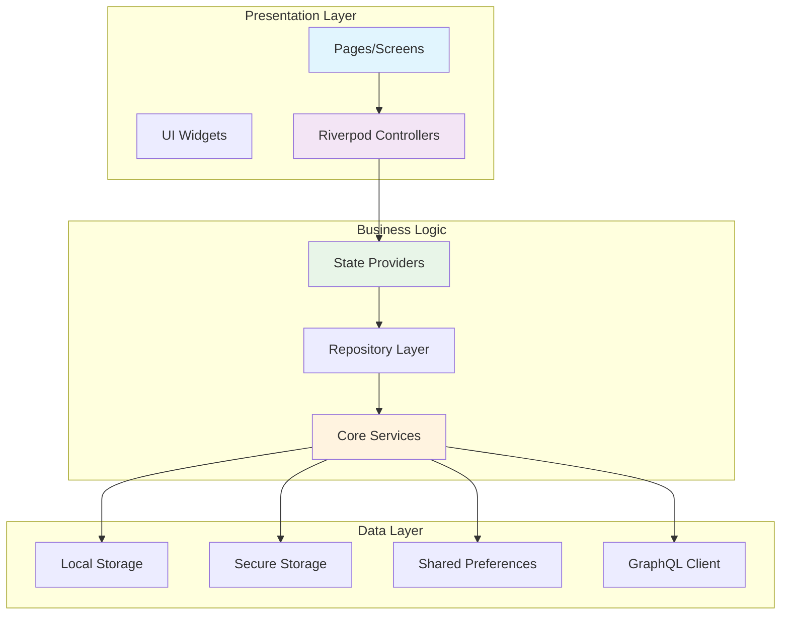

# Clubland Flutter App - API Documentation

## Overview

This document provides comprehensive API documentation for the Clubland Flutter application, covering state management, providers, services, and integration patterns.

## Table of Contents

- [Architecture Overview](#architecture-overview)
- [State Management](#state-management)
- [Authentication API](#authentication-api)
- [Profile Management](#profile-management)
- [Internationalization API](#internationalization-api)
- [Navigation System](#navigation-system)
- [Storage Services](#storage-services)
- [GraphQL Integration](#graphql-integration)
- [Error Handling](#error-handling)

## Architecture Overview

### Core Components Diagram



## State Management

### Riverpod Providers

#### Authentication Controller

```dart
@riverpod
class AuthController extends _$AuthController {
  @override
  Future<User?> build() async {
    // Initialize authentication state
    return await _checkInitialAuthState();
  }

  /// Login with email and password
  Future<void> login({
    required String email,
    required String password,
  }) async {
    // Parameters:
    // - email: User's email address (required)
    // - password: User's password (required)
    // Throws: AuthException, NetworkException

    state = const AsyncLoading();
    try {
      final user = await ref.read(authRepositoryProvider).login(
        email: email,
        password: password,
      );
      state = AsyncData(user);
    } catch (error, stackTrace) {
      state = AsyncError(error, stackTrace);
      rethrow;
    }
  }

  /// Logout current user
  Future<void> logout() async {
    // Side effects:
    // - Clears secure storage
    // - Resets authentication state
    // - Navigates to login screen

    await ref.read(authRepositoryProvider).logout();
    state = const AsyncData(null);
  }

  /// Check if user is authenticated
  bool get isAuthenticated => state.value != null;

  /// Get current user or null
  User? get currentUser => state.value;
}
```

#### Language Provider

```dart
@riverpod
class LanguageNotifier extends _$LanguageNotifier {
  @override
  Future<AppLanguage?> build() async {
    // Load saved language or detect system locale
    final savedLanguage = await ref.read(languageRepositoryProvider).getSavedLanguage();
    if (savedLanguage != null) {
      return savedLanguage;
    }

    // Fall back to system locale
    final systemLocale = PlatformDispatcher.instance.locale;
    return AppLanguage.fromCode(systemLocale.languageCode) ?? AppLanguage.english;
  }

  /// Change app language
  Future<void> setLanguage(AppLanguage language) async {
    // Parameters:
    // - language: AppLanguage enum (english, swedish)
    // Side effects:
    // - Updates UI immediately
    // - Saves preference to SharedPreferences
    // - Triggers app-wide locale change

    state = AsyncData(language);
    await ref.read(languageRepositoryProvider).saveLanguage(language);
  }

  /// Reset to system default
  Future<void> resetToSystemDefault() async {
    await ref.read(languageRepositoryProvider).clearLanguage();

    final systemLocale = PlatformDispatcher.instance.locale;
    final systemLanguage = AppLanguage.fromCode(systemLocale.languageCode);
    final newLanguage = systemLanguage ?? AppLanguage.english;

    state = AsyncData(newLanguage);
  }
}

/// Current locale provider
@riverpod
Locale? currentLocale(CurrentLocaleRef ref) {
  final languageAsync = ref.watch(languageNotifierProvider);
  return languageAsync.when(
    data: (language) => language?.locale,
    loading: () => null,
    error: (_, __) => AppLanguage.english.locale,
  );
}

/// Supported locales provider
@riverpod
List<Locale> supportedLocales(SupportedLocalesRef ref) {
  return AppLanguage.values.map((lang) => lang.locale).toList();
}
```

## Authentication API

### Authentication Repository

```dart
abstract class AuthRepository {
  /// Login with email and password
  Future<User> login({
    required String email,
    required String password,
  });

  /// Get current authenticated user
  Future<User?> getCurrentUser();

  /// Logout current user
  Future<void> logout();

  /// Check if user is authenticated
  Future<bool> isAuthenticated();

  /// Refresh authentication token
  Future<void> refreshToken();
}

class AuthRepositoryImpl implements AuthRepository {
  final AuthRemoteDataSource _remoteDataSource;
  final SecureStorageService _secureStorage;

  @override
  Future<User> login({
    required String email,
    required String password,
  }) async {
    try {
      final response = await _remoteDataSource.login(
        email: email,
        password: password,
      );

      // Store tokens securely
      await _secureStorage.storeToken(response.accessToken);
      await _secureStorage.storeRefreshToken(response.refreshToken);

      return User.fromJson(response.user);
    } catch (e) {
      throw AuthException('Login failed: ${e.toString()}');
    }
  }

  @override
  Future<User?> getCurrentUser() async {
    final token = await _secureStorage.getToken();
    if (token == null) return null;

    try {
      final response = await _remoteDataSource.getCurrentUser(token);
      return User.fromJson(response.data);
    } catch (e) {
      // Token might be expired
      await logout();
      return null;
    }
  }

  @override
  Future<void> logout() async {
    await _secureStorage.clearAll();
  }
}
```

### Authentication Exceptions

```dart
/// Base authentication exception
abstract class AuthException implements Exception {
  final String message;
  final String? code;

  const AuthException(this.message, [this.code]);
}

/// Invalid credentials exception
class InvalidCredentialsException extends AuthException {
  const InvalidCredentialsException()
    : super('Invalid email or password', 'INVALID_CREDENTIALS');
}

/// Token expired exception
class TokenExpiredException extends AuthException {
  const TokenExpiredException()
    : super('Authentication token has expired', 'TOKEN_EXPIRED');
}

/// Network error during authentication
class AuthNetworkException extends AuthException {
  const AuthNetworkException(String message)
    : super('Network error: $message', 'NETWORK_ERROR');
}
```

## Profile Management

### Profile Data Models

```dart
/// Simplified user model for profile display
class SimpleUser {
  final String id;
  final String firstName;
  final String lastName;
  final String email;
  final String? avatar;
  final String? bio;
  final int visitCount;
  final int reviewCount;
  final int clubCount;
  final int points;

  const SimpleUser({
    required this.id,
    required this.firstName,
    required this.lastName,
    required this.email,
    this.avatar,
    this.bio,
    this.visitCount = 0,
    this.reviewCount = 0,
    this.clubCount = 0,
    this.points = 0,
  });

  /// Get full name
  String get fullName => '$firstName $lastName';

  /// Convert to JSON
  Map<String, dynamic> toJson() => {
    'id': id,
    'firstName': firstName,
    'lastName': lastName,
    'email': email,
    'avatar': avatar,
    'bio': bio,
    'visitCount': visitCount,
    'reviewCount': reviewCount,
    'clubCount': clubCount,
    'points': points,
  };

  /// Create from JSON
  factory SimpleUser.fromJson(Map<String, dynamic> json) => SimpleUser(
    id: json['id'] as String,
    firstName: json['firstName'] as String,
    lastName: json['lastName'] as String,
    email: json['email'] as String,
    avatar: json['avatar'] as String?,
    bio: json['bio'] as String?,
    visitCount: json['visitCount'] as int? ?? 0,
    reviewCount: json['reviewCount'] as int? ?? 0,
    clubCount: json['clubCount'] as int? ?? 0,
    points: json['points'] as int? ?? 0,
  );
}
```

### Activity Models

```dart
/// Simple activity for activity feed
class SimpleActivity {
  final String id;
  final String type;
  final String title;
  final String description;
  final DateTime timestamp;

  const SimpleActivity({
    required this.id,
    required this.type,
    required this.title,
    required this.description,
    required this.timestamp,
  });

  /// Activity type enumeration
  static const String visitType = 'visit';
  static const String reviewType = 'review';
  static const String favoriteType = 'favorite';
  static const String checkinType = 'checkin';

  /// Get icon for activity type
  IconData get icon {
    switch (type) {
      case visitType:
        return Icons.location_on;
      case reviewType:
        return Icons.rate_review;
      case favoriteType:
        return Icons.favorite;
      case checkinType:
        return Icons.check_circle;
      default:
        return Icons.timeline;
    }
  }

  /// Format timestamp for display
  String formatTimestamp() {
    final now = DateTime.now();
    final difference = now.difference(timestamp);

    if (difference.inDays > 0) {
      return '${difference.inDays}d ago';
    } else if (difference.inHours > 0) {
      return '${difference.inHours}h ago';
    } else if (difference.inMinutes > 0) {
      return '${difference.inMinutes}m ago';
    } else {
      return 'Just now';
    }
  }
}
```

### Achievement System

```dart
/// User achievement model
class SimpleAchievement {
  final String id;
  final String title;
  final String description;
  final IconData icon;
  final bool earned;
  final DateTime? earnedDate;
  final int? progress;
  final int? maxProgress;

  const SimpleAchievement({
    required this.id,
    required this.title,
    required this.description,
    required this.icon,
    required this.earned,
    this.earnedDate,
    this.progress,
    this.maxProgress,
  });

  /// Get progress percentage (0.0 to 1.0)
  double get progressPercentage {
    if (earned) return 1.0;
    if (progress == null || maxProgress == null) return 0.0;
    return progress! / maxProgress!;
  }

  /// Check if achievement has progress tracking
  bool get hasProgress => progress != null && maxProgress != null;

  /// Format earned date for display
  String formatEarnedDate() {
    if (earnedDate == null) return '';

    final now = DateTime.now();
    final difference = now.difference(earnedDate!);

    if (difference.inDays > 30) {
      final months = (difference.inDays / 30).floor();
      return '$months month${months > 1 ? 's' : ''} ago';
    } else if (difference.inDays > 0) {
      return '${difference.inDays} day${difference.inDays > 1 ? 's' : ''} ago';
    } else {
      return 'Today';
    }
  }
}
```

## Internationalization API

### Language Management

```dart
/// Supported languages enumeration
enum AppLanguage {
  english('en', 'English', 'Engelska'),
  swedish('sv', 'Swedish', 'Svenska');

  const AppLanguage(this.code, this.englishName, this.swedishName);

  final String code;
  final String englishName;
  final String swedishName;

  /// Get display name based on current language
  String getDisplayName(AppLanguage currentLanguage) {
    switch (currentLanguage) {
      case AppLanguage.english:
        return englishName;
      case AppLanguage.swedish:
        return swedishName;
    }
  }

  /// Get Flutter Locale object
  Locale get locale => Locale(code);

  /// Find language by code
  static AppLanguage? fromCode(String? code) {
    if (code == null) return null;
    try {
      return AppLanguage.values.firstWhere((lang) => lang.code == code);
    } catch (e) {
      return null;
    }
  }
}
```

### Language Repository

```dart
/// Language settings repository
class LanguageRepository {
  static const String _languageKey = 'app_language';

  /// Get saved language preference
  Future<AppLanguage?> getSavedLanguage() async {
    // Returns: AppLanguage? (null if not set)

    final prefs = await SharedPreferences.getInstance();
    final languageCode = prefs.getString(_languageKey);
    return AppLanguage.fromCode(languageCode);
  }

  /// Save language preference
  Future<void> saveLanguage(AppLanguage language) async {
    // Parameters:
    // - language: AppLanguage enum to save
    // Side effects: Persists to SharedPreferences

    final prefs = await SharedPreferences.getInstance();
    await prefs.setString(_languageKey, language.code);
  }

  /// Clear language preference (use system default)
  Future<void> clearLanguage() async {
    final prefs = await SharedPreferences.getInstance();
    await prefs.remove(_languageKey);
  }
}
```

### Translation Usage

```dart
/// Using translations in widgets
class ExampleWidget extends ConsumerWidget {
  @override
  Widget build(BuildContext context, WidgetRef ref) {
    return Column(
      children: [
        // Simple text translation
        Text(S.of(context).profile),

        // Text with interpolation
        Text(S.of(context).earnedAgo('2 weeks ago')),

        // Button with translated text
        ElevatedButton(
          onPressed: () => _signOut(),
          child: Text(S.of(context).signOut),
        ),

        // Dialog with translated content
        AlertDialog(
          title: Text(S.of(context).signOutConfirmTitle),
          content: Text(S.of(context).signOutConfirmMessage),
          actions: [
            TextButton(
              onPressed: () => Navigator.pop(context),
              child: Text(S.of(context).cancel),
            ),
          ],
        ),
      ],
    );
  }
}
```

## Navigation System

### App Router Configuration

```dart
@riverpod
GoRouter appRouter(AppRouterRef ref) {
  ref.watch(authControllerProvider.notifier);

  return GoRouter(
    initialLocation: RoutePaths.login,
    redirect: (BuildContext context, GoRouterState state) {
      // Authentication guard
      final authState = ref.read(authControllerProvider);
      final isAuthenticated = authState.value != null;
      final isLoginRoute = state.matchedLocation == RoutePaths.login ||
                          state.matchedLocation == RoutePaths.register;

      if (!isAuthenticated && !isLoginRoute) {
        return RoutePaths.login;
      }

      if (isAuthenticated && isLoginRoute) {
        return RoutePaths.home;
      }

      return null; // No redirect
    },
    routes: [
      // Authentication routes
      GoRoute(
        path: RoutePaths.login,
        name: 'login',
        builder: (context, state) => const LoginPage(),
      ),

      // Main app routes with bottom navigation
      ShellRoute(
        builder: (context, state, child) => MainScaffold(child: child),
        routes: [
          GoRoute(
            path: RoutePaths.home,
            name: 'home',
            builder: (context, state) => const HomePage(),
          ),
          GoRoute(
            path: RoutePaths.profile,
            name: 'profile',
            builder: (context, state) => const ProfilePage(),
          ),
        ],
      ),

      // Settings route (outside main navigation)
      GoRoute(
        path: RoutePaths.settings,
        name: 'settings',
        builder: (context, state) => const ProfileSettingsPage(),
      ),
    ],
  );
}
```

### Route Paths

```dart
/// Route path constants
class RoutePaths {
  // Authentication
  static const String login = '/login';
  static const String register = '/register';

  // Main app
  static const String home = '/';
  static const String clubs = '/clubs';
  static const String bookings = '/bookings';
  static const String profile = '/profile';
  static const String settings = '/settings';

  // Dynamic routes
  static String getClubDetailPath(String clubId) => '/clubs/$clubId';
  static String getBookingDetailPath(String bookingId) => '/bookings/$bookingId';
}
```

## Storage Services

### Secure Storage Service

```dart
/// Secure storage for sensitive data
class SecureStorageService {
  static const _tokenKey = 'auth_token';
  static const _refreshTokenKey = 'refresh_token';
  static const _userDataKey = 'user_data';

  final FlutterSecureStorage _storage;

  SecureStorageService() : _storage = const FlutterSecureStorage(
    aOptions: AndroidOptions(
      encryptedSharedPreferences: true,
    ),
    iOptions: IOSOptions(
      accessibility: IOSAccessibility.first_unlock_this_device,
    ),
  );

  /// Store authentication token
  Future<void> storeToken(String token) async {
    await _storage.write(key: _tokenKey, value: token);
  }

  /// Get authentication token
  Future<String?> getToken() async {
    return await _storage.read(key: _tokenKey);
  }

  /// Store refresh token
  Future<void> storeRefreshToken(String token) async {
    await _storage.write(key: _refreshTokenKey, value: token);
  }

  /// Get refresh token
  Future<String?> getRefreshToken() async {
    return await _storage.read(key: _refreshTokenKey);
  }

  /// Store user data
  Future<void> storeUserData(Map<String, dynamic> userData) async {
    final jsonString = jsonEncode(userData);
    await _storage.write(key: _userDataKey, value: jsonString);
  }

  /// Get user data
  Future<Map<String, dynamic>?> getUserData() async {
    final jsonString = await _storage.read(key: _userDataKey);
    if (jsonString == null) return null;
    return jsonDecode(jsonString) as Map<String, dynamic>;
  }

  /// Clear all stored data
  Future<void> clearAll() async {
    await _storage.deleteAll();
  }
}
```

## GraphQL Integration

### GraphQL Client Setup

```dart
/// GraphQL client configuration
class GraphQLClientService {
  static GraphQLClient? _client;

  static GraphQLClient get client {
    if (_client == null) {
      final httpLink = HttpLink(
        EnvironmentConfig.apiUrl,
        defaultHeaders: {
          'Content-Type': 'application/json',
        },
      );

      final authLink = AuthLink(
        getToken: () async {
          final secureStorage = SecureStorageService();
          final token = await secureStorage.getToken();
          return token != null ? 'Bearer $token' : '';
        },
      );

      final link = authLink.concat(httpLink);

      _client = GraphQLClient(
        link: link,
        cache: GraphQLCache(store: InMemoryStore()),
        defaultPolicies: DefaultPolicies(
          watchQuery: Policies(
            fetchPolicy: FetchPolicy.cacheAndNetwork,
          ),
          query: Policies(
            fetchPolicy: FetchPolicy.cacheFirst,
          ),
        ),
      );
    }

    return _client!;
  }

  /// Reset client (useful for logout)
  static void resetClient() {
    _client = null;
  }
}
```

### GraphQL Operations

```dart
/// Example GraphQL queries and mutations
class AuthQueries {
  /// Login mutation
  static const String loginMutation = '''
    mutation Login(\$email: String!, \$password: String!) {
      login(email: \$email, password: \$password) {
        accessToken
        refreshToken
        user {
          id
          email
          firstName
          lastName
          avatar
        }
      }
    }
  ''';

  /// Current user query
  static const String currentUserQuery = '''
    query Me {
      me {
        id
        email
        firstName
        lastName
        avatar
        bio
        stats {
          visitCount
          reviewCount
          clubCount
          points
        }
      }
    }
  ''';
}
```

## Error Handling

### Exception Hierarchy

```dart
/// Base application exception
abstract class AppException implements Exception {
  final String message;
  final String? code;
  final dynamic originalError;

  const AppException(this.message, [this.code, this.originalError]);

  @override
  String toString() => 'AppException: $message${code != null ? ' ($code)' : ''}';
}

/// Network-related exceptions
class NetworkException extends AppException {
  const NetworkException(String message, [String? code, dynamic originalError])
      : super(message, code, originalError);
}

/// Validation exceptions
class ValidationException extends AppException {
  final Map<String, String> fieldErrors;

  const ValidationException(
    String message,
    this.fieldErrors, [
    String? code,
    dynamic originalError,
  ]) : super(message, code, originalError);
}

/// Storage exceptions
class StorageException extends AppException {
  const StorageException(String message, [String? code, dynamic originalError])
      : super(message, code, originalError);
}
```

### Global Error Handler

```dart
/// Global error handling service
class ErrorHandlerService {
  static void handleError(Object error, StackTrace stackTrace) {
    // Log error
    logger.error('Unhandled error: $error', stackTrace);

    // Report to crash analytics
    FirebaseCrashlytics.instance.recordError(error, stackTrace);

    // Show user-friendly message
    if (error is AppException) {
      _showUserFriendlyError(error);
    } else {
      _showGenericError();
    }
  }

  static void _showUserFriendlyError(AppException exception) {
    // Show appropriate error message based on exception type
    final message = exception is NetworkException
        ? 'Network connection error. Please check your internet connection.'
        : exception.message;

    _showErrorSnackBar(message);
  }

  static void _showGenericError() {
    _showErrorSnackBar('An unexpected error occurred. Please try again.');
  }

  static void _showErrorSnackBar(String message) {
    final context = navigatorKey.currentContext;
    if (context != null) {
      ScaffoldMessenger.of(context).showSnackBar(
        SnackBar(
          content: Text(message),
          backgroundColor: Colors.red,
          duration: const Duration(seconds: 3),
        ),
      );
    }
  }
}
```

## Testing Utilities

### Test Helpers

```dart
/// Test utilities for mocking providers
class TestUtils {
  /// Create test container with mocked providers
  static ProviderContainer createTestContainer({
    List<Override> overrides = const [],
  }) {
    return ProviderContainer(
      overrides: [
        ...overrides,
        // Mock authentication
        authControllerProvider.overrideWith(
          () => MockAuthController(),
        ),
        // Mock language
        languageNotifierProvider.overrideWith(
          () => MockLanguageNotifier(),
        ),
      ],
    );
  }

  /// Create mock user for testing
  static SimpleUser createMockUser({
    String id = 'test-user-1',
    String firstName = 'Test',
    String lastName = 'User',
    String email = 'test@example.com',
  }) {
    return SimpleUser(
      id: id,
      firstName: firstName,
      lastName: lastName,
      email: email,
      visitCount: 10,
      reviewCount: 5,
      clubCount: 3,
      points: 1500,
    );
  }
}

/// Mock authentication controller for testing
class MockAuthController extends AuthController {
  @override
  Future<User?> build() async {
    return TestUtils.createMockUser();
  }

  @override
  Future<void> login({required String email, required String password}) async {
    if (email == 'test@example.com' && password == 'password') {
      state = AsyncData(TestUtils.createMockUser());
    } else {
      throw const InvalidCredentialsException();
    }
  }
}
```

---

This API documentation provides comprehensive coverage of the Clubland Flutter app's architecture, state management, and key services. Each section includes detailed function signatures, parameters, return types, and usage examples to facilitate development and integration.